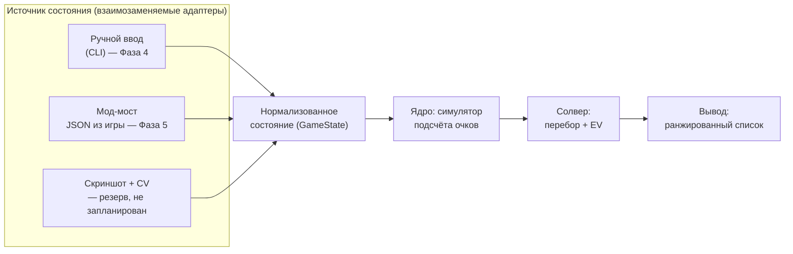

# Бот для Balatro — план проекта

**Смена цели (зафиксировано в этой редакции):** проект был советником (человек играет сам,
бот считает и объясняет) — это отменено. Новая цель: бот, самостоятельно проходящий игру на
любой сложности без участия человека, то есть стабильно побеждающий на всех 8 ставках
(White…Gold). Раздел 2 ниже переписан под эту цель; причина смены и её последствия — там же.
Режим советника (`advise`/`doctor`/`watch`) не выброшен — он остаётся и как самостоятельный
инструмент, и как источник решений для автопилота: автопилот не заменяет расчёт, а добавляет
слой действия поверх уже посчитанных советов и достраивает те решения, что раньше честно
отдавались на усмотрение человека.

Статус: фазы 0, 1, 2 и 4 закрыты; Фаза 5 подтверждена вживую на реальной macOS, Фаза 7
(порядок джокеров и магазин) и первый кусок Фазы 8 (скип блайнда) сделаны. Движок подсчёта
работает. Новая Фаза 9 («Автопилот») задаёт объём работы под новую цель — раздел 6, подраздел
«Автопилот». Актуальное состояние по каждой фазе и что осталось — раздел 8.1.
Платформа разработки и игры: macOS (Apple Silicon / Intel), Steam-версия Balatro.

---

## 1. Выбор игры: Balatro

Balatro выбрана осознанно, а не просто «потому что нравится». Она почти идеально подходит и
советнику, которым проект был изначально, и автопилоту, которым стал (раздел 2) — обеим ролям
нужно одно и то же: у хода есть точно вычислимый правильный ответ:

| Критерий | Balatro |
|---|---|
| Реакция / таймеры | Нет вообще. Ход длится столько, сколько нужно. Бот может думать секунды и минуты |
| Детерминированность | Подсчёт очков — чистая арифметика без случайности (кроме отдельных джокеров). У хода есть **объективно лучший** вариант, который можно вычислить |
| Пространство решений | Из 8 карт выбрать подмножество (до 5) — это 218 вариантов на руку, плюс решение «играть или сбросить», плюс магазин. Человек физически не перебирает это, машина перебирает мгновенно |
| Цена ошибки | Высокая: один неправильно выбранный сброс на Ante 8 убивает ран |
| Доступ к состоянию | Игра написана на Lua + LÖVE 2D, есть зрелая мод-экосистема, состояние читается напрямую из движка |
| Правовой аспект | Однопользовательская офлайн-игра, без анти-чита и без мультиплеера, который можно испортить |

Ключевое: в Balatro **есть правильный ответ**, и его можно посчитать. Это отличает её от
игр, где «помощник» скатывается в вкусовые советы.

**Рассмотренные альтернативы** (тоже пошаговые, без экшена):

- *Slay the Spire* — отличная мод-поддержка, но там уже есть сильные готовые боты, и оценка
  хода упирается в долгосрочную стратегию, а не в счёт. Меньше «вычислимости».
- *Into the Breach* — полностью детерминированная, но ходы и так прозрачны, помощник почти
  не добавляет ценности.
- *Luck be a Landlord* — близка по духу, но сильно проще и меньше сообщество/инструменты.

Итог: **делаем под Balatro**.

---

## 2. Что именно делает бот

### Вехи и их соответствие фазам

Единственное определение версий в документе. Везде дальше ссылаемся только на него.

| Веха | Фазы | Что умеет |
|---|---|---|
| **v0.1 «Калькулятор»** | 0–4 | Ручной ввод состояния, выбор лучшего подмножества карт с точным счётом. Первая практическая польза |
| **v1 «Советник»** | 5–6 | Плюс автоподключение к игре и решение «играть или сбросить». Здесь закрывалась DoD прежней цели |
| **v2 «Магазин»** | 7 | Плюс покупки и порядок джокеров |
| **v3 «Стратегия»** | 8 | Плюс решения уровня всего рана (скип блайнда — сделано; экономика — нет) |
| **v4 «Автопилот»** | 9 | Плюс цикл действий через честные RPC-методы мода и решения там, где раньше советник честно молчал (скип — да/нет, а не числа; магазин — купить/не купить, ваучеры и паки; вскрытие паков; консумаблы перед розыгрышем; легальность хода под правило-модифицирующими боссами). **Новая цель проекта** — раздел ниже |

### Новая цель: автономное прохождение (Фаза 9)

Зафиксировано явно, потому что меняет весь раздел «Чего сознательно НЕ делаем» ниже, бывший
неизменным с самого начала проекта.

**Критерий успеха:** бот стабильно побеждает (доходит до Ante 8 и добивает финального босса)
на каждой из 8 ставок (`WHITE`…`GOLD`) отдельно — не «повезло один раз», а измеримый винрейт
по N прогонам на ставку, с отдельным отчётом по каждой ставке. Ставки в Balatro кумулятивны
(подтверждено по исходнику, `game.lua`: `if self.GAME.stake >= K then ... end`) — `GOLD`
включает все 8 модификаторов разом (без денег за Small Blind, ускоренный рост требований,
Eternal/Perishable/Rental джокеры в магазине, −1 сброс). Отсюда порядок обкатки: снизу вверх,
`WHITE → RED → ... → GOLD`, а не сразу самая тяжёлая — на промежуточных ставках проще понять,
какой конкретно из 8 модификаторов уронил прогон.

**Режим запуска — управляемый, не демон.** `balatro-bot autoplay --deck X --stake Y` играет
один ран честными действиями до победы или поражения и останавливается с отчётом; массовый
прогон по N ранов на ставку — обвязка поверх этого же раннера. Работа сутками без присмотра
(24/7, автоперезапуск ранов) осознанно не входит в объём сейчас — это отдельная надстройка
(watchdog на зависания, лимиты по времени/попыткам), которую можно добавить позже поверх уже
работающего управляемого цикла, не переделывая его.

**Переключение между советником и автопилотом — обязательное требование, не побочный эффект
того, что оба режима существуют.** Мало того, что `advise`/`doctor`/`watch` не удаляются
(раздел выше) — должна быть возможность переключиться между ними и `autoplay` по ходу дела:
начать ран под автопилотом и в любой момент забрать управление себе (доиграть руками дальше)
либо наоборот — досмотреть советником и передать автопилоту доиграть. Оба режима читают одно и
то же состояние через один и тот же мост, поэтому переключение — это не перенос данных между
раздельными системами, а вопрос того, кто в данный момент дёргает действия (`play`/`buy`/...),
советник этого не делает вообще. `autoplay` обязан уметь корректно завершиться (или встать на
паузу) в любой момент между действиями, не только в конце рана, — раз человек должен суметь
перехватить руль посреди игры, а не только между ранами.

**Только честные действия.** RPC мода (`src/lua/utils/openrpc.json`) даёт два разных класса
методов: игровые (`select`, `skip`, `play`, `discard`, `buy`, `sell`, `use`, `reroll`,
`next_round`, `cash_out`, `rearrange`, `start`) и читерские (`set` — поставить деньги/анте/руки
напрямую минуя игровые правила, `add` — заспавнить любую карту, `load` — подставить чужое
сохранение). Автопилот использует только первый класс — это тот же принцип, что уже
зафиксирован в разделе 8 плана про сид-анализаторы («Идея на потом»): бот не читает будущее и
не жульничает, только считает и действует в рамках того, что доступно живому игроку. `set`/
`add`/`load` остаются доступны исключительно тестовой инфраструктуре (`tests/fake_mod.py` и
подобное), как и сейчас.

### Что показывает v1

Советник, не автопилот. Игрок играет сам, бот в соседнем окне показывает:

1. **Какие карты играть** — **ранжированный список** вариантов с посчитанным счётом и разбивкой,
   а не единственная рекомендация. Максимум очков не всегда лучший ход: иногда выгоднее еле
   перебить блайнд, сохранив руки и сбросы, иногда — сыграть слабее ради прокачки уровня нужного
   типа руки. Выбор остаётся за игроком, задача бота — показать, из чего сложилось число.
2. **Играть или сбросить** — сравнение «сыграть сейчас» против матожидания «сбросить N карт
   и сыграть следующей рукой».
3. **Хватит ли на блайнд** — «эта рука даёт 12 400, до блайнда 30 000, за 2 оставшиеся руки не
   добиваем → надо перестраивать».

Пункты 1 и 2 здесь описаны как два разных вида совета — по факту реализации (раздел 6,
Фаза 6) это давно один список: `solver.actions.rank_actions` сливает розыгрыши и сбросы в
единый ранжированный вывод по убыванию счёта, потому что для игрока это одно и то же решение
«что делать сейчас», а не два списка для сравнения глазами.

**Definition of Done для v1:** на вход подано состояние (рука, джокеры, уровни рук, блайнд) —
на выход за <100 мс выдан ранжированный список ходов с разбивкой счёта, совпадающей с игрой
до последней единицы.

### Сквозное требование: честность расчёта

Действует **начиная с Фазы 3** и распространяется на все последующие. Ядро всегда возвращает
не только число, но и **признак полноты расчёта**. Если во входном состоянии встретился джокер,
улучшение или боссовый эффект, которого движок не знает, расчёт помечается неточным, и
интерфейс обязан это показать. Молча выдать правдоподобное, но неверное число — худший
возможный исход для советника.

**Третья категория с Фазы 9: явно помеченная эвристика.** До сих пор у числа было два честных
состояния — точный расчёт (`exact=True`) или отказ посчитать вовсе (текст вместо числа, как
`core/tags.py`/`ShopItem.effect` для того, что не с чем сравнить контрфактумом). Советнику
этого хватало: решение оставалось за человеком. Автопилоту решение принимать всё равно надо —
молчание для него равносильно случайному выбору, то есть отказ перестаёт быть нейтральным
вариантом. Отсюда третье состояние: экспертная оценка на основе игрового смысла эффекта (не
подсчитанная контрфактумом, а назначенная), обязана быть отличима от точного числа так же явно,
как сейчас `exact=False` отличим от `exact=True` — не тем же полем с той же семантикой,
означающей «оценка по выборке» (как у `DiscardOption.exact`), а отдельно, потому что здесь
неточность другого рода: не приближение точного числа, а константа без вычисления вовсе.

### Чего сознательно НЕ делаем

- **Автоигру теперь делаем — это отменяет исходное решение проекта.** До этой редакции плана
  здесь стояло «не делаем автоигру, это не нужно для качества решений» — то была осознанная
  граница ответственности (человек решает, бот считает), а не техническое ограничение. Новая
  цель (раздел 2, «Автопилот») требует ровно обратного, и решение развёрнуто намеренно, не
  случайно. Граница смещается на другую ось: не «кто жмёт кнопки», а «какими методами» —
  см. «Только честные действия» выше.
- Не читаем сид рана заранее (см. «Идея на потом» в разделе 8) — даже автономно играя, бот не
  знает будущего магазина/боссов наперёд, только то, что видно живому игроку прямо сейчас.
- Не делаем ML/нейросети. Здесь работает честный перебор + симулятор, он точнее и объяснимее —
  это не изменилось: автопилот действует по тем же расчётам солвера, что и раньше показывались
  человеку, просто без человека посередине.

---

## 3. Архитектура

Три слоя, жёстко разделённые. Ядро ничего не знает про то, откуда пришло состояние.



Почему так: **симулятор скоринга — самая ценная и самая долгоживущая часть**. Способ добычи
состояния может смениться трижды (мод сломался после патча — переехали на CV), ядро при этом
не трогаем. Поэтому первым делаем ядро, а не интеграцию.

---

## 4. Как достать состояние игры

Три варианта, в порядке предпочтения.

### Вариант A — мод-мост (выбран, Фаза 5)

Balatro — это LÖVE 2D + Lua, всё состояние живёт в глобальном объекте `G`
(`G.hand`, `G.jokers`, `G.shop_jokers`, `G.GAME.blind`, `G.GAME.dollars`, ...).
Мод на Lua сериализует это в JSON и отдаёт наружу.

Стек на macOS:
- [Lovely Injector](https://github.com/ethangreen-dev/lovely-injector) — рантайм-инжектор Lua
  (для M-серии нужен билд `lovely-aarch64-apple-darwin`). Нужен только сам `liblovely.dylib`:
  CLI мода подставляет его через `DYLD_INSERT_LIBRARIES` сам, скрипт запуска не требуется.
  Запускать игру через Steam на macOS нельзя — этому мешает баг клиента.
- [Steamodded](https://github.com/Steamodded/smods) — фреймворк модов, моды кладутся в
  `~/Library/Application Support/Balatro/Mods`.

**Важно: скорее всего не надо писать мод с нуля.** Уже есть
[`coder/balatrobot`](https://github.com/coder/balatrobot) (MIT) — мод, поднимающий
**JSON-RPC 2.0 HTTP API** поверх игры: отдаёт состояние и принимает действия (выбор карт,
покупки в магазине, выбор блайнда). Есть и альтернативы (мод, дампящий состояние в файл
каждый кадр). План — взять готовое как транспорт и вложить свои силы в мозги, а не в биндинги.

**Спайк (Фаза 1) делается заранее и вне очереди:** поставить это на конкретном Mac и убедиться,
что заводится с текущей версией игры. Спайк не блокирует Фазы 2–4, но обязан быть пройден
до начала Фазы 5, иначе к тому моменту вложения окажутся сделаны в неработающий путь.
При успехе спайк **фиксирует конкретные версии** игры, Lovely, Steamodded и мода — за время
Фаз 2–4 они могут обновиться.

Риски:
- Steamodded **по умолчанию отключает достижения Steam** (защита от случайной накрутки).
  Возвращается тумблером в игровом меню модов, но об этом надо знать заранее.
- Обновление Balatro в Steam может временно сломать Lovely/Steamodded — придётся ждать
  обновления модов. Отсюда правило: играть можно и без бота, бот не должен быть обязателен.

### Вариант B — компьютерное зрение (резерв, в дорожную карту не входит)

Захват окна игры + распознавание карт. Плюс: не трогает игру вообще, достижения целы.
Минус: сильно дороже в разработке и хрупко. **Сознательно не планируется** — задача заводится
только если Фаза 1 провалилась и мод-путь закрыт. Карты в Balatro визуально контрастные,
template matching реалистичен, полноценный OCR не нужен.

### Вариант C — ручной ввод (Фаза 4, нужен в любом случае)

CLI/TUI, где рука вводится строкой вида `AH KH QH 7C 7D 3S 2S 2C`, джокеры — по именам.
Это **не костыль**: он позволяет разрабатывать и тестировать ядро, не завися от модов,
и остаётся как режим отладки навсегда.

Важное ограничение, которое надо понимать сразу: ручной ввод даёт полноценный ответ на вопрос
«какие карты играть», но **не даёт точного состава оставшейся колоды**. Это напрямую бьёт по
Фазе 6 — см. раздел 6.

---

## 5. Ядро: симулятор подсчёта очков

Это сердце проекта. Счёт = `chips × mult`, но оба множителя собираются в строго определённом
порядке, и порядок важен (сложение до умножения даёт совсем другой результат).

Порядок вычисления, который надо воспроизвести:

1. **Определить тип руки** из сыгранных карт → базовые chips/mult **по текущему уровню руки**
   (уровни повышаются Planet-картами, поэтому уровни рук — часть состояния, а не константа).
   Учесть модификаторы распознавания: `Four Fingers` (флеш/стрит из 4 карт), `Shortcut`
   (стрит с пропусками), `Smeared Joker` (масти попарно эквивалентны), Wild-карты,
   секретные руки (Five of a Kind, Flush House, Flush Five).
2. **Дебаффы боссового блайнда** — какие карты отключены и не считаются.
3. **Сыгранные карты слева направо**: chips карты (2–10 = номинал, J/Q/K = 10, A = 11),
   улучшения (Bonus, Mult, Glass, Steel, Stone, Gold, Lucky), издания (Foil, Holographic,
   Polychrome), печати; ретриггеры (красная печать, `Hanging Chad`, `Dusk`, `Hack`).
4. **Карты, оставшиеся в руке** (Steel, `Baron`, ретриггеры от `Mime`).
5. **Джокеры слева направо** — в порядке их расположения. `Blueprint`/`Brainstorm` копируют
   соседей, поэтому порядок — это самостоятельная задача оптимизации.
6. **Финал** — произведение с округлением. Точное правило округления и поведение на очень
   больших числах **сверяем с исходниками**, а не предполагаем: это не всегда обычный `round`.

### Откуда брать точные данные

Не выписывать 150+ джокеров руками по памяти — это гарантированные ошибки.
Исходники игры лежат прямо на диске:

```
~/Library/Application Support/Steam/steamapps/common/Balatro/Balatro.app/Contents/Resources/Balatro.love
```

Это обычный zip. Внутри — Lua-код: таблицы `G.P_CENTERS` (все джокеры, улучшения, издания),
значения покерных рук, функция подсчёта очков. План — **сгенерировать справочник джокеров
скриптом из исходников игры** и держать его как данные, а в коде описывать только логику
эффектов. Это же — эталон для сверки порядка вычислений и правила округления.

Следствие для планирования: **Фаза 3 требует доступа к установленной игре.** Без файлов игры
её можно начать (каркас движка), но нельзя закрыть.

### Проверка корректности

Golden-тесты: набор реальных ситуаций из игры (рука + джокеры + уровни) и точный счёт,
который показала игра. Ядро обязано совпадать до единицы.

**Сбор этих кейсов — отдельная ручная работа человека за игрой**, а не побочный эффект
написания кода. Она вынесена в дорожную карту как явная задача Фазы 3, потому что без неё
критерий готовности Фазы 3 недостижим в принципе.

---

## 6. Солвер

### Выбор руки (Фаза 4)

Перебор всех подмножеств руки размера 1–5: из 8 карт — 218 вариантов; при увеличенном размере
руки (`Juggler` даёт +1 карту, есть и другие источники) — до ~640 при десяти картах. Каждое
подмножество прогоняется через симулятор. Полный перебор, никакой эвристики — доли миллисекунды.

Результат — не одна «лучшая» рука, а ранжированный список с разбивкой счёта (см. раздел 2).

### Играть или сбросить (Фаза 6)

Матожидание сброса считаем методом Монте-Карло: сэмплируем N добборов, для каждого считаем
лучший возможный счёт, усредняем. Сравниваем с «сыграть сейчас» с учётом того, сколько рук
и сбросов осталось до блайнда.

**Точность зависит от источника состояния**, и это надо честно показывать в интерфейсе:

- **С мод-мостом (Фаза 5)** состав оставшейся колоды известен точно — мы видим всю колоду
  и все ушедшие карты. Оценка корректна.
- **При ручном вводе** точный состав колоды недоступен: колода меняется за ран (карты
  добавляются, удаляются, улучшаются), и отслеживать это руками нереально. Работаем
  на допущении стандартной колоды из 52 карт минус увиденное в текущем раунде, а результат
  помечаем как приблизительный.

Отсюда порядок фаз: **Фаза 6 идёт после Фазы 5**, потому что полноценной она становится
только с автоматическим источником состояния.

### Консумаблы до розыгрыша (обнаружено в сессии, не было в исходном плане)

Солвер не знает о Tarot/Planet-картах, которые лежат неиспользованными в инвентаре
(`consumables` в состоянии мода) — а их можно применить перед розыгрышем и изменить результат.
Два случая совсем разного размера:

- **Planet-карты** — маленькая механическая задача: поднять уровень нужной руки на 1 по уже
  существующим таблицам и пересчитать тем же движком. Тот же паттерн, что и перебор порядка
  джокеров. Не начато — не на чем было проверить (0 Planet-карт в инвентаре на момент
  обнаружения).
- **Tarot-карты** — на порядок больше: ~22 разных эффекта, многие не прибавляют число, а
  трансформируют карты (`Death` — выбор пары карт «донор/цель», отдельное пространство перебора
  поверх текущего). По объёму сравнимо с реализацией новых джокеров. Не начато; `Death` уже
  встречался в инвентаре вживую.

Не привязано к номеру фазы: по сути ближе к Фазе 4 (влияет на текущий розыгрыш, не на
магазин), но всплыло уже после того, как нумерация фаз была зафиксирована.

### Магазин и порядок джокеров (Фаза 7)

- Порядок джокеров: перебор перестановок с отсечениями (для 5 слотов — 120 вариантов,
  считается влёт) на репрезентативной руке. **Сделано** — `solver.play.rank_joker_orders`.
- **Покупка (сделано)** — `solver.shop.evaluate_shop`. Мод отдаёт настоящий, а не
  гипотетический магазин (`GameState.shop`/`shop_vouchers`/`shop_packs`, только в фазе
  `SHOP`) — считать вероятность того, что выпадет, не нужно, ровно как с тегами скипа
  (раздел «Стратегия рана» ниже). Для джокеров оценка — тот же контрфактум, что у порядка
  джокеров: добавить кандидата к текущим и посмотреть, насколько вырастет `advise().best`,
  только не на одной руке игрока (её в фазе `SHOP` нет — `GameState.hand` пуст), а
  усреднено по `SAMPLE_HANDS = 12` представительным рукам из колоды (`full_deck` в узком
  случае, иначе `standard_deck()` с честной пометкой `exact_deck=False`). Неизвестный игре
  джокер получает `expected_uplift=None`, не догадку. Ваучеры и паки оценки не получают
  вовсе — это осознанное решение, не пробел: ваучер меняет правила рана целиком (скидки,
  слоты, шансы), а не счёт одной руки, сравнивать контрфактумом не с чем; вместо числа —
  живой текст эффекта от самой игры (`ShopItem.effect`, то же поле `value.effect`, что даёт
  `JokerCard.current_value` в других местах). Поправка на экономику (проценты капают до $25)
  пока не сделана — это то, что осталось от исходной формулировки пункта. **Вживую на Mac
  ещё не проверено**: за время разработки игра не доходила до фазы `SHOP` — только `doctor`
  на пустом магазине (не в фазе `SHOP`) подтверждён без падения. Проверка на реальном
  предложении джокеров — открытая задача, не выполненная работа.

### Стратегия рана (Фаза 8)

Полная симуляция ранов (прогон тысяч ранов с разными политиками, отбор лучших
правил) — не первый шаг, а последний: без рабочих эвристик для отдельных
решений (скип блайнда, магазин, экономика) симулировать нечем — политику для
симуляции берём как раз из них.

**Скип блайнда (сделано, первый кусок фазы)** — `solver/skip.py`,
`evaluate_skip()`. Ключевое наблюдение: экран выбора блайнда — не то место,
где нужно гадать вероятности. Мод уже отдаёт настоящее состояние: требования
всех трёх блайндов анте (`GameState.blinds["small"/"big"/"boss"]`) и точный
текст тега, который достанется при скипе (`Blind.tag_name`/`tag_effect`), а
не распределение возможных тегов. Поэтому это не симуляция, а честный разбор
уже известного выбора — тот же принцип, что у `advise_discard`/
`rank_joker_orders`: не гадать, а посчитать по тому, что реально видно.

Функция не сводит решение к одному выдуманному числу — часть тегов
(бесплатный джокер, ваучер, пак) в принципе не переводится в очки или деньги
без произвольной оценки полезности. Вместо вердикта — разложенные числа:
во сколько раз следующий блайнд анте тяжелее этого (`requirement_ratio`,
без хода — на экране выбора блайнда руки ещё нет), гарантированный минимум
денег за победу (`_BASE_REWARD`: `bl_small=$3`, `bl_big=$4`, выписано из
`game.lua`, не по памяти), и содержание тега как есть. Точная денежная
цена тега (`tag_dollars`) считается только там, где формула не требует
счётчика уровня рана, которого мод нигде не присылает (только
`round.*`, по раунду): `Investment Tag` ($25, условие — победа над боссом
этого анте) и `Economy Tag` (`min($40, текущие деньги)`) — точны;
`Handy`/`Garbage`/`Skip Tag` требуют суммарного числа рук/сбросов/скипов за
весь ран — `tag_dollars` для них честно `None`, а не догадка. Каталог всех
24 тегов (`core/tags.py`, `TAGS`) выписан из исходника игры (`game.lua`
`tag_*`, `tag.lua` `Tag:apply_to_run`) тем же способом, что джокеры —
структурное описание, что тег механически делает, без оценки полезности.

Подключено в `doctor`/`watch` (`render_skip_advice`), не в `advise`: на
экране выбора блайнда `GameState.hand` пустой, `advise()` считать не на
чем.

**Проверено вживую на Mac** 2026-08-22: реальный Big Blind с Investment Tag
(анте 1) — числа совпали с ручным расчётом ($4 гарантированно за игру против
$25 условно за скип), решение обсуждалось и подтверждено отдельно от кода.

Покупка джокеров переехала в Фазу 7 (раздел «Магазин и порядок джокеров»
выше) — она про магазин конкретно, здесь остаётся более общая экономика
(проценты, момент реролла) и полная симуляция ранов после неё.

### Автопилот (Фаза 9)

Зависит от всего готового ядра решений (Фазы 4–8) — не пересчитывает их заново, а достраивает
слой действия сверху и закрывает решения, которые раньше честно отдавались человеку. Новая
цель проекта и её объём — раздел 2. Порядок подзадач ниже — не строгая последовательность
(зависимости важнее номеров, как и везде в этом документе), но 9.1 и 9.5 логически идут первыми:
без цикла действий нечем исполнять решения, без каталога боссов автопилот может честно
посчитать нелегальный ход и застрять, пытаясь его сыграть.

**9.1. Цикл действий и честные вызовы моста.** `ModBridge` уже умеет собирать `game_state()`
и формально имеет клиентские методы `play()`/`discard()`, но их никто не вызывает (см.
CLAUDE.md). Мод отдаёт куда больше действий, чем сейчас используется, — весь список сверен по
`openrpc.json` (раздел 2, «Только честные действия»): `select`/`skip` (экран выбора блайнда),
`play`/`discard` (розыгрыш), `buy`/`sell`/`reroll`/`next_round`/`cash_out` (магазин), `use`
(консумабль, опционально с целевыми картами), `rearrange` (порядок руки/джокеров/консумаблов —
нужен, чтобы применить результат `rank_joker_orders`, который солвер уже считает, но некому
применять), `start` (новый ран с выбранным деском и ставкой). Сам цикл — конечный автомат по
`GameState.phase`: на каждой фазе конкретное решение (из готового солвера, где оно уже точное;
из новых подзадач ниже, где раньше был честный отказ) → один RPC-вызов → снова читаем
состояние. Тот же паттерн опроса и сравнения состояний, что уже есть в `ui/tui.py` для `watch`,
только `watch` кончает поллингом, а автопилот — действием.

Отсюда прямо следует требование переключения (раздел 2): раз оба режима читают состояние
одним и тем же способом и различаются только тем, кто дёргает действия, `autoplay` обязан
проверять переключатель «пауза/перехват» между каждым действием цикла (не только между ранами)
и на паузе вести себя как `watch` — показывать то же самое, ничего не трогая, пока управление
не вернут обратно.

**9.2. Замыкание решений без готового вердикта.** Три места, где до сих пор честно
показывались числа/текст без выбора:
  - `solver/skip.py` — `SkipAdvice` не сводит решение к одному числу для тегов вроде
    ваучера/джокера/пака. Автопилоту нужно решающее правило поверх уже посчитанных чисел
    (`requirement_ratio`, `play_reward_min`, `tag_dollars` где он есть) — не новый расчёт, а
    политика, как их читать.
  - `solver/shop.py` — ранжирует джокеров по приросту счёта, но не решает «купить/не купить»,
    не трогает ваучеры и паки вообще, не выбирает реролл, не решает момент ухода из магазина.
  - Вскрытие паков (фазы `*_PACK`) — не реализовано вовсе: нужно решить, какие карты взять из
    показанных (обычно 1–2 из 3–5).

**9.3. Оценка ваучеров и паков.** 32 ваучера разобраны по `card.lua`/`game.lua` (`Card:apply_to_run`,
таблица `v_*` в `game.lua`) на группы по тому, насколько честно их можно оценить — не бинарно
«считаем/не считаем», а по трём уровням, согласно новой третьей категории честности выше:
  - **Точный расчёт, без новых допущений.** `Grabber`/`Nacho Tong` (+1/+2 руки за раунд),
    `Wasteful`/`Recyclomancy` (+1/+2 сброса), `Paint Brush`/`Palette` (+1 к размеру руки) —
    прямые ресурсы, уже понятные солверу; оцениваются тем же контрфактумом, что джокеры в
    `solver/shop.py` (добавить ресурс, пересчитать на representative-руках, взять разницу).
    `Hieroglyph`/`Petroglyph` (−1 анте ценой −1 руки за раунд) — двусторонний трейд-офф, обе
    стороны которого уже считаются существующими кусками (требования блайндов по анте,
    ценность лишней руки) — тоже точный расчёт, не эвристика.
  - **Денежная формула с явным горизонтом.** `Seed Money`/`Money Tree` (`interest_cap`),
    `Clearance Sale`/`Liquidation` (`discount_percent`), `Reroll Surplus`/`Reroll Glut`
    (дешевле реролл) — формулы точные (вытащены из `card.lua`), но их денежная ценность
    зависит от того, сколько ещё раундов и покупок впереди; нужен постулированный горизонт
    (например, «до конца анте»), помеченный как допущение так же явно, как во всём остальном
    проекте — не подавать как факт.
  - **Эвристическая константа.** `Hone`/`Glow Up` (шанс изданий в магазине), `Tarot/Planet
    Merchant`/`Tycoon` (частота консумаблов), `Overstock`/`Overstock Plus` (+1 слот магазина),
    `Crystal Ball` (+1 слот консумабля), `Antimatter` (+1 слот джокера), `Telescope`/
    `Observatory` (Celestial-пак всегда содержит нужную планету / бонус мульта от планет в
    инвентаре) — меняют будущую RNG или будущие решения, точного числа не будет никогда;
    получают явно помеченную (см. новую третью категорию честности) константу по игровому
    смыслу, не молчание.

  **Паки** — отдельный случай: магазин показывает только тип пака и цену (область `packs`),
  содержимое генерируется только при вскрытии (отдельная область `pack`, отдельная фаза) —
  контрфактум до покупки в принципе невозможен, только матожидание по пулу карт этого типа.
  Celestial/Planet-паки — точный расчёт (level-up руки через уже существующие таблицы и тот же
  движок). Arcana/Tarot и Spectral — новый пласт: десятки разных трансформирующих эффектов,
  пересекается со следующим пунктом.

**9.4. Консумабли и подготовка руки перед розыгрышем.** Раздел «Консумаблы до розыгрыша» выше
был помечен «обнаружено вживую, не сделано» без привязки к фазе — теперь это прямая
зависимость автопилота: если в инвентаре лежит Planet/Tarot-карта, нужно решить, применять ли
её перед розыгрышем текущей руки. Planet — механически просто (level-up + пересчёт тем же
движком, тот же паттерн, что перебор порядка джокеров). Tarot — по объёму сравним с
реализацией новых джокеров: часть карт не прибавляет число, а трансформирует конкретные карты
(`Death` — донор/цель, отдельное пространство перебора поверх текущего).

**9.5. Правило-модифицирующие боссы — из известного дефекта в блокер.** Допущение №10 (раздел
8.3) было «молчаливо неверный совет», который замечал человек. Для автопилота это не мелкий
дефект: бот может честно посчитать нелегальный ход и попытаться его сыграть через `play`,
получить отказ мода и не знать, что делать дальше. В игре 28 боссовых блайндов
(`game.lua`, таблица `bl_*`) — для существенной части допущение «дебафф карты не влияет на
тип руки» уже подтверждено вживую (`The Goad`, раздел 8.3 №4), но часть боссов не про
chips/mult вовсе, а про сами правила розыгрыша: `The Mouth` (один тип руки за весь раунд),
`The Water` (ноль сбросов), `The Needle` (одна рука за раунд), `The Manacle` (−1 к размеру
руки), `The Eye` (нельзя повторять тип руки в раунде), `The Ox` (обнуляет деньги при розыгрыше
самого частого типа руки), `The Hook` (сам сбрасывает 2 случайные карты после розыгрыша),
`The Serpent`, `The Pillar` (карты, сыгранные ранее в этом раунде, дебаффятся на весь раунд).
Нужен явный каталог (тот же паттерн, что `core/tags.py` — выписан из `card.lua`/`blind.lua`,
не по памяти) и фильтр нелегальных вариантов в `solver/play.py` до того, как они попадут в
ранжированный список — не после того, как автопилот попробует их сыграть и получит отказ.

**9.6. Ставки — уже кумулятивны, частично уже читаются.** Подтверждено по исходнику
(`game.lua`: `if self.GAME.stake >= K then ... end`, восемь условий подряд) — `GOLD` включает
все 8 модификаторов разом, не только свой. Требования блайндов по анте читаются из мода живьём
(`BlindInfo.required_score`), не предсказываются формулой — значит ускоренный рост требований
на `GREEN`/`PURPLE` не требует нового кода, он уже учтён самим фактом чтения актуального числа.
Новое: `JokerCard.eternal` уже парсится (мод отдаёт поле с `BLACK` и выше), `perishable`
(таймер до бесплатного исчезновения, `ORANGE`+) и `rental` (стоимость владения за раунд,
`GOLD`) — нет, хотя мод отдаёт оба поля в той же области `modifier`, что и `eternal`. Оба
нужны для решения о покупке в `solver/shop.py`: Eternal нельзя продать (влияет на бюджет
слотов при неудачной покупке), Perishable не стоит переплачивать за то, что скоро исчезнет
бесплатно, Rental — постоянная стоимость владения, вычитаемая из его ценности каждый раунд.

**9.7. Ран-раннер и измерение винрейта.** Управляемая команда (условно `balatro-bot autoplay
--deck X --stake Y`) играет один ран честными действиями до победы или `GAME_OVER` и
останавливается с отчётом и логом каждого решения (для разбора неудачных ранов — тот же смысл,
что у golden-тестов для скоринга, только для целого рана, а не одного розыгрыша). Обвязка
поверх раннера гоняет N ранов на каждой из 8 ставок отдельно (раздел 2, критерий успеха) —
порядок `WHITE → ... → GOLD`, потому что ставки кумулятивны и так проще понять, какой из
модификаторов уронил прогон. 24/7-режим без присмотра — намеренно не в этом объёме (раздел 2).

---

## 7. Стек и структура репозитория

- **Python 3.12+**, менеджер зависимостей — `uv`.
- `pytest` — тесты, `ruff` — линт/формат, `mypy` — типы (ядро типизируем строго).
- **Ноль зависимостей в рантайме** (`pyproject.toml`: `dependencies = []`) — план изначально
  предполагал `pydantic` для валидации состояния и `textual`/`rich` для TUI, но ни то ни
  другое не понадобилось: разбор состояния от мода делает `adapters/mod_bridge.py` сам, без
  схем; живое окно (`ui/tui.py`) обходится голыми ANSI-кодами (раздел 8.2). Отступление
  зафиксировано там же, здесь просто отражена итоговая реальность, а не повторный план.

Дерево ниже — фактическая структура на 2026-08-22, не то, что предполагалось изначально;
свежее состояние всегда можно свериться командой `find balatro_bot tests tools -name "*.py"`.

```
balatro_bot/
  core/
    cards.py               # карта: ранг, масть, улучшение, издание, печать
    hands.py                # распознавание покерных рук + балатровские правила
    scoring.py               # симулятор подсчёта очков (порядок из раздела 5)
    catalogue.py              # справочник джокеров из enums.lua мода — сгенерирован, не редактировать
    tags.py                    # каталог всех 24 тегов скипа блайнда, из game.lua/tag.lua
    state.py                    # GameState, BlindInfo, ShopItem, JokerCard — нормализованное состояние
    jokers/
      __init__.py              # реестр джокеров, протокол Joker, build_jokers()
      implementations.py        # логика эффектов каждого джокера
  solver/
    play.py                   # ранжированный список подмножеств, порядок джокеров
    discard.py                  # точный EV заданного сброса + advise_discard (Discard Spec)
    actions.py                   # rank_actions — единый список розыгрышей и сбросов
    skip.py                       # evaluate_skip — совет по скипу блайнда
    shop.py                        # evaluate_shop — совет по покупке джокеров в магазине
  adapters/
    manual.py                    # ручной ввод состояния с клавиатуры
    mod_bridge.py                  # клиент к JSON-RPC мосту (только чтение — play()/discard() есть, не вызываются)
  ui/
    render.py                    # форматирование вывода, общее для advise/doctor/watch
    tui.py                         # watch — поллинг + перерисовка по изменению состояния
  cli.py                          # команды install/advise/watch/doctor/record
  install.py                       # установщик мод-стека на macOS одной командой
tools/
  generate_catalogue.py             # Balatro.love → core/catalogue.py (было extract_game_data.py, 8.2)
tests/
  golden/                          # эталонные дампы состояния + счёт из реальной игры
  fixtures/                         # gamestate.json — каноничный снимок состояния
  fake_mod.py                        # фальшивый JSON-RPC сервер по спецификации мода
  test_*.py                           # по одному файлу на модуль ядра/солвера/адаптера
docs/
  mac-setup.md                        # установка мод-стека вручную, шаг за шагом
  Discard Spec.md                      # спецификация advise_discard (раздел 6, Фаза 6)
```

---

## 8. Дорожная карта

Фазы пронумерованы по порядку выполнения, но **зависимости важнее номеров** — см. колонку
«Зависит от». Фаза 1 стоит рано намеренно: она проверяет самый большой внешний риск проекта,
но при этом никого не блокирует до Фазы 5.

| Фаза | Зависит от | Содержание | Готово, когда |
|---|---|---|---|
| **0. Каркас** | — | Репозиторий, `uv`, `ruff`, `mypy`, `pytest`, CI на GitHub Actions | Все проверки CI зелёные на smoke-тесте (пустой `pytest` без тестов даёт код 5 и валит CI — нужен хотя бы один настоящий тест) |
| **1. Спайк интеграции** | доступ к Mac с игрой | Поставить Lovely + Steamodded + `balatrobot`, руками дёрнуть API, посмотреть реальный JSON. Включить тумблер достижений. Зафиксировать версии | Есть сохранённый дамп реального состояния игры и записанный список версий |
| **2. Карты и руки** | 0 | Модель карты, распознавание всех типов рук включая секретные. `Four Fingers`/`Shortcut`/`Smeared`/Wild реализуются как **абстрактные флаги-модификаторы** — привязка их к конкретным джокерам будет в Фазе 3 | Тесты на все типы рук, на каждый модификатор и на пограничные случаи (`A-2-3-4-5` валиден, `Q-K-A-2-3` нет) |
| **3. Скоринг** | 2 + файлы игры | Симулятор подсчёта, `extract_game_data.py`, уровни рук, ~30 самых частых джокеров, **механизм пометки неточного расчёта** (раздел 2) | Golden-тесты совпадают с игрой до единицы; неизвестный джокер помечает расчёт неточным, а не игнорируется |
| **3a. Сбор golden-кейсов** | игра под рукой | **Ручная работа человека:** записать ~20 реальных ситуаций (рука, джокеры, уровни, блайнд) и показанный игрой счёт | Кейсы лежат в `tests/golden/`, Фаза 3 может быть закрыта |
| **4. Солвер + ручной ввод** | 3 | Перебор подмножеств, ранжированный вывод, CLI. **Первая практическая польза (v0.1)** | Ввожу с клавиатуры руку, джокеров и блайнд — получаю список ходов со счётом и ответ «хватает / не хватает» |
| **5. Автоподключение** | 1, 4 | Мост к моду, TUI обновляется сам во время игры | Играю, не трогая бота — советы появляются сами |
| **6. Сброс и EV** | 5 | Монте-Карло по колоде, отслеживание вышедших карт. При ручном вводе — режим допущения (раздел 6). **Здесь закрывается v1** | Бот говорит «сбрось эти 3», объясняет числами и честно помечает, точная оценка или приблизительная |
| **7. Магазин и джокеры** | 3, 5 | Покрытие остальных джокеров, советы по покупкам и порядку (v2) | Бот рекомендует перестановку джокеров с приростом счёта; доля «неизвестных джокеров» упала до нуля |
| **8. Стратегия рана** | 7 | Скипы блайндов, теги, экономика, симуляция ранов (v3) | Оценка политик на массовых прогонах |
| **9. Автопилот** | 4–8 | Цикл действий через честные RPC мода, ваучеры/паки, вскрытие паков, консумабли перед розыгрышем, каталог правило-модифицирующих боссов, Perishable/Rental джокеры, ран-раннер (v4) — раздел 6, «Автопилот» | Стабильный винрейт по N прогонам на каждой из 8 ставок отдельно (раздел 2, критерий успеха) |

**Фазы 0–4 дают работающий инструмент без единого мода** — это v0.1. Он считает точно, но
состояние вводится руками, а совет по сбросу ещё не даётся.

### 8.1. Где мы сейчас

| Фаза | Состояние | Что осталось |
|---|---|---|
| 0. Каркас | **закрыта** | — |
| 1. Спайк интеграции | **закрыта** — стек ставится и заводится на Apple Silicon. Версии: игра 1.0.1o-FULL, Lovely 0.9.0, Steamodded 1.0.0~BETA-1814a, BalatroBot v1.5.2 (внутри мода отдаёт себя как 1.5.1). Дамп состояния — `tests/golden/20260820-104352-phase1-spike.json` | — |
| 2. Карты и руки | **закрыта** | — |
| 3. Скоринг | движок готов, реализовано 149 джокеров из 150 | сверка чисел с игрой (Фаза 3a); `j_hiker` — единственный осознанно отложенный (см. раздел 8.2) |
| 3a. Сбор golden-кейсов | доступ к Mac есть | ~20 случаев: сыграть руку, дописать к дампу счёт из игры |
| 4. Солвер + ручной ввод | **закрыта** | — |
| 5. Автоподключение | **закрыта** — мост и `watch` проверены вживую 2026-08-21: `uvx balatrobot serve` держал реальную партию несколько антов подряд, `doctor`/`watch` читали состояние без сбоев, живая сессия и вскрыла дефект издания джокера (см. 8.4) | — |
| 6. Сброс и EV | узкий срез сделан: `solver.discard.discard_outcome` считает точный EV сброса **одного заданного** набора карт (перебор добора без повторов, не Монте-Карло); `balatro-bot advise --discard "карты"` сравнивает его с розыгрышем сейчас. Мост parse-ит область `cards` мода в `GameState.deck` — с ним колода точна, без него используется приближение (52 минус рука), и это честно помечается. `solver.discard.rank_single_discards` даёт точный EV сброса каждой одной карты (≤8 кандидатов), но больше не вызывается из `watch` сама по себе — заменена более широким `advise_discard` в общем списке действий (см. ниже), функция осталась доступна как точный строительный блок. **Общий случай («что сбрасывать» без заданного набора) закрыт**: `solver.discard.advise_discard` (`docs/Discard Spec.md`) перебирает не сбросы, а **цели** (флеш/стрит/N одинаковых/фулл-хаус/«оставить как есть»), вероятность цели считает точно гипергеометрически (`DiscardOption.success_probability`), а ожидаемый счёт при каждом числе пришедших аутов — по представительной выборке (`SAMPLE_HANDS_PER_BUCKET = 16`) через дешёвую эвристику розыгрыша (`_fast_best_score`, 1-2 кандидата вместо честных 218 подмножеств) вместо полного `rank_plays`. На проверочных руках отклонение от честного перебора (`discard_outcome` как эталон) держится в пределах 15% из раздела 7 спеки, время — в разы меньше бюджета в 200 мс. **`solver.actions.rank_actions`** сливает `advise_discard` с `rank_plays` в один список «что делать сейчас», отсортированный по счёту — розыгрыш и сброс больше не два списка для сравнения глазами, а один; это теперь безусловный (не по флагу) вывод `balatro-bot advise` и `watch` — стоячее требование пользователя, не разовая настройка | для сбросов из **двух и более** карт полный перебор кандидатов *для одного заданного набора* (`discard_outcome`) всё ещё не делает — это уже не укладывается по времени даже без Монте-Карло (перебор одного кандидата размера 2 — уже ~950 доборов, кандидатов — 28); перебор доборов ограничен `MAX_DRAW_COMBINATIONS = 2000`, выше — честный отказ, а не догадка. `advise_discard` — оценка по построению (`DiscardOption.exact` всегда `False`), не точный расчёт (кроме `success_probability` — она точна); **проверено вживую на Mac** 2026-08-22 (`advise_discard`/`rank_actions` — на реальной раздаче с Crazy Joker: расчёт правильно предпочёл сбор стрита флешу из-за джокера, бьющего только по стриту; узкий срез (`discard_outcome`) проверялся ранее) |
| 7. Магазин и джокеры | «порядок джокеров» (`solver.play.rank_joker_orders`, `advise --joker-order`) и «покупка» (`solver.shop.evaluate_shop`, `doctor`/`watch`) сделаны — см. раздел «Магазин и порядок джокеров» выше | поправка на экономику (проценты); `j_hiker` (см. раздел 8.3, №3) |
| 8. Стратегия рана | скип блайнда сделан (`solver.skip.evaluate_skip`, `doctor`/`watch`) — первый кусок; советы по покупкам переехали в Фазу 7 (см. её строку выше) как относящиеся именно к магазину; экономика и полная симуляция ранов не начаты | подробности — раздел 6, «Стратегия рана» |
| 9. Автопилот | **не начата** — новая фаза этой редакции плана, объём под новую цель (раздел 2) | все 7 подзадач раздела 6 «Автопилот»: цикл действий, замыкание решений без вердикта, ваучеры/паки, вскрытие паков, консумабли перед розыгрышем, каталог правило-модифицирующих боссов, ставки (Perishable/Rental), ран-раннер |

### 8.2. Отступления от плана

Зафиксировано, чтобы расхождение документа с кодом не копилось молча.

- **Появился установщик**, которого в плане не было: `balatro-bot install` ставит весь
  мод-стек одной командой. Фаза 1 от этого не исчезла, но сократилась до «запустить и
  посмотреть».
- **Часть Фазы 5 сделана до Фазы 1**, хотя план требовал обратного порядка. Причина в том,
  что клиент к моду оказался полностью проверяемым против фальшивого сервера, собранного по
  спецификации мода. Риск, ради которого Фаза 1 стояла первой, это не снимает: сам стек на
  macOS по-прежнему никем не запускался.
- **`extract_game_data.py` заменён на `generate_catalogue.py`** с другим источником данных
  (см. раздел 5).
- **`ui/tui.py` написан без `textual`/`rich`**, вопреки стеку из раздела 7: живое окно
  (`balatro-bot watch`) обходится опросом раз в секунду и перерисовкой через голые ANSI-коды
  (`\x1b[2J\x1b[H`) — этого достаточно для read-only вывода без интерактивности, а зависимостей
  по-прежнему ноль (правило из CLAUDE.md). Отрисовка вынесена в `ui/render.py` и переиспользуется
  командами `advise`/`doctor`, чтобы не разойтись в форматировании.
- **Значения рук приходят от игры**, поэтому таблицы из `hands.py` понижены до запасного
  пути для ручного ввода.
- **Область `cards` в ответе мода оказалась оставшейся колодой**, а не всем деском: на
  golden-дампах `hand.count + cards.count` всегда равно размеру всей колоды. В исходной
  нумерации фаз это не упоминалось явно, план предполагал Монте-Карло по неизвестному
  составу — на деле мост из Фазы 5 отдаёт состав точно, и это разблокировало точный (не
  сэмплированный) перебор для узкого среза Фазы 6.
- **Общий случай сброса («что сбрасывать» без заданного набора) реализован не как Монте-Карло
  по доборам**, вопреки формулировке раздела 6 выше, а по отдельной спецификации
  `docs/Discard Spec.md`: перебираются цели (флеш/стрит/N одинаковых/фулл-хаус), их вероятность
  считается точно гипергеометрически, и сэмплирование остаётся только внутри одной корзины
  «пришло ровно i аутов» — иначе перебор всех сбросов с Монте-Карло добора внутри каждого не
  укладывался по времени (раздел 8.3, допущение №9). Подробности — `solver.discard.advise_discard`.
- **Консумаблы (Tarot/Planet) до розыгрыша** — целый пласт, не учтённый в исходной нумерации
  фаз. Обнаружен вживую, не сделан. Подробности — раздел 6, «Консумаблы до розыгрыша».
- **В спецификации мода (`openrpc.json`) нет отдельного поля для полного состава колоды** —
  только `cards` («Cards remaining in deck»), то есть то, что ещё можно добрать, а не всё,
  чем владеет игрок. Для джокеров, считающих по всей колоде (`j_steel_joker`, `j_stone`,
  `j_drivers_license`, `j_erosion`), это разрешено узким случаем: пока за раунд ничего не
  сыграно и не сброшено (`round.hands_played == 0` и `round.discards_used == 0`), `hand ∪
  cards` и есть вся колода — `GameState.full_deck` заполняется только тогда, иначе `None`, и
  джокер честно помечает расчёт неточным. `j_erosion` дополнительно нужен стартовый размер
  колоды — он зависит от выбранной колоды рана (`GameState.deck_type`, из top-level поля
  `deck` в ответе мода): у всех колод 52 карты, кроме `ABANDONED` (начинает без картинок — 40).
  Таблица `_DECK_STARTING_SIZE` в `implementations.py` захардкожена по игровому знанию, не по
  данным мода — это статические игровые правила, а не история событий рана, поэтому не
  подпадает под правило «не гадать текстом эффекта» ниже.
- **`Oops! All 6s` (`j_oops`) удваивает вероятность у Lucky-карт и `j_bloodstone`** через
  `core.scoring.double_chance` — общую функцию для любого джокера с двухвариантной таблицей
  «не повезло / бонус». Misprint не тронут: у него не шанс, а равномерный разброс 0–23,
  удваивать нечего. Джокеры, что дают только деньги при срабатывании (`j_business`,
  `j_reserved_parking`, `j_8_ball`), Oops не трогает: их вероятность реальна, но эффект и без
  удвоения не входит в chips/mult этого розыгрыша.
- **Джокеры-накопители читают готовое число из текста эффекта, а не пересчитывают историю.**
  Изначально план (и раздел 8.3 в прежней редакции) считал 27 накопительных джокеров
  недостижимыми: их реальный эффект копится по событиям, которых состояние игры не хранит
  (прошлые сбросы, продажи, рероллы). Но сама игра уже считает текущее значение и подставляет
  его в текст эффекта («+3 множ. за каждую карту джокера (сейчас +15 множ.)» — обнаружено
  вживую на `Abstract Joker` при разборе бага с изданием джокера, см. 8.4). Мост
  (`mod_bridge._extract_current_value`) вытаскивает число из последней скобочной группы текста
  структурно — по позиции и наличию цифры, не по конкретному слову — поэтому не зависит от
  языка игры (проверено на русском и английском текстах), и кладёт его в новое поле
  `JokerCard.current_value`. 23 из 27 накопителей (`core/jokers/implementations.py`,
  `_LiveAccumulator`/`_accumulator(...)`) читают это поле напрямую и прикладывают его как есть
  нужным эффектом (`AddChips`/`AddMult`/`XMult` — тип эффекта уже известен из текста каталога,
  само число просто подставляется). Работает только вживую: при ручном вводе или если в тексте
  эффекта скобочной группы с числом не нашлось, `current_value` — `None`, джокер честно
  помечает расчёт неточным.
- **Оставшиеся 6 джокеров закрыты разбором исходников игры** (`Balatro.love` — архив движка
  LÖVE внутри `Balatro.app`, распаковывается как обычный zip; `card.lua` — реализация всех
  джокеров, `localization/{ru,en-us}.lua` — тексты). Раньше 4 из них (`j_hiker`,
  `j_loyalty_card`, `j_popcorn`, `j_ramen`) считались недостижимыми, потому что в статическом
  тексте каталога (`catalogue.py`, собран из `enums.lua`) не было скобочной группы с текущим
  значением — но это оказалось артефактом статической выгрузки, не отсутствием данных:
  - **`j_popcorn`, `j_ramen`** — `card.lua` показывает `loc_vars = {self.ability.mult, ...}` /
    `{self.ability.x_mult, ...}` — текущее (затухающее) значение живое, просто стоит **первым**
    числом в тексте эффекта, а не последним в скобках, как у остальных 23. Добавлена вторая
    функция извлечения, `mod_bridge._extract_leading_value` → `JokerCard.leading_value`, и
    класс `_LeadingValueJoker`.
  - **`j_ancient`, `j_idol`** — текущая цель (масть у `Ancient Joker`; ранг и масть у `The
    Idol`) — это `G.GAME.current_round.ancient_card`/`idol_card`, поле уровня раунда, которого
    в схеме мода (`openrpc.json`) нет вообще ни в каком виде — только сама игра подставляет имя
    масти/ранга словом прямо в текст эффекта (`localize(suit, 'suits_singular')` и т.п.). Нет
    способа получить это структурно, поэтому `mod_bridge._extract_word` ищет по словарю
    известных слов (`_SUIT_WORDS`, `_RANK_WORDS`) — единственное место в проекте, где
    распознавание завязано на язык игры, а не на структуру текста. Сейчас словарь покрывает
    только русский и английский; на любом другом языке `target_suit`/`target_rank` останутся
    `None`, и джокер честно пометит расчёт неточным, а не промолчит неверно. Отдельная защита от
    ложного срабатывания: у `The Idol` множитель всегда `X2` (`config.extra = 2`), поэтому цифра
    «2» есть в тексте эффекта постоянно и не годится как признак ранга — `_RANK_WORDS`
    намеренно не содержит числового ключа `"2"`, так что если цель — именно двойка, бот честно
    её не найдёт, а не один раз угадает по omonимичной цифре.
  - **`j_loyalty_card`** — настоящая формула триггера (`(every - 1 - (hands_played -
    hands_played_at_create)) % (every + 1) == 0`) зависит от момента покупки конкретного
    джокера, которого состояние не хранит нигде — вычислить самим нельзя. Но игра сама рисует
    в тексте эффекта готовый ответ: слово «Активно!»/«Active!», когда X4 сработает в этот
    розыгрыш, или «N осталось»/«N remaining» — когда нет. `mod_bridge._extract_loyalty_active`
    распознаёт оба маркера (снова только на русском/английском) → `JokerCard.loyalty_active`.
  - **`j_hiker`** остался единственным нереализованным. Механизм подтверждён по исходнику:
    бонус (+5 фишек за розыгрыш) навешивается не на джокер, а перманентно на саму сыгранную
    ИГРАЛЬНУЮ карту (`context.other_card.ability.perma_bonus`, накапливается весь ран) и
    рендерится через тот же общий пайплайн текста, что и у джокеров (`bonus_chips =
    ability.bonus + perma_bonus` в `generate_UIBox_ability_table`, тот же код что уже строит
    `value.effect` для карт руки). Но точный текст, который при этом получится (например,
    строка «+30 доп. фишек», которую видели вживую у Bonus-карты в начале этой сессии), не
    совпадает слово в слово с шаблоном `"Бонус +#1# шт. фишек"` из `localization/ru.lua` того
    же `Balatro.love` — либо Steamodded подменяет текст на лету, либо ответственная функция
    другая. Реализовывать по неподтверждённому тексту решили не рисковать: ждём живую карту,
    тронутую `Hiker`, чтобы свериться, прежде чем писать регулярку.

### 8.3. Открытые допущения и дефекты

Список упорядочен по влиянию: сверху то, что искажает каждое число, снизу — узкие случаи.
Пометка «нужен Mac» означает, что закрыть пункт можно только эталонными случаями из игры
(задача 3a).

| № | Что | Влияние | Как закрыть |
|---|---|---|---|
| 1 | Базовые значения рук выписаны по памяти | искажает **каждый** расчёт | нужен Mac |
| 2 | Порядок шагов подсчёта не сверен с исходниками игры | искажает расчёты со сложными джокерами | нужен Mac либо разбор `Balatro.love` |
| 3 | Реализовано 149 джокеров из 150. Немалая часть — джокеры «известны, но эффект не трогает chips/mult розыгрыша» (деньги, расходники, размер руки/сбросов, уже отражённый в состоянии, события после подсчёта): `j_burnt`, `j_rough_gem`, `j_business`, `j_reserved_parking`, `j_ticket`, `j_8_ball`, `j_astronomer`, `j_juggler`, `j_burglar`, `j_certificate`, `j_mr_bones`, `j_midas_mask`, `j_space` и ещё около 25 в этом духе — молчаливый `BaseJoker` для них честный посчитанный ноль, а не догадка. Ради части джокеров расширено состояние: `PokerHandInfo.played_this_round` (`j_card_sharp`), `GameState.hands_played` (`j_ice_cream`), `GameState.joker_slots` (`j_stencil`), `JokerCard.sell_value` (`j_swashbuckler`), `GameState.full_deck` (`j_steel_joker`, `j_stone`, `j_drivers_license`, `j_erosion` — точен только в узком случае, см. докстринг поля и раздел 8.2), `GameState.deck_type` (`j_erosion` — стартовый размер колоды по её типу), `JokerCard.current_value` (23 джокера-накопителя), `JokerCard.leading_value` (`j_popcorn`, `j_ramen`), `JokerCard.target_suit`/`target_rank` (`j_ancient`, `j_idol` — только на русском/английском текстах эффекта), `JokerCard.loyalty_active` (`j_loyalty_card` — тоже только ru/en; всё это — раздел 8.2). Три новые правило-модифицирующие карты в `HandModifiers`: `pareidolia` (любая карта — картинка), `chicot` (дебафф боссового блайнда снят), `oops` (`core.scoring.double_chance` удваивает вероятность бонусного исхода у Lucky-карт и `j_bloodstone`). Отдельно захардкожена таблица редкости всех 150 джокеров (`_JOKER_RARITY` в `implementations.py`, ради `j_baseball`) — статичное игровое правило, а не история событий, сверена и по трём категориям вики сообщества (61/64/20/5, совпадает с официальными числами), и по `rarity` прямо в `game.lua` | `j_hiker` — единственный оставшийся: бонус навешивается на игральные карты, а не на джокера, нужен новый механизм на уровне карт колоды (раздел 8.2). Фаза 7 |
| 4 | Допущение: дебафф карты не влияет на определение типа руки | боссовые блайнды | **подтверждено на игре** 2026-08-20 (The Goad, дебафф пик): `3S 3H 3D` → three_of_a_kind, 108, счёт совпал точь-в-точь — `tests/golden/20260820-104835-boss-goad-debuffed-spade-trips.json` |
| 5 | Допущение: `Supernova` не считает текущую руку | один джокер | нужен Mac |
| 6 | Допущение: `Photograph` срабатывает повторно при ретриггере | связка двух джокеров | нужен Mac |
| 7 | Допущение: роял-флеш считается обычным стрит-флешем | название руки в выводе | нужен Mac |
| 8 | При цикле `Blueprint` ⇄ `Brainstorm` цепочка обрывается | редкая расстановка | нужен Mac |
| 9 | Монте-Карло Фазы 6 упрётся в скорость: 1000 выборок × 218 вариантов ≈ 13 с | Фаза 6 не заработает в лоб | отсечение кандидатов в Фазе 6 |
| 10 | Боссовые блайнды, меняющие **правила**, а не chips/mult (`The Mouth` — «только 1 тип руки в раунде», возможны похожие), никак не смоделированы: `BlindInfo.effect` — просто текст для показа, `PokerHandInfo` не хранит присылаемый модом `played_this_round`, солвер не фильтрует нелегальные типы руки | молчаливо неверный совет: движок может честно посчитать и порекомендовать тип руки, который в этом раунде физически нельзя сыграть | для советника было бы достаточно минимального шага (`unknown` при таком блайнде); для автопилота это уже блокер, не мелкий дефект — см. раздел 6, «Автопилот», п. 9.5: полный каталог всех 28 боссов из `game.lua`/`card.lua`/`blind.lua`, тем же способом, что уже подтвердил дебафф-допущение №4 ниже вживую |

Каждое допущение из этого списка **уже помечено в коде** рядом с местом, где оно принято,
чтобы не искать их потом по документу.

### 8.4. Исправленные дефекты

Ведётся, чтобы одни и те же ошибки не возвращались: каждая закрыта регрессионным тестом.

- `Blueprint` и `Brainstorm`, поставленные рядом, копировали друг друга до переполнения стека.
- Сыгранная карта могла посчитаться ещё и оставшейся в руке — `Steel` молча завышал счёт.
- Причина неточности попадала в отчёт дважды, в двух формулировках.
- `Steel` и `Stone` печатались одной пометкой, хотя работают в разные моменты.
- `advise --top 0` падал на пустой выборке.
- Установщик падал с трассировкой, если GitHub отвечал не тем, чего ждали.
- Запасной способ разрешения случайностей брал первый исход вместо самого вероятного.
- Поиск файла в архиве зависел от порядка обхода и мог подцепить вложенный каталог.
- Поиск каталога `lua` в архиве BalatroBot был неоднозначен: `tests/lua/` (Python-зеркало
  тестов) лежит на той же глубине, что и настоящий `src/lua/`, и мог быть выбран вместо него —
  игра падала на старте с `Error reading file 'src/lua/settings.lua'`. Найдено вживую при
  спайке Фазы 1. Исправлено: раскладка ищет не каталог по имени, а сам `settings.lua`.
- Издание (Edition) самой карты-джокера — Foil/Holographic/Polychrome — нигде не считалось:
  `mod_bridge` его честно парсил, `BaseJoker.edition` даже отдавал его наружу, но ни один
  код подсчёта это свойство не читал, так что `+50`/`+10`/`×1.5` молча пропадали, а расчёт
  всё равно помечался точным (парсинг проходил успешно, применить эффект было некому — не
  «неизвестное», а забытое). Найдено вживую 2026-08-21: живая рука с Foil на `8 Ball` и
  `Seeing Double` дала `13 706`, бот предсказывал максимум `6 966`. Исправлено: `_run_once`
  применяет `_score_joker_edition` на ходу каждого джокера (`core/scoring.py`), так же, как
  издание уже применялось к игральным картам.
- CLI нигде не показывал Edition и Seal карт — `format_card` умел только улучшение
  (Enhancement), из-за чего дефект издания джокера выше было невозможно заметить глазами
  даже глядя на вывод `doctor`. Исправлено вместе с ним: издание карты теперь в тех же
  скобках, что улучшение (`TD(BF)`), печать — отдельным значком (`!R`/`!G`/`!U`/`!P`), а
  список джокеров показывает их собственное издание рядом с именем.
- `advise_discard(..., limit=0)` из-за проверки `if limit else options` в Python (`0` —
  ложное значение) возвращал **все** варианты вместо нуля — молча противоречило поведению
  `rank_actions`/`rank_plays`, где `top=0` трактуется как «хотя бы один». Найдено тестом
  регрессии вывода, не вживую. Исправлено: срез списка без условия (`options[:limit]`), а
  верхний уровень (`rank_actions`) сам поднимает `top` до 1, если попросили меньше.

### Идея на потом (опционально)

RNG в Balatro посеян: по сиду ран полностью предопределён — есть сторонние анализаторы сидов,
предсказывающие содержимое магазинов и боссов наперёд. Технически это подключаемо, но это
уже не «помощь в принятии решений», а знание будущего. Оставляю как отдельный флаг, который
по умолчанию выключен — решать тебе, где проходит граница между помощником и читом.

---

## 9. Риски

| Риск | Что делаем |
|---|---|
| Steamodded отключает достижения Steam | Знать заранее, включить тумблер в конфиге модов (Фаза 1), либо играть под отдельным профилем |
| Патч Balatro ломает моды | Ядро от мода не зависит; ручной ввод продолжает работать — но советы по сбросу деградируют до приблизительных (раздел 6) |
| Ошибка в симуляторе скоринга незаметно портит советы | Golden-тесты плюс сквозной механизм пометки неточного расчёта с Фазы 3 |
| С Фазы 5 игра отдаёт джокеров, которых движок не знает | Тот же механизм: расчёт помечается неточным. Полное покрытие закрывается только в Фазе 7 — до тех пор это штатная ситуация, а не сбой |
| 150+ джокеров — большой объём | Данные генерируем из исходников игры, руками пишем только логику; покрываем по частоте использования |
| `balatrobot` окажется несовместим/заброшен | Спайк в Фазе 1 до вложений в Фазу 5; запасной путь — свой минимальный мод-дампер (он несложный) |
| Golden-кейсы некому собрать | Вынесено в отдельную задачу 3a с явным исполнителем — иначе Фаза 3 не закрывается |
| Автопилот честным действием портит реальный ран/сохранение (Фаза 9) | Управляемый запуск, не демон (раздел 2) — человек рядом на время обкатки; только методы из белого списка (раздел 2, «Только честные действия»), `set`/`add`/`load` вне тестов не используются вовсе; отдельный игровой профиль, как и для тумблера достижений |
| Правило-модифицирующий босс не в каталоге (Фаза 9, п. 9.5) → автопилот пробует нелегальный ход | Каталог из 28 боссов выписывается из исходника, не по памяти (тот же принцип, что `core/tags.py`); до его завершения — консервативный список известных, не претензия на полноту с первого дня |
| Эвристическая оценка (ваучеры группы 3, п. 9.3) окажется плохой политикой | Не подаётся как факт — отдельная, явно помеченная категория (раздел 2, «Третья категория»); ран-раннер (п. 9.7) даёт измеримый винрейт, по которому эвристики можно и нужно пересматривать |

## 9.1. Принятые решения

Зафиксировано, дальше исходим из этого:

- **Роль бота — автопилот, не только советник (пересмотрено).** До этой редакции плана здесь
  стояло «роль бота — советник, автоигру не делаем» — решение развёрнуто намеренно (раздел 2).
  Советник никуда не делся: `advise`/`doctor`/`watch` остаются рабочим режимом и источником
  решений для автопилота, а не заменяются им.
- **Переключение между советником и автопилотом обязательно** (раздел 2, раздел 6 п. 9.1) —
  не «оба режима существуют по отдельности», а можно перехватить управление у автопилота
  посреди рана и вернуть его обратно, не теряя состояние. Оба читают один и тот же мост,
  различаются только тем, кто дёргает действия.
- **Вывод советника — по-прежнему ранжированный список с разбивкой счёта**, а не единственная
  команда, там, где решение остаётся за человеком (ручной режим). Автопилот берёт из этого же
  списка верхний вариант там, где он уже точный, и достраивает недостающие вердикты (раздел 6,
  «Автопилот», п. 9.2) там, где список раньше не сводился к одному выбору.
- **Интеграция — мод-мост, ручной ввод как база.** Ставим Lovely + Steamodded + `balatrobot`,
  состояние приходит автоматически. Ручной ввод реализуем в любом случае и оставляем навсегда
  как режим отладки и как страховку на случай, когда патч игры ломает моды. Автопилот работает
  только через мод-мост — ручной ввод не умеет исполнять действия, только принимать состояние.
- **Компьютерное зрение не планируется** — только как аварийный путь, если Фаза 1 провалилась.
- Следствие: тумблер достижений в конфиге модов включаем осознанно при установке (Фаза 1).
- **Только честные RPC-методы мода** (раздел 2) — `set`/`add`/`load` не используются в игровом
  цикле автопилота ни при каких обстоятельствах, только в тестовой инфраструктуре.

---

## 10. Практическая сторона

Balatro — однопользовательская офлайн-игра без анти-чита и без соревновательного мультиплеера.
Внешний помощник никому не портит игру и ничего не нарушает. Единственный реальный побочный
эффект — поведение достижений Steam при установке модов (см. выше).
