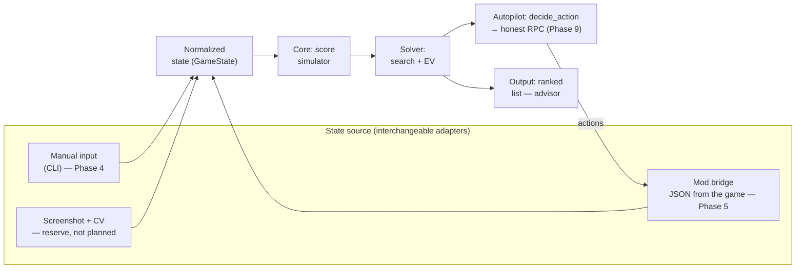

# Balatro bot — project plan

**Goal change (recorded in this revision):** the project used to be an advisor (the human
plays, the bot computes and explains) — that's cancelled. The new goal: a bot that clears
the game on its own at any difficulty without human involvement, i.e. one that reliably wins
on all 8 stakes (White…Gold). Section 2 below is rewritten around this goal; the reason for
the change and its consequences are there too. Advisor mode (`advise`/`doctor`/`watch`) is
not thrown away — it stays both as a standalone tool and as the source of decisions for the
autopilot: the autopilot doesn't replace the computation, it adds an action layer on top of
the already-computed advice and fills in the decisions that used to be left honestly to the
human.

Status: phases 0–2 and 4 are closed. Phase 3 — the scoring engine is ready (149 of 150
jokers), but verifying the numbers against the real game (task 3a) hasn't been done — needs
a Mac. Phase 5 is confirmed live on real macOS; phases 6–8 are done (exact discard EV, shop
and joker order, blind skip and economy). Phase 9 ("Autopilot") — subtasks 9.1–9.7 are done
(action loop, skip/shop/pack-opening, vouchers, Planet consumables, boss catalogue and score
fix, stake stickers, run-runner) plus improvements A1–A10, B1, C1, D1 and F1–F3 from section 9.8 — see
section 6, "Autopilot" subsection. Run 7 (RED/WHITE, 2026-09-01) is the **first autopilot
win** — beat Ante 8, 168 steps, zero mod rejections/timeouts/stalls, with A5/A6/A7/B1/D1/F1
all exercised live; it also surfaced the reroll churn A8/F2 (the bot burned ~$75 on 21
rerolls and visibly hung in the shop while re-evaluating). What's left: fix A8/F2 and re-run
the shakedown, Tarot consumables (C1), Arcana/Spectral/Standard packs, an unattended 24/7
mode, and the mass win-rate measurement itself (E1). The current state of
each phase and what's left — section 8.1; the improvement roadmap — section 9.8.
Development and gameplay platform: macOS (Apple Silicon / Intel), the Steam version of
Balatro.

---

## 1. Game choice: Balatro

Balatro was chosen deliberately, not just "because it's fun". It fits almost perfectly both
the advisor the project originally was and the autopilot it became (section 2) — both roles
need the same thing: a move has an exactly computable correct answer:

| Criterion | Balatro |
|---|---|
| Reaction / timers | None at all. A move takes as long as it needs. The bot can think for seconds and minutes |
| Determinism | Score computation is pure arithmetic with no randomness (except for individual jokers). A move has an **objectively best** option that can be computed |
| Decision space | Picking a subset (up to 5) of 8 cards is 218 options per hand, plus the "play or discard" decision, plus the shop. A human physically can't enumerate this; a machine does it instantly |
| Cost of a mistake | High: one wrongly chosen discard on Ante 8 kills the run |
| State access | The game is written in Lua + LÖVE 2D, there is a mature mod ecosystem, state is read straight from the engine |
| Legal aspect | A single-player offline game, no anti-cheat and no multiplayer that could be spoiled |

The key point: in Balatro **there is a correct answer**, and it can be computed. That sets it
apart from games where a "helper" slides into taste-based advice.

**Alternatives considered** (also turn-based, no action):

- *Slay the Spire* — excellent mod support, but strong ready-made bots already exist, and
  evaluating a move comes down to long-term strategy rather than score. Less "computability".
- *Into the Breach* — fully deterministic, but the moves are already transparent, a helper
  adds almost no value.
- *Luck be a Landlord* — close in spirit, but much simpler and with a smaller
  community/tooling.

Conclusion: **we build for Balatro**.

---

## 2. What exactly the bot does

### Milestones and how they map to phases

The single definition of versions in the document. Everywhere further down we refer only to
this.

| Milestone | Phases | What it can do |
|---|---|---|
| **v0.1 "Calculator"** | 0–4 | Manual state input, picking the best subset of cards with an exact score. First practical use |
| **v1 "Advisor"** | 5–6 | Plus auto-connection to the game and the "play or discard" decision. This is where the DoD of the old goal was met |
| **v2 "Shop"** | 7 | Plus purchases and joker order |
| **v3 "Strategy"** | 8 | Plus whole-run decisions (blind skip — done; economy — not) |
| **v4 "Autopilot"** | 9 | Plus an action loop through the mod's honest RPC methods and decisions where the advisor used to stay honestly silent (skip — yes/no, not numbers; shop — buy/don't buy, vouchers and packs; opening packs; consumables before a play; move legality under rule-modifying bosses). **The project's new goal** — section below |

### The new goal: autonomous clearing (Phase 9)

Recorded explicitly, because it changes the whole "What we deliberately do NOT do" section
below, which had been unchanged since the very start of the project.

**Success criterion:** the bot reliably wins (reaches Ante 8 and finishes off the final
boss) on each of the 8 stakes (`WHITE`…`GOLD`) separately — not "got lucky once", but a
measurable win-rate over N runs per stake, with a separate report per stake. Stakes in
Balatro are cumulative (confirmed from source, `game.lua`: `if self.GAME.stake >= K then
... end`) — `GOLD` includes all 8 modifiers at once (no money for the Small Blind,
accelerated requirement growth, Eternal/Perishable/Rental jokers in the shop, −1 discard).
Hence the shakedown order: bottom-up, `WHITE → RED → ... → GOLD`, not the hardest one
straight away — on the intermediate stakes it's easier to tell which of the 8 modifiers
sank a run.

**Launch mode — managed, not a daemon.** `balatro-bot autoplay --deck X --stake Y` plays one
run with honest actions to a win or a loss and stops with a report; a mass run of N runs per
stake is a wrapper on top of that same runner. Running around the clock unattended (24/7,
auto-restarting runs) is deliberately out of scope for now — it's a separate layer (a
watchdog for hangs, time/attempt limits) that can be added later on top of the
already-working managed loop without reworking it.

**Switching between advisor and autopilot — a mandatory requirement, not a side effect of
both modes existing.** Beyond `advise`/`doctor`/`watch` not being removed (section above) —
it must be possible to switch between them and `autoplay` on the fly: start a run under the
autopilot and take control back at any moment (finish playing by hand), or the other way
round — watch as advisor and hand the run to the autopilot to finish. Both modes read the
same state through the same bridge, so switching isn't a transfer of data between separate
systems, it's a question of who is currently pulling the actions (`play`/`buy`/...) — the
advisor doesn't do that at all. `autoplay` must be able to terminate cleanly (or pause) at
any moment between actions, not only at the end of a run — since the human must be able to
grab the wheel mid-game, not only between runs.

**Honest actions only.** The mod's RPC (`src/lua/utils/openrpc.json`) offers two different
classes of methods: game actions (`select`, `skip`, `play`, `discard`, `buy`, `sell`,
`use`, `reroll`, `next_round`, `cash_out`, `rearrange`, `start`) and cheats (`set` — set
money/ante/hands directly, bypassing the game rules; `add` — spawn any card; `load` — swap
in someone else's save). The autopilot uses only the first class — the same principle
already recorded in section 8 of the plan about seed analyzers ("Idea for later"): the bot
doesn't read the future and doesn't cheat, it only computes and acts within what a live
player has available. `set`/`add`/`load` stay available exclusively to test infrastructure
(`tests/fake_mod.py` and the like), as they are now.

### What v1 shows

Advisor, not autopilot. The player plays; the bot in a window next to it shows:

1. **Which cards to play** — a **ranked list** of options with a computed score and
   breakdown, not a single recommendation. The maximum score isn't always the best move:
   sometimes it's better to barely beat the blind, keeping hands and discards; sometimes to
   play weaker to level up the hand type you need. The choice stays with the player; the
   bot's job is to show what the number is made of.
2. **Play or discard** — comparing "play now" against the expected value of "discard N
   cards and play with the next hand".
3. **Whether the blind will be met** — "this hand gives 12,400, the blind is 30,000, over 2
   remaining hands we don't get there → we need to rebuild".

Points 1 and 2 are described here as two different kinds of advice — in the implementation
(section 6, Phase 6) it's long been one list: `solver.actions.rank_actions` merges plays and
discards into a single ranked output by descending score, because for the player it's one
and the same decision, "what to do now", not two lists to compare by eye.

**Definition of Done for v1:** given a state (hand, jokers, hand levels, blind) — within
<100 ms produce a ranked list of moves with a score breakdown that matches the game to the
last unit.

### A cross-cutting requirement: honest computation

In effect **starting from Phase 3** and extends to all subsequent phases. The core always
returns not only a number but also a **completeness flag for the computation**. If the input
state contains a joker, enhancement, or boss effect the engine doesn't know, the computation
is marked inexact, and the interface must show it. Silently returning a plausible but wrong
number is the worst possible outcome for an advisor.

**A third category from Phase 9: an explicitly flagged heuristic.** Until now a number had
two honest states — an exact computation (`exact=True`) or a refusal to compute at all (text
instead of a number, like `core/tags.py`/`ShopItem.effect` for things there's nothing to
compare with via a counterfactual). That was enough for the advisor: the decision stayed
with the human. The autopilot has to make the decision anyway — silence for it is equivalent
to a random choice, so a refusal stops being a neutral option. Hence a third state: an
expert estimate based on the game-sense of the effect (not computed via a counterfactual,
but assigned), which must be as clearly distinguishable from an exact number as `exact=False`
is now from `exact=True` — not the same field with the same semantics meaning "sample-based
estimate" (like `DiscardOption.exact`), but a separate one, because the inexactness here is
of a different kind: not an approximation of an exact number, but a constant with no
computation at all.

### What we deliberately do NOT do

- **We now do autoplay — this reverses the project's original decision.** Before this
  revision of the plan it said here "we don't do autoplay, it isn't needed for decision
  quality" — that was a deliberate boundary of responsibility (the human decides, the bot
  computes), not a technical limitation. The new goal (section 2, "Autopilot") requires
  exactly the opposite, and the decision is reversed on purpose, not by accident. The
  boundary moves to a different axis: not "who presses the buttons" but "by what methods" —
  see "Honest actions only" above.
- We don't read the run's seed ahead of time (see "Idea for later" in section 8) — even
  playing autonomously, the bot doesn't know the future shop/bosses in advance, only what a
  live player can see right now.
- We don't do ML/neural nets. Honest search + a simulator works here; it's more accurate and
  more explainable — that hasn't changed: the autopilot acts on the same solver computations
  that used to be shown to the human, just without the human in the middle.

---

## 3. Architecture

Three layers, strictly separated. The core knows nothing about where the state came from.
The action layer (autopilot, Phase 9) sits on top of the solver: it takes the solver's
output and executes it through the same mod bridge it read state from; the advisor just
displays that same output.



Why this way: **the scoring simulator is the most valuable and longest-lived part**. The way
state is obtained may change three times (the mod broke after a patch — we moved to CV); the
core is left untouched. So we build the core first, not the integration.

---

## 4. How to get the game state

Three options, in order of preference.

### Option A — the mod bridge (chosen, Phase 5)

Balatro is LÖVE 2D + Lua, all state lives in the global object `G`
(`G.hand`, `G.jokers`, `G.shop_jokers`, `G.GAME.blind`, `G.GAME.dollars`, ...).
A Lua mod serializes this to JSON and exposes it.

The macOS stack:
- [Lovely Injector](https://github.com/ethangreen-dev/lovely-injector) — a runtime Lua
  injector (M-series needs the `lovely-aarch64-apple-darwin` build). Only `liblovely.dylib`
  itself is needed: the mod's CLI sets it up via `DYLD_INSERT_LIBRARIES` on its own, no
  launch script required. You can't launch the game through Steam on macOS — a client bug
  gets in the way.
- [Steamodded](https://github.com/Steamodded/smods) — a mod framework; mods go into
  `~/Library/Application Support/Balatro/Mods`.

**Important: most likely there's no need to write a mod from scratch.** There's already
[`coder/balatrobot`](https://github.com/coder/balatrobot) (MIT) — a mod that brings up a
**JSON-RPC 2.0 HTTP API** over the game: it exposes state and accepts actions (card
selection, shop purchases, blind selection). There are alternatives too (a mod that dumps
state to a file every frame). The plan is to take the ready thing as transport and put our
effort into the brains, not the bindings.

**The spike (Phase 1) is done early and out of order:** install this on the specific Mac and
confirm it comes up with the current game version. The spike doesn't block Phases 2–4, but
it must be passed before Phase 5 starts, otherwise by then the investment will have gone
into a non-working path. On success the spike **pins specific versions** of the game,
Lovely, Steamodded, and the mod — over the course of Phases 2–4 they may update.

Risks:
- Steamodded **disables Steam achievements by default** (protection against accidental
  farming). It's restored with a toggle in the in-game mods menu, but you need to know this
  in advance.
- A Balatro update on Steam may temporarily break Lovely/Steamodded — you'll have to wait
  for the mods to update. Hence the rule: you can play without the bot too, the bot must not
  be mandatory.

### Option B — computer vision (reserve, not in the roadmap)

Capturing the game window + card recognition. Upside: doesn't touch the game at all,
achievements are intact. Downside: much more expensive to develop and fragile. **Deliberately
not planned** — the task starts only if Phase 1 failed and the mod path is closed. Cards in
Balatro are visually high-contrast, template matching is realistic, full OCR isn't needed.

### Option C — manual input (Phase 4, needed in any case)

A CLI/TUI where the hand is entered as a string like `AH KH QH 7C 7D 3S 2S 2C`, jokers by
name. This is **not a crutch**: it lets us develop and test the core without depending on
mods, and it stays forever as a debug mode.

An important limitation to understand right away: manual input gives a full answer to "which
cards to play", but **doesn't give the exact composition of the remaining deck**. This
directly hits Phase 6 — see section 6.

---

## 5. The core: the score-computation simulator

This is the heart of the project. Score = `chips × mult`, but both factors are assembled in
a strictly defined order, and the order matters (adding before multiplying gives a
completely different result).

The computation order to reproduce:

1. **Determine the hand type** from the played cards → base chips/mult **at the current hand
   level** (levels are raised by Planet cards, so hand levels are part of the state, not a
   constant). Account for detection modifiers: `Four Fingers` (a flush/straight from 4
   cards), `Shortcut` (a straight with gaps), `Smeared Joker` (suits pairwise equivalent),
   Wild cards, secret hands (Five of a Kind, Flush House, Flush Five).
2. **Boss blind debuffs** — which cards are disabled and don't count.
3. **Played cards left to right**: card chips (2–10 = face value, J/Q/K = 10, A = 11),
   enhancements (Bonus, Mult, Glass, Steel, Stone, Gold, Lucky), editions (Foil,
   Holographic, Polychrome), seals; retriggers (red seal, `Hanging Chad`, `Dusk`, `Hack`).
4. **Cards left in hand** (Steel, `Baron`, retriggers from `Mime`).
5. **Jokers left to right** — in their slot order. `Blueprint`/`Brainstorm` copy their
   neighbours, so the order is an optimization task in its own right.
6. **Finalize** — the product, with rounding. The exact rounding rule and the behaviour on
   very large numbers are **checked against the sources**, not assumed: it isn't always a
   plain `round`.

### Where to get the exact data

Don't write out 150+ jokers by hand from memory — that's guaranteed errors. The game's
sources are right there on disk:

```
~/Library/Application Support/Steam/steamapps/common/Balatro/Balatro.app/Contents/Resources/Balatro.love
```

This is a plain zip. Inside — Lua code: the `G.P_CENTERS` tables (all jokers, enhancements,
editions), the poker-hand values, the score-computation function. The plan is to
**generate the joker catalogue with a script from the game's sources** and keep it as data,
describing only the effect logic in code. This is also the reference for checking the
computation order and the rounding rule.

A planning consequence: **Phase 3 requires access to an installed game.** Without the game
files it can be started (the engine skeleton) but not closed.

### Correctness check

Golden tests: a set of real situations from the game (hand + jokers + levels) and the exact
score the game showed. The core must match to the unit.

**Collecting these cases is a separate piece of manual work by a human at the game**, not a
by-product of writing code. It's carried into the roadmap as an explicit Phase 3 task,
because without it the readiness criterion for Phase 3 is unreachable in principle.

---

## 6. The solver

### Hand selection (Phase 4)

A search over all hand subsets of size 1–5: from 8 cards — 218 options; with an increased
hand size (`Juggler` gives +1 card, there are other sources) — up to ~640 at ten cards. Each
subset is run through the simulator. Full search, no heuristics — fractions of a
millisecond.

The result isn't a single "best" hand but a ranked list with a score breakdown (see
section 2).

### Play or discard (Phase 6)

The expected value of a discard is computed by Monte-Carlo: sample N draws, compute the best
possible score for each, average. Compare against "play now", taking into account how many
hands and discards are left before the blind.

**Accuracy depends on the state source**, and this must be shown honestly in the interface:

- **With the mod bridge (Phase 5)** the composition of the remaining deck is known exactly —
  we see the whole deck and every card that's gone. The estimate is correct.
- **With manual input** the exact deck composition isn't available: the deck changes over
  the run (cards added, removed, upgraded), and tracking it by hand is unrealistic. We work
  on the assumption of a standard 52-card deck minus what's been seen this round, and mark
  the result approximate.

Hence the phase order: **Phase 6 comes after Phase 5**, because it only becomes fully
capable with an automatic state source.

### Consumables before a play (discovered in a session, wasn't in the original plan)

The solver doesn't know about Tarot/Planet cards sitting unused in the inventory
(`consumables` in the mod's state) — and they can be used before a play and change the
result. Two cases of very different size:

- **Planet cards** — a small mechanical task: raise the level of the needed hand by 1 using
  the existing tables and recompute with the same engine. The same pattern as the joker
  order search. **Done** — `solver/consumables.py`, Phase 9.4 (section 6, "Autopilot",
  item 9.4).
- **Tarot cards** — an order of magnitude larger: ~22 different effects, many of which don't
  add a number but transform cards (`Death` — picking a "donor/target" pair of cards, a
  search dimension on top of the existing one). Comparable in scope to implementing new
  jokers. Not started (improvement C1); `Death` has already turned up in the inventory live.

Not tied to a phase number: essentially closer to Phase 4 (affects the current play, not the
shop), but it surfaced after the phase numbering was already fixed.

### Shop and joker order (Phase 7)

- Joker order: a permutation search with pruning (for 5 slots — 120 options, computed
  instantly) on a representative hand. **Done** — `solver.play.rank_joker_orders`.
- **Purchasing (done)** — `solver.shop.evaluate_shop`. The mod exposes the real, not a
  hypothetical, shop (`GameState.shop`/`shop_vouchers`/`shop_packs`, only in phase `SHOP`) —
  there's no need to compute the probability of what might roll, exactly as with the skip
  tags ("Run strategy" section below). For jokers the estimate is the same counterfactual as
  the joker order: add the candidate to the current jokers and see how much `advise().best`
  grows, only not on the player's single hand (there is none in phase `SHOP` —
  `GameState.hand` is empty), but averaged over `SAMPLE_HANDS = 12` representative hands from
  the deck (`full_deck` in the narrow case, otherwise `standard_deck()` with an honest
  `exact_deck=False` marker). A joker the game doesn't know gets `expected_uplift=None`, not
  a guess. Vouchers and packs get no estimate at all — a deliberate decision, not a gap: a
  voucher changes the run's rules wholesale (discounts, slots, odds), not the score of one
  hand, there's nothing to compare with via a counterfactual; instead of a number — the live
  effect text from the game itself (`ShopItem.effect`, the same `value.effect` field that
  gives `JokerCard.current_value` elsewhere). **The economy adjustment (done)** —
  `JokerOffer.interest_lost`: buying a joker also means forgone interest at the end of the
  next round, not only `item.price`. The formula (`solver.shop._interest`) is written out
  from the game's `functions/state_events.lua`, not from memory: `interest_amount *
  min(floor(dollars/5), interest_cap/5)`, defaults `interest_amount=1`/`interest_cap=25`
  from `game.lua`. Dollars and points are deliberately not collapsed into one number (the
  same principle as `core/tags.py`) — `interest_lost` is shown next to `expected_uplift`,
  not subtracted from it. Two honestly acknowledged incompletenesses: the figure is only
  about the next round-end, not the whole rest of the run (that needs knowing the number of
  remaining rounds — already Phase 9 scope, not a shop-screen thing), and it assumes the
  default $25 cap because `GameState` doesn't store already-redeemed `Seed Money`/`Money
  Tree` (which raise the cap to $50/$100) — so it's an honest lower bound, not an
  overestimate. The one explicitly tracked special case is `Green Deck`
  (`GameState.deck_type == "GREEN"`), where `game.lua` disables interest outright: there
  `interest_lost` is a guaranteed zero, not an approximation. **Not verified live on a Mac
  yet**: over the course of development the game never reached the `SHOP` phase — only
  `doctor` on an empty shop (not in phase `SHOP`) is confirmed not to crash. Verification
  against a real joker offer is an open task, not completed work.

### Run strategy (Phase 8)

A full run simulation (running thousands of runs with different policies, selecting the best
rules) isn't the first step but the last: without working heuristics for individual
decisions (blind skip, shop, economy) there's nothing to simulate with — the policy for the
simulation comes from exactly those.

**Clarification (session 2026-08-27): "simulation" means running the real game through the
autopilot, not our own offline rules engine.** Stated and recorded explicitly so it isn't
read two ways in future sessions: our own simulator would require guessing the generation
odds for the shop/deck/bosses — exactly what `solver/skip.py`/`solver/shop.py`/
`solver/discard.py` have consistently refused to do (compute only from what the game
actually showed, never model randomness in advance). "Run a thousand runs" means literally
playing a thousand real runs with the bot through the bridge to the mod and looking at the
win statistics — so this item **hard-depends on the autopilot's action loop (Phase 9, not
yet started)**, it's not just last in order: there's technically nothing to play on before
that.

**Blind skip (done, the first slice of the phase)** — `solver/skip.py`, `evaluate_skip()`.
The key observation: the blind-select screen isn't the place to guess probabilities. The mod
already exposes the real state: the requirements of all three ante blinds
(`GameState.blinds["small"/"big"/"boss"]`) and the exact text of the tag you'd get on a skip
(`Blind.tag_name`/`tag_effect`), not a distribution of possible tags. So this isn't a
simulation but an honest analysis of an already-known choice — the same principle as
`advise_discard`/`rank_joker_orders`: don't guess, compute from what's actually visible.

The function doesn't collapse the decision to a single made-up number — some tags (a free
joker, a voucher, a pack) can't be converted to points or dollars at all without an
arbitrary utility valuation. Instead of a verdict — laid-out numbers: how many times heavier
the next ante blind is than this one (`requirement_ratio`, no play — on the blind-select
screen there's no hand yet), the guaranteed minimum money for a win (`_BASE_REWARD`:
`bl_small=$3`, `bl_big=$4`, written out from `game.lua`, not from memory), and the tag's
contents as-is. The exact dollar value of a tag (`tag_dollars`) is computed only where the
formula doesn't need a run-level counter that the mod never sends (only `round.*`, per
round): `Investment Tag` ($25, conditional on beating this ante's boss) and `Economy Tag`
(`min($40, current money)`) — exact; `Handy`/`Garbage`/`Skip Tag` need a run-total count of
hands/discards/skips — `tag_dollars` for them is honestly `None`, not a guess. The catalogue
of all 24 tags (`core/tags.py`, `TAGS`) is written out from the game's source (`game.lua`
`tag_*`, `tag.lua` `Tag:apply_to_run`) the same way as jokers — a structural description of
what a tag mechanically does, with no utility valuation.

Wired into `doctor`/`watch` (`render_skip_advice`), not `advise`: on the blind-select screen
`GameState.hand` is empty, there's nothing for `advise()` to compute on.

**Verified live on a Mac** 2026-08-22: a real Big Blind with an Investment Tag (ante 1) —
the numbers matched a hand calculation ($4 guaranteed for playing versus $25 conditionally
for skipping), the decision was discussed and confirmed separately from the code.

Joker purchasing moved to Phase 7 ("Shop and joker order" section above) — it's about the
shop specifically; what stays here is the more general economy (interest, reroll timing) and
the full run simulation after it.

**Interest — done in Phase 7** (`JokerOffer.interest_lost`, see the "Shop and joker order"
section above).

**Reroll timing (done, honestly limited scope).** `GameState.reroll_cost` — the live reroll
price right now, from the mod's `round` area (`reroll_cost`, the same area as
`hands_left`/`discards_left` — read live from `tests/fixtures/gamestate.json`, not from
memory). `ShopAdvice.reroll_cost` shows it next to the evaluation of the current shop offer
(`solver/shop.py`, `doctor`/`watch`). The bot deliberately goes no further: an honest "is a
reroll worth it" estimate would require knowing the distribution of what might roll instead
of the current offer (`joker_rate`, rarity odds from `game.lua`) — a computation over a
probabilistic model of what doesn't exist yet, rather than over what the game already
showed, different in spirit and risky in scope compared with the rest of this module. The
same principle as `solver/skip.py`: laid-out numbers, not a made-up verdict.

### Autopilot (Phase 9)

Depends on the entire finished decision core (Phases 4–8) — it doesn't recompute them, it
builds an action layer on top and closes the decisions that used to be left honestly to the
human. The project's new goal and its scope — section 2. The order of the subtasks below
isn't a strict sequence (dependencies matter more than numbers, as everywhere in this
document), but 9.1 and 9.5 logically come first: without an action loop there's nothing to
execute decisions with, and without the boss catalogue the autopilot can honestly compute an
illegal move and get stuck trying to play it.

**9.1. The action loop and honest bridge calls.** `ModBridge` can already assemble
`game_state()` and formally has client methods `play()`/`discard()`, but nobody calls them
(see CLAUDE.md). The mod exposes far more actions than are used now — the whole list checked
against `openrpc.json` (section 2, "Honest actions only"): `select`/`skip` (blind-select
screen), `play`/`discard` (a play), `buy`/`sell`/`reroll`/`next_round`/`cash_out` (the
shop), `use` (a consumable, optionally with target cards), `rearrange`
(hand/joker/consumable order — needed to apply the result of `rank_joker_orders`, which the
solver already computes but which nobody applies), `start` (a new run with a chosen deck and
stake). The loop itself is a finite state machine over `GameState.phase`: on each phase a
concrete decision (from the finished solver, where it's already exact; from the new subtasks
below, where there used to be an honest refusal) → one RPC call → read state again. The same
poll-and-compare-states pattern already present in `ui/tui.py` for `watch`, except `watch`
ends with polling and the autopilot with an action.

This directly implies the switching requirement (section 2): since both modes read state the
same way and differ only in who pulls the actions, `autoplay` must check a "pause/takeover"
switch between every action of the loop (not only between runs) and, when paused, behave
like `watch` — show the same thing, touch nothing — until control is handed back.

**Done (`SELECTING_HAND` — play/discard).** `balatro_bot/autopilot.py`:
`decide_action(state)` at its base takes the top-1 from `solver.actions.rank_actions` (the
same list the human sees in `advise`/`watch`) and translates the chosen cards into the
0-based indices the mod's RPC expects (`ModBridge.play`/`.discard`). **A correction added
after a live run:** `rank_actions` compares plays and discards by expected value, and for a
discard it's optimistic by construction (`ActionOption.exact = False`), so "discard toward a
flush" often shows a bigger number than "play this two pair" — even when the pair already
guarantees clearing the blind. The human sees the "hits the blind" marker and isn't fooled;
the autopilot, though, traded a certain win for a gamble (live: discarding all four discards
where the current hand already cleared ante 1). Now `decide_action` first checks
`advise(state).cheapest_sufficient` — the most economical move whose **lower bound**
(`Candidate.beats`, not the mean) already covers the remaining requirement — and plays it;
the top-1 of `rank_actions` (possibly a discard) is taken only when there's no guaranteed
move. Not a new score computation, but a "certain over probable" priority, the same
principle as `decide_skip`.
`ui/tui.py.autoplay()` — the same poll loop as `watch`, plus a "pause/takeover" switch on
the `p` key (not a separate command — pressed while it's running), checked on every
iteration, i.e. between every individual action, not only between runs — that same
requirement above, recorded as mandatory. Real keyboard input is read via `termios`/`tty` in
cbreak mode (standard library, no new dependencies); if stdin isn't a terminal, the switch
quietly disables itself instead of crashing, and the autopilot keeps working without it. A
mod rejection of an honestly computed move (e.g. a boss restriction that `_is_legal_play`
doesn't cover yet) doesn't bring down the loop — it prints the error and keeps polling with
the same state.

**Done (`BLIND_SELECT` — blind skip, the first slice of 9.2).** `autopilot.decide_skip(advice)`
— an extremely conservative policy on top of the already-computed `evaluate_skip` numbers,
not a new computation: skip only if `SkipAdvice.tag_dollars` is known exactly (currently
only `Investment`/`Economy Tag`) and strictly exceeds `play_reward_min`. Structural tags (a
free joker/voucher/pack) never trigger a skip on their own — not because they're worthless
(a common experienced choice is exactly to skip for them), but because valuing them in
dollars here would mean guessing. When a skip isn't proven by a number (including the case
where skipping isn't even possible — the Boss Blind is next) — the decision is `select`,
play. `ModBridge.select()`/`.skip()` — new client methods (parameterless RPC, `openrpc.json`
confirms: the mod knows which blind is being selected). Tests —
`tests/test_autopilot.py` (`TestDecideSkip`, `TestDecideActionНаВыбореБлайнда`),
`tests/test_tui.py::TestAutoplay`, `tests/test_mod_bridge.py::TestКлиент`.

**Done (`SHOP`/`ROUND_EVAL` — the shop, the second slice of 9.2).** Between "won the round"
and "entered the shop" there's a `ROUND_EVAL` phase ("collect the round reward") — there's
nothing to decide there, but without an explicit `cash_out` the autopilot would be stuck
there forever, exactly as without `select`/`skip` on blind-select; `decide_action` calls it
unconditionally. In the shop the joker-buying policy is as simple and honest as possible:
buy the best one by uplift (`solver.shop.evaluate_shop`'s `expected_uplift`, already sorted
descending) if it's known to the engine (`known`), affordable (`affordable`), has a slot
(`has_slot`), and the uplift is strictly positive — all four flags are already computed in
`evaluate_shop`, not a new heuristic. `interest_lost` (forgone interest, "Shop and joker
order" section) deliberately plays no part in the "buy or not" decision — a quantity
incommensurable with a score uplift (dollars versus points, the same principle as
`decide_skip`), only shown to the human alongside. A purchase — at most one per
`decide_action` call: `evaluate_shop`'s counterfactual for a second joker doesn't account
for the first one just bought (jokers like `Blueprint` depend on neighbours), so it's right
to recompute after each purchase — the poll loop re-reads state every iteration anyway, the
next joker's score will be honest on its own. When there's nothing left to buy — the
decision is `next_round`, leave the shop. Vouchers, packs, and reroll were deliberately
untouched in this slice of 9.2 — `evaluate_shop` didn't give them a numeric estimate then;
later the autopilot learned to buy packs and vouchers (improvements A3/A4, paragraph below),
reroll — still not (A5, section 8 of the plan, "Reroll timing").
`ModBridge.buy()`/`.next_round()`/`.cash_out()` — new client methods (`buy` multiplexes
`card`/`voucher`/`pack` per the mod's schema, only `card` used here). Tests —
`tests/test_autopilot.py` (`TestDecideActionНаRoundEval`, `TestDecideActionВМагазине`),
`tests/test_tui.py::TestAutoplay`, `tests/test_mod_bridge.py::TestКлиент`.

Later (improvements A1–A4, item 9.8) this branch grew: **A2** — the joker-buy threshold
raised from "> 0" to 3% of the next blind's requirement (`_worth_buying`); **A4** — buying
vouchers across all three honesty tiers (`_decide_voucher_action`); **A3** — buying a
Celestial pack from the shop (the same branch as Buffoon); **A1** — sell-replace when slots
are full (`_decide_replace_action` sells the weakest non-eternal joker under a noticeably
better offer). The current branch order in `_decide_shop_action`: buy a joker → buy a
voucher → buy a Buffoon/Celestial pack → sell-replace → leave (`next_round`). Details of all
four — item 9.8.

**Done (`PLANET_PACK` — opening a Celestial/Planet Pack, the third and last slice of 9.2).**
`solver/pack.py`'s `evaluate_pack(state)` computes the same counterfactual as jokers in the
shop (`_evaluate_joker_offer`): raise the level of the needed hand type in a copy of
`GameState.hand_info` (`_level_up`, the step from the already-verified
`core.hands.PER_LEVEL_VALUES`), recompute `advise()` on representative hands (the same
sample as in `solver/shop.py` — `GameState.full_deck` if known exactly, otherwise the
standard deck), take the difference from the old score. `PLANET_HAND_TYPES` — a "planet key
-> hand type" table for all 12 planets, written out from the already-verified effect texts
in `core/catalogue.py` (`c_pluto`, `c_mercury`, ...), not from memory; coverage (all 12 hand
types exactly once) is checked by `tests/test_pack.py`. The autopilot's policy
(`_decide_pack_action`) is simpler than skip/shop: raising a hand level can't by construction
worsen the best achievable score (it's purely additive chips/mult for one specific type,
taking nothing from the others) — so there's no "is it worth it" question here at all, only
"which of the offered cards"; `skip_pack` is only a defensive case when the pack contained
no recognized planet. Jumbo/mega packs (1 of 5 / up to 2 of 5) needed no separate branch:
the poll loop re-reads state every iteration anyway, and if the pack stays open after one
pick, the next pick is recomputed on the already-updated state. The new bridge client method
is `ModBridge.open_pack(*, card=None, skip=None)` (the mod's RPC method is called `pack`,
renamed on the client to avoid confusion with `buy(pack=...)` — that's a pack index in the
shop, a different concept). `GameState.pack` — a new area (`ShopItem`, the same shape as
`shop`/`shop_vouchers`/`shop_packs`). Rendering — `render_pack_advice`, shown in
`doctor`/`watch`/`autoplay` unconditionally, like the other kinds of advice. Tests —
`tests/test_pack.py` (the computation itself),
`tests/test_autopilot.py::TestDecideActionНаВскрытииПака`, `tests/test_tui.py::TestAutoplay`,
`tests/test_mod_bridge.py::TestКлиент`/`TestРазборСостояния`.

All four parts (`SELECTING_HAND`/`BLIND_SELECT`/`SHOP`+`ROUND_EVAL`/`PLANET_PACK`) — **not
verified live on a Mac**, so far only against the fake mod (`tests/fake_mod.py`, which
simulates neither a real play nor a real transition between phases).

Any phase other than those listed above (opening a Tarot/Spectral/Standard/Buffoon pack,
`TAROT_PACK`/`SPECTRAL_PACK`/`STANDARD_PACK`/`BUFFOON_PACK`) still deliberately returns
`None` — the decisions there aren't closed yet, the autopilot does nothing on them, exactly
like `watch`.

**9.2. Closing decisions without a ready verdict — fully closed.** Blind skip, shop joker
purchasing, and opening a Celestial/Planet Pack are done above. The other pack types
(Arcana/Tarot, Spectral, Standard, Buffoon) are a separate task, see 9.3/9.4 below: they
don't reduce to the same simple counterfactual (they transform specific cards or contain RNG
this pack doesn't have).

**9.3. Valuing vouchers and packs.** The 32 vouchers were analyzed against
`card.lua`/`game.lua` (`Card:apply_to_run`, the `v_*` table in `game.lua`) into groups by
how honestly they can be valued — not binary "we compute / we don't", but across three
tiers, per the new third honesty category above:
  - **Exact computation, no new assumptions — done (`solver/vouchers.py`).** `Grabber`/
    `Nacho Tong` (+1 hand per round each, verified against `card.lua`: `config.extra` really
    is added, doesn't set an absolute value) are valued as the plain average best score
    (`advise().best.score`) over representative hands — no baseline subtracted, an extra hand
    creates a wholly new play opportunity rather than improving an existing one. `Paint
    Brush`/`Palette` (+1 hand size each) — by the same counterfactual as jokers in
    `solver/shop.py`: one sample of a hand of size `_HAND_SIZE + 1`, the score with it and
    the score over the first `_HAND_SIZE` cards of the same sample, the difference — so the
    uplift is measured over the one specific added card, not over two independently sampled
    hands. `Wasteful`/`Recyclomancy` (+1 discard per round each) — the one case in this
    group that's honestly **no longer quite "no new assumptions"**: the value is measured
    only through `rank_single_discards` (the one discard size whose exact search is always
    cheap), not through the full `rank_discards` up to five cards — that's an order of
    magnitude more expensive per sample and doesn't fit a shop-visit budget (~1.5 s for 4
    vouchers in a live measurement). The number is an honest lower bound
    (`VoucherOffer.note` says so directly), not an overestimate: a real multi-card discard
    could be worth more.

    **`Hieroglyph`/`Petroglyph` — honestly deferred, not done.** An earlier revision of this
    plan item assumed that "per-ante blind requirements" were already computed by existing
    pieces — during implementation it turned out they aren't: nowhere in the project is
    there a formula for a blind requirement by ante number (`get_blind_amount(ante)` in
    `functions/misc_functions.lua` — an exact, deterministic table for antes 1–8 and a power
    formula beyond, but it also depends on the stake and the deck, which aren't accounted
    for anywhere either). Building it now is noticeably more scope than "just one more
    voucher", so `Hieroglyph`/`Petroglyph` fall into the same honest `None` with an
    explanation as tiers two and three below, rather than being silently skipped or given a
    wrong estimate.
  - **A dollar formula with an explicit horizon — done (`solver/vouchers.py`).** `Seed
    Money`/`Money Tree` (`core.economy.interest_cap`) are valued as `(interest at the new
    cap − interest at the old cap) × horizon`, where the horizon isn't an invented "until
    the end of the ante" in words but a computed number: how many of this ante's blinds are
    not yet `DEFEATED` in `GameState.blinds`. The one explicitly flagged assumption is that
    the money total at each future round-end stays roughly what it is now (it may actually
    grow or shrink). `Reroll Surplus`/`Reroll Glut` are valued noticeably more narrowly:
    only the saving on the *next* reroll at the current `GameState.reroll_cost`, not on
    every reroll to the end of the run — the same partiality that `JokerOffer.interest_lost`
    already had. `Clearance Sale`/`Liquidation` (`core.economy.discount_percent`) are valued
    against the goods already shown in this shop visit (`GameState.shop` + `shop_packs`),
    not against projected future visits — the horizon is again taken from what's shown, not
    invented; inverting an already-discounted price back to the undiscounted base (needed
    only if a discount is already partly active) is an approximation of a few dollars
    because of the `floor()` in the game's own price formula, `VoucherOffer.note` says so
    directly.

    **A side finding and fix: `GameState.used_vouchers`.** To compute the "current
    cap"/"current discount" exactly at all rather than by default, we needed to know which
    vouchers have already been redeemed this run — the field exists in the mod's schema
    (`openrpc.json`'s `GameState.used_vouchers`), but the bridge never parsed it. Added
    (`adapters/mod_bridge.py`, `core/economy.py` — the shared interest/discount formula,
    extracted from `solver/shop.py` so two places with the same logic don't drift). This
    also closes an earlier honestly acknowledged assumption in `solver/shop.py`'s
    `JokerOffer.interest_lost`, which used to always assume the default $25 cap precisely
    because this field wasn't there.
  - **A heuristic constant — done (`solver/vouchers.py`).** `Hone`/`Glow Up` (edition odds
    in the shop), `Tarot`/`Planet Merchant`/`Tycoon` (consumable frequency),
    `Overstock`/`Overstock Plus` (+1 shop slot), `Crystal Ball` (+1 consumable slot),
    `Antimatter` (+1 joker slot), `Telescope`/`Observatory` (a Celestial pack always
    contains the needed planet / a mult bonus from planets in the inventory) — all 12 change
    future RNG or future decisions, there will never be an exact number; they got not
    silence but an explicitly separate field `VoucherOffer.heuristic_value` (not
    `expected_uplift` — section 2, "Third category": the inexactness here is of a different
    kind than an approximate computation, so the field must be structurally different too,
    not the same one with a flag). The numbers are ranked by the game-sense of the effect,
    not computed: a joker slot (`Antimatter`) is ranked highest, `Observatory` lowest (it
    helps only while the needed planet actually sits unused in the inventory);
    `render_shop_advice` labels them "экспертно", not "прирост", so they don't visually mix
    with the first two tiers. The run-runner (9.7) will give a measurable win-rate against
    which these twelve numbers can and should be revised.

    A side finding was also fixed: `v_blank` ("Does nothing?" in the game's own text) — not
    a heuristic but a fact confirmed against `card.lua` (`Card:apply_to_run` does nothing
    for it beyond an achievement check), so it got an exact `expected_uplift = 0.0`, not a
    guess. The other vouchers not even mentioned in this tier's original list
    (`Director's Cut`/`Retcon` — Boss Blind reroll, `Illusion`/`Magic Trick` — buying
    playing cards, `Omen Globe` — a Spectral in an Arcana Pack) stay honestly `None`.

  **Packs — Celestial and Buffoon are done.** The shop shows only the type and price; the
  contents are generated on opening — a counterfactual *before the purchase* is impossible,
  only an expected value over the pool.
  - **Opening** (`solver/pack.py`, `evaluate_pack`, phases `PLANET_PACK`/`BUFFOON_PACK`):
    Celestial/Planet — an exact hand level-up via the existing tables; Buffoon — the jokers
    are *visible*, no RNG, the same counterfactual as a shop joker (`solver.shop.joker_uplift`,
    extracted into shared code). A planet can't worsen the score → always take the best one;
    a bad joker can → take one only on a strictly positive uplift and a free slot, otherwise
    `skip_pack` (`autopilot._decide_pack_action`).
  - **Purchasing** (`solver/shop.py`, `PackPurchaseOffer` in `ShopAdvice.packs`): Buffoon
    only, via an honest expected value of the pack mechanic — `joker_uplift` over
    `PACK_JOKER_SAMPLE = 24` random implemented jokers (once per shop visit), then a cheap
    resample `_monte_carlo_pack` "best `choose` of `extra`" by pack size (Normal 2/1, Jumbo
    4/1, Mega 4/2, from `game.lua`). An early version took a lower bound — the mean uplift of
    one random joker, always positive, which made the autopilot buy every pack (3 of 4
    bought live were then skipped); replaced after live run 5.
    `autopilot._decide_shop_action` buys a Buffoon pack (`Action.kind = "buy_pack"` →
    `ModBridge.buy(pack=...)`) if there are no jokers worth taking, the estimate is
    positive, there's a slot, and it's affordable.
  - `TAROT_PACK`/`SPECTRAL_PACK`/`STANDARD_PACK` — nothing to value them with (they need the
    consumable/deck-card mechanics, the next item), but the autopilot takes `skip_pack` on
    them rather than getting stuck.
  - A Celestial pack *in the shop* (purchasing) is valued — by the same technique as Buffoon
    (an expected value over the 12 planets, `_planet_uplift_pool` + `_monte_carlo_pack`),
    improvement A3 (item 9.8).

**9.4. Consumables and hand preparation before a play — the Planet slice is done
(`solver/consumables.py`).** The "Consumables before a play" section above was marked
"discovered live, not done" with no phase attached — now it's a direct dependency of the
autopilot. A new state area `GameState.consumables` (the mod sends it for the whole run, not
just on one phase like `shop`/`pack`) gives the list of Tarot/Planet/Spectral cards in the
inventory.

Planet cards turned out even simpler than expected: mechanically it's the same level-up as
picking a card from a Celestial Pack (`solver.pack.level_up`, now a public function, reused
rather than duplicated), but here there's a real current hand (`SELECTING_HAND` always
provides one) — instead of sampling representative hands, as in `solver/pack.py`/
`solver/shop.py`, an exact `advise()` is computed directly on the real hand cards twice
(without the level / with the level). This is an honestly incomplete figure: the uplift is
computed only for *this* hand, not for every future play of this type in the rest of the run
(the same principle as `JokerOffer.interest_lost` — only the nearest, not the whole
horizon), so the autopilot's policy doesn't wait for a positive number — it uses any Planet
card it finds right away, exactly like `_decide_pack_action` in 9.2 (a level-up can't worsen
the score).

**A side finding: `v_observatory` creates a real but uncomputed trade-off.** This voucher
(the third honesty tier, `solver/vouchers.py`) gives X1.5 mult per *unused* Planet card in
the inventory that matches the type of the hand being played — so using the card now may
cost a repeatable bonus for the sake of a one-time level-up. The bonus itself isn't
implemented anywhere in the scoring engine (only text in `core/catalogue.py`, not a formula
in `core/scoring.py`), so there's nothing here to compare "use" against "hold" —
`PlanetConsumableOffer.note` honestly warns about this if `v_observatory` is redeemed,
rather than staying silent about a real trade-off. The new bridge client method is
`ModBridge.use(consumable, *, cards=None)` (`openrpc.json`'s `use`; Planet cards don't use
`cards` — no targets needed).

**Tarot cards are still untouched** — comparable in scope to implementing new jokers: ~22
different effects, some of which don't add a number but transform specific cards (`Death` —
donor/target, a search dimension on top of the existing one).

**9.5. Rule-modifying bosses — catalogue, legality filter, and score fix all done.**
Assumption #10 (section 8.3) used to be "silently wrong advice" that a human would catch.
For the autopilot it isn't a minor defect: the bot can honestly compute an illegal move and
try to play it via `play`, get a mod rejection, and not know what to do next. **The
catalogue is done** — `core/bosses.py`, all 28 boss blinds (`game.lua`'s `P_BLINDS`, `bl_*`
keys; `bl_small`/`bl_big` aren't in there, they're ordinary blinds), written out from
`blind.lua` (`Blind:debuff_hand`/`modify_hand`/`press_play`/`set_blind`/`disable`, dispatched
on `self.name` — the English identifier from `game.lua`, the same one the mod sends as
`BlindInfo.name` regardless of interface locale) and `functions/state_events.lua` (an
addendum for `The Serpent`), not from memory — the same pattern as `core/tags.py`. Coverage
— `tests/test_bosses.py`, 28 keys exactly once (the same principle as `test_tags.py`).

Of the 28 bosses, only three actually hit the *composition of a specific play*
(`BossEffect.restricts_legal_plays=True`, flagged in the catalogue): `The Mouth` (only one
hand type for the whole round), `The Eye` (can't replay an already-played hand type),
`The Psychic` (can't play fewer than 5 cards). The rest are either already honestly
reflected by live state fields with no separate code (`The Water`/`The Needle` —
`discards_left`/`hands_left`; `The Manacle` — the size of the live `GameState.hand`), or the
generic suit/rank/face debuff case (`Card.debuffed`, already working — the assumption "a
debuff doesn't affect the hand type" confirmed live, `The Goad`, section 8.3 #4), or purely
visual (face-down cards for `The Fish`/`The House`/`The Mark`/`The Wheel` — they don't
change the hand composition the bot sees through the mod), or economic side effects with no
influence on the score (`The Tooth`: −$1 per card; `The Ox`: zeroing out money; `The Hook`:
a forced discard of 2 cards after a play) — honestly recorded in `summary`, but they block
no move.

**`The Flint` — fixed.** The base hand chips and mult are halved during scoring
(`floor(x*0.5+0.5)`, minimum 1 for mult and 0 for chips — from `blind.lua`'s
`Blind:modify_hand`) — this was **implemented nowhere in `core/scoring.py`**, i.e. under
this boss the bot overstated the score by roughly 2x, not merely risked proposing an
illegal move. Discovered while building the catalogue, wasn't a separate assumption item
before. Fixed in `core/scoring.py._apply_boss_score_modifier`, step 1.5 of the pipeline
(section 5) — with one honestly acknowledged incompleteness: in the game The Flint fires
after hand-level jokers like `Joker` (unconditional / hand-conditional bonuses) but before
individual card scoring; our pipeline evaluates jokers as the last step for the sake of
`Blueprint`/`Brainstorm`/`XMult` ordering, and that "before/after" split can't be reproduced
exactly — with no jokers in play the result is exact, and with any joker the calculation is
honestly marked `unknown` rather than silently under- or over-counting the real effect.
Tests — `tests/test_scoring.py::TestБоссФлинт`.

**The illegal-option filter in `solver/play.py` — done.** `rank_plays` now filters out
options illegal under the current boss (`_is_legal_play`) before they reach the ranked list,
rather than after the autopilot tries to play one and gets rejected. For `The Mouth`/`The
Eye` it uses the history of hand types played this round —
`PokerHandInfo.played_this_round` (already in the state, added for `j_card_sharp`, section
8.3 #3); for `The Psychic` — just the card-set length (`≥ 5`). The list of three boss names
is cross-checked by a test against `BossEffect.restricts_legal_plays` in `core/bosses.py` so
the two can't silently drift. A degenerate case (filtering would leave the list empty — e.g.
`The Psychic` with a hand shorter than 5 cards) — the filter honestly backs off and returns
the unfiltered list: staying silent would be worse than showing an option of doubtful
legality. Tests — `tests/test_solver.py::TestЛегальностьПодБоссом`. Assumption #10 (section
8.3) is fully closed by this and the previous (`The Flint`) fix.

`The Arm` (permanently lowers a hand type's level on a play) and `The Serpent` (the draw
after the first move — no more than 3 cards) are also real effects, but informational for
the advisor (warn about the cost of a move / the future hand size), not about legality and
not about the scoring of this play itself — out of scope for this item.

**9.6. Stakes — already cumulative, partly already read.** Confirmed from source (`game.lua`:
`if self.GAME.stake >= K then ... end`, eight conditions in a row) — `GOLD` includes all 8
modifiers at once, not just its own. Per-ante blind requirements are read live from the mod
(`BlindInfo.required_score`), not predicted by a formula — so the accelerated requirement
growth on `GREEN`/`PURPLE` needs no new code, it's already accounted for by the very fact of
reading the current number. **Stake stickers — done (`solver/shop.py`).** `JokerCard.eternal`
was parsed before too (the mod sends the field at `BLACK` and above), but `perishable`
(`ORANGE`+) and `rental` (`GOLD`) weren't, even though the mod sends both in the same
`modifier` area. Now `adapters/mod_bridge.py` parses them into `ShopItem`
(`eternal`/`perishable_rounds`/`rental`), and `solver/shop.py`'s `JokerOffer` carries each
as a separate field modeled on `interest_lost`, not folded into `expected_uplift`:
`rental_cost_per_round` (`core.economy.RENTAL_RATE`, $3 per round of ownership — written out
from `game.lua`'s `GAME_MOD.rental_rate`, `card.lua`'s `Card:calculate_rental`; a trap
because the game force-drops the purchase price to $1, `Card:set_cost`), `perishable_rounds`
(the residual counter, the mod sends the current value, not the starting `perishable_rounds
= 5`), `eternal` (can't sell what's bought — a "slot budget on a bad purchase" risk). The
score estimate on representative hands stays correct for the rounds a perishable joker is
active — the term is shown alongside as a fact, not subtracted from the estimate (that would
need a horizon of remaining rounds, the same incompleteness as `interest_lost`).
**A mechanics clarification (`card.lua`):** a perishable joker at counter zero **doesn't
disappear** ("a timer until it vanishes for free" in an earlier revision of this item was
wrong) — the game calls `set_debuff`, the joker stops counting, but the slot stays occupied
by a non-working card. Rendering (`render_shop_advice`) shows all three markers;
`autopilot._decide_shop_action` does **not act on them yet** — whether to make
`rental`/`eternal` a stop factor for an autonomous buy (dollars/term versus points — the
same incommensurability as `interest_lost`) is a separate, not-yet-taken policy decision,
exactly like autonomous voucher buying.

**Still open in this item.** `JokerCard` (jokers already in slots, not the shop) got no new
fields — the ongoing rent drain and the perish countdown on already-bought jokers matter for
planning future rounds, and that's Phase 9.7 (the run-runner), not the shop screen.
`GREEN`/`PURPLE` (accelerated requirement growth) and stake cumulativity (`game.lua`:
`if self.GAME.stake >= K then ... end`, eight conditions in a row — `GOLD` includes all
eight at once) need no new code: blind requirements are read live from the mod
(`BlindInfo.required_score`), not predicted by a formula.

**9.7. The run-runner and win-rate measurement — done (`balatro_bot/runner.py`).**
`balatro-bot autoplay --deck X [--stake Y] [--seed S]` now plays one run with honest actions
from `ModBridge.start` to a win (`GameState.won`), a loss (`phase == "GAME_OVER"`), or a
stall, and stops with a report (`RunReport`) and a log of every decision (`DecisionEntry` —
the same idea as golden tests for scoring, but for a whole run). `--all-stakes`/`--runs N` —
a batch run: `run_batch` plays N runs on each of the 8 stakes separately in the cumulative
order `WHITE → RED → GREEN → BLACK → BLUE → PURPLE → ORANGE → GOLD` (checked against
`game.lua`'s `stake_level` 1..8) and prints a win-rate per stake (`render_batch_summary`).
Without `--deck` the command works as before — the live `ui/tui.py.autoplay` mode (watch +
play, pause with `p`).

The `play_run` loop is **not polling**: each bridge action returns the already-settled next
state, polling (`game_state`) is needed only to wait out an animation phase
(`HAND_PLAYED`/`DRAW_TO_HAND`/`NEW_ROUND`/`PLAY_TAROT`), where `decide_action` honestly
returns `None`. On any other phase `None` means an unclosed decision
(Tarot/Spectral/Standard/Buffoon packs — Phase 9.3/9.4), and the run is honestly recorded as
"stuck here" with the phase in `RunReport.note`, rather than guessing. A stall also covers
`stall_limit` (default 3) consecutive steps with no state change, consecutive mod-rejected
actions, or consecutive empty polls on the same transitional phase (the mod hung on an
animation), and exceeding `max_steps` (default 2000) — so one hung run doesn't hang the
whole batch. Any keypress (`key_reader`) aborts the run with the outcome `aborted` and stops
the batch — since the human stepped in, the following runs don't start (section 2 —
advisor ⇄ autopilot switching on the fly); `Ctrl+C` in a batch run also doesn't lose what's
been collected — `run_batch` returns a summary of what it managed. A single managed run
prints progress one line per decision (`on_step`), so a long run doesn't look hung; a batch
— one line per run (`on_run`).

Side additions the runner required: `ModBridge.start(deck, stake, seed=None)` and `.menu()`
(honest mod RPCs the client didn't have before); `GameState.won` (the bridge didn't parse
the `won` field at all — without it a win can't be told from `GAME_OVER`);
`autopilot.dispatch_action` (the shared `Action.kind` → RPC-method translation, extracted
from the `ui/tui.py` loop, now shared with the runner) and `autopilot.describe_action` (the
log line, also extracted from `tui`).

**What's deliberately NOT in this scope.** An unattended 24/7 mode (a watchdog for hangs,
auto-restart, time limits) — a separate layer on top of the already-working managed loop
(section 2). The runner doesn't try to pull a run out of an unclosed phase (opening a
non-Celestial pack, etc.) — it honestly stops there, and that's a signal to close the
corresponding decision in `autopilot`, not a job for the runner itself. `run_batch` with a
fixed `--seed` gives N identical runs (useful for regression, not for win-rate) — for an
honest measurement the seed is not set.

### 9.8. An improvement roadmap from the live runs

Six live runs on a Mac (RED/WHITE). Runs 1–5 lost on antes 3–5 (run 5 reached ante 4 r12)
and revealed one ceiling: **the economy engine** — the autopilot could only "buy ≤5 jokers
on antes 1–2, then sit on money", not sell, reroll, or buy vouchers/Celestial packs/Tarot
(run 5: $79 of dead weight from ante 3, all 5 slots on weak jokers, nothing else to buy).
A1–A4 and D1 address most of that and worked live for the first time in **run 6**, which
reached **ante 5** (a new record) before being stopped manually to fix what run 6 surfaced.
B1 (over-aggressive discarding), A5 (shop reroll), F1 (decision-loop speed) and the smaller
shop-policy fixes A6 (strong sell-replace before the pack branch) and A7 (a context-scaled
tier-3 voucher threshold) are now closed on top of those: the economy engine is complete
(buy / sell-replace / voucher / pack / reroll) and a `SELECTING_HAND` decision is ~0.6 s
instead of 15–40 s. The live shakedown then happened — run 7 (RED/WHITE, 2026-09-01), the
**first autopilot win** (Ante 8, 168 steps, no mod rejections/timeouts/stalls) — and it
surfaced two new items: **A8** (the reroll policy over-rerolls: 21 rerolls in one run, two
4-in-a-row streaks that drained a whole shop visit and bought nothing) and **F2** (each
reroll rebuilds the slow `evaluate_shop` from scratch — the "hangs in the shop" the user
saw). Both are now **closed** (2026-09-04): the reroll gained an opportunity-cost gate and a
per-visit cap, and the shop's sampled work is memoised — a decision after a reroll went from
78.5 s to 6.9 s. What's left before the batch win-rate run (E1) is re-running the shakedown to
confirm both live, plus Tarot consumables (C1). That re-run happened the same day — **run 8**
confirmed A8 (5 rerolls all run, longest streak 2 against run 7's 21 and streaks of 4) and F2
(147 decisions over 39 shop visits in 9 min 49 s, where the old per-visit cost alone would
have needed ~51 minutes), and lost at Ante 7 for an unrelated reason that became **A9**: with
`Joker Stencil` held, the autopilot could not shed a joker worth less than an empty slot while
a slot was free. A9 is now closed too.

The planned order (letter labels are working ones, not from the general phase numbering):

- **A1. Joker sell-replace — done.** `solver.shop.joker_contributions` computes the mirror
  `joker_uplift` counterfactual (how much the best score drops if each joker is removed from
  its slot). `evaluate_shop` attaches the weakest non-eternal joker as a `ReplaceCandidate`
  to every priced offer (`JokerOffer.replaces`). `autopilot._decide_replace_action`: when
  slots are full, sell the victim if the offer is strictly better than its contribution
  **and** either the contribution is below `_DEAD_JOKER_REQ_FRACTION` (3%) of the next
  blind's requirement (dead weight) or the offer is twice as strong
  (`_REPLACE_UPLIFT_RATIO`, a guard against churn on noise). Selling is a standalone action
  (`Action.kind="sell"` → `ModBridge.sell(joker=…)`), the purchase is decided by the next
  call on the freed slot. Both thresholds are calibrated on live runs. A real trade (not
  just dead weight) is explicitly allowed by the user. Tests —
  `tests/test_shop.py::TestПродажаЗамена`, `tests/test_autopilot.py`,
  `tests/test_mod_bridge.py`.
- **D1. Joker rearrange — done.** `autopilot._decide_rearrange_action` on `SELECTING_HAND`
  (after consumables, before play/discard) runs `rank_joker_orders` on the current hand; if
  the best order gives a relative score uplift `>= _MIN_REORDER_GAIN_FRAC = 0.02`, it emits
  `Action(kind="rearrange")` → `ModBridge.rearrange(jokers=…)` (a permutation of the current
  indices). A standalone action, re-checked on every hand; the threshold cuts flip-flopping
  on noise. Cap `MAX_JOKERS_FOR_ORDER_SEARCH` (6). Tests — `tests/test_autopilot.py`,
  `tests/test_mod_bridge.py`.
- **A3. Buying a Celestial pack from the shop — done.** `solver.shop._planet_uplift_pool`
  computes the uplift of leveling each of the 12 hand types (shared `solver.pack.level_up`,
  a deferred import — `shop`↔`pack` is a two-way cycle), then the shared `_monte_carlo_pack`
  — "best choose of extra" by pack size (`_CELESTIAL_PACK_SIZES`: Normal 3/1, Jumbo 5/1,
  Mega 5/2, checked against `game.lua`'s `P_CENTERS`). A planet needs no slot (it's taken
  and applied immediately) → `has_slot` on a Celestial offer is always `True`. The autopilot
  buys via the same pack branch as Buffoon (threshold "> 0"). Tests —
  `tests/test_shop.py::TestПокупкаПака`, `tests/test_autopilot.py`.
- **A2. A stricter joker-buy threshold — done.** `autopilot._worth_buying`: buy a joker into
  a free slot only if `expected_uplift` is not below `_MIN_BUY_REQ_FRACTION` (3%, = A1's
  dead-weight threshold) of the next blind's requirement — don't take up a slot with
  something we'd immediately call dead weight. With an unknown requirement (manual input) —
  fall back to the old "> 0". The threshold does **not** touch the Buffoon-pack branch (a
  pack is a hedge of 2–4 and the only money sink before A3/A5). Tests —
  `tests/test_autopilot.py::TestDecideActionВМагазине`.
- **A4. Buying vouchers — done.** The user's verdict: buy across all three tiers.
  `autopilot._decide_voucher_action` — a threshold per honesty tier (the new field
  `VoucherOffer.value_unit`): `"score"` (tier 1) — the same `_worth_buying` as a joker;
  `"dollars"` (tier 2) — a net dollar gain (estimate ≥ price); `heuristic_value` (tier 3, an
  expert constant, not a computation) — only structural upgrades
  `>= _MIN_HEURISTIC_VOUCHER_VALUE = 5.0` (Antimatter, Glow Up). A voucher takes no slot, it
  goes after the joker, before the pack. `Action.kind = "buy_voucher"` →
  `ModBridge.buy(voucher=…)`. `render_shop_advice` labels tier 2 "в деньгах ~$N". Tests —
  `tests/test_vouchers.py::TestValueUnit`, `tests/test_autopilot.py`.
- **B1. Temper the over-aggressive discarding — done (run 6 confirmed).** Two guards over
  `rank_actions`'s top-1 in `autopilot.decide_action` on `SELECTING_HAND`, both sitting
  after the existing `cheapest_sufficient` check:
  - `_on_pace_without_discard` — if `best_play.score × hands_left` already covers the
    remaining requirement with a `_DISCARD_PACE_MARGIN = 1.5` cushion (and ≥ 2 hands are
    left), play the best hand and skip `advise_discard` entirely. Catches the case where
    `cheapest_sufficient` is empty only because a variance joker (`Misprint`) pulled a
    play's guaranteed floor under the requirement while its mean is comfortably over.
  - `_discard_edge_is_noise` — if the top-1 is still a discard but its EV beats the best
    play by less than `_DISCARD_EDGE_MARGIN = 1.15` (the ±15 % tolerance `advise_discard`
    documents for itself, §7 `docs/Discard Spec.md`), play the hand: the "edge" is smaller
    than the estimator's own error. Kills run 6's 7,371→7,427 (+0.7 %) last-discard trade
    on a 10,000 boss directly.
  Both constants are calibrated on live runs and live next to the other autopilot
  thresholds. The guards touch only the autopilot — `rank_actions` / `advise` / `watch`
  output is unchanged (a human reads the "hits the blind" markers and isn't fooled). Tests —
  `tests/test_autopilot.py::TestOnPaceWithoutDiscard`, `::TestDiscardEdgeIsNoise`,
  `::TestDecideActionB1`.
- **A5. Shop reroll — done (run 6's economy ceiling).** `ModBridge.reroll` (mod's `reroll`
  endpoint, no params) + `Action(kind="reroll")`. `RerollOutlook` (`ShopAdvice.reroll`,
  `solver/shop.py`) is the first place the module reasons about the *unseen* roll rather than
  the already-generated shop: a Monte-Carlo of the roll mechanic itself — each of
  `GameState.shop_slots` slots is a joker with probability
  `economy.SHOP_JOKER_RATE / (joker+tarot+planet rate)` (20/28, from `game.lua`'s
  `GAME_MOD`), joker uplift drawn from the same random-implemented-joker sample the Buffoon
  pack estimate uses (`random_joker_uplifts`, computed once per shop visit). Documented
  simplification in `RerollOutlook.note`: rarity (`game.lua` 70/25/5 C/U/R) is only reflected
  by averaging over implemented jokers, not stratified into three pools — a follow-up if live
  runs show bias. New parsed field `GameState.shop_slots` (mod's `shop` area `limit`, mirrors
  `joker_slots`). `autopilot._decide_reroll_action` — the verdict, last branch before
  `next_round` (so only when nothing here is worth buying/selling): reroll when the blind
  requirement is known, `expected_best_uplift` clears the same `_worth_buying` bar as a joker
  buy, and `money − cost ≥ _REROLL_MONEY_RESERVE = 12` (leaves money for the buy itself and
  stops a drain to $0 — run 4's bug; the escalating reroll cost plus this reserve end a
  streak in a few steps). Tests — `tests/test_shop.py::TestОценкаРерола`,
  `tests/test_autopilot.py::TestDecideActionРеролМагазина`, `tests/test_mod_bridge.py`,
  `tests/test_economy.py::TestShopRates`. Calibration notes for live runs: `expected_best_uplift`
  is a mean and tail-inflated (a 5 % Rare can dominate it), so the effective policy is closer
  to "reroll while cash-rich and nothing to buy" than a tight EV compare — `_REROLL_MONEY_RESERVE`
  is the real limiter and the knob to tune.
- **F1. Decision-loop performance — done.** Profiled first: `decide_action` on
  `SELECTING_HAND` was dominated by `rank_joker_orders` doing `N!` full `advise()` calls
  (218 subsets each), and with a variance joker (`Misprint`) every `score_play` also unrolls
  a probability tree up to 4096 branches. Measured on a 9-card hand: 3 jokers + Misprint
  0.9 s, 4 jokers +Blueprint 42 s, 5 jokers +Blueprint+Baseball **194 s**. Fix, both halves
  in `solver/play.rank_joker_orders`:
  - **cheap gate** — if the stack has no copy joker (`Blueprint`/`Brainstorm`) and reversing
    it gives the same top score (`math.isclose`), joker order provably can't matter (an
    additive-only stack is order-invariant — addition commutes); return the current order
    without the `N!` search.
  - **surrogate search** — when order *can* matter, score only the top
    `_ORDER_SURROGATE_SUBSETS = 5` subsets of the base order under each permutation via
    `score_play` (the best *subset* barely ever changes with joker order — only its score),
    then one full `advise()` for the winning permutation. Verified against the exhaustive
    search on 12 order-sensitive stacks: 0 deviations.
  Plus `decide_action` now computes `advise(state)` once and threads it through the rearrange
  check (`base_advice`), the sufficient-play check and the B1 guards, instead of 2–3 separate
  calls. Result on the same hands: 5j+Misprint+Blueprint+Baseball `decide_action` 4.4 s
  (from 194 s+), the run-6-shaped case (5j additive + Misprint) **0.6 s** (from 15–40 s).
  `rank_joker_orders` stays exact for order-invariant stacks; the surrogate is a documented
  approximation for the rest (PLAN sanctions it). Tests — `tests/test_solver.py::TestПорядокДжокеров`.
- **A6. Shop branch order — sell-replace vs. a cheap pack — done.** `_decide_shop_action`'s
  order was joker-buy → voucher → pack → sell-replace → reroll → leave; run 6 left a
  +776/+3576 offer untaken for 2–3 shop polls because a positive Celestial pack (~44 uplift)
  pre-empted the sell-replace branch every time (it self-corrects once packs are exhausted,
  one action per poll, but wastes money and time). Fix: the branch is split.
  `_decide_replace_action(..., strong_only=True)` — a replace whose captured offer would
  itself clear the joker-buy bar (`_worth_buying`, i.e. ≥ `_MIN_BUY_REQ_FRACTION` of the
  blind requirement) — now runs *before* the pack branch; the ordinary pass (any qualifying
  replace) stays after it, unchanged. `strong_only` needs a known blind requirement, else
  `_worth_buying` degrades to "> 0" and would swallow every positive replace. Tests —
  `tests/test_autopilot.py::TestDecideActionРазменДоПаков`.
- **A7. Voucher tier-3 threshold when cash-rich with empty joker slots — done.** Run 6
  skipped `Overstock` ($10, +1 shop slot, `heuristic_value` 3.0 < the flat
  `_MIN_HEURISTIC_VOUCHER_VALUE = 5.0`) on $29 with 3 empty joker slots. `Overstock`'s rated
  value collides with merchant-rate vouchers (`Telescope` is also 3.0), so the number alone
  can't single it out — `autopilot._heuristic_voucher_bar(state, key, price)` lowers the bar
  only for `_STRUCTURAL_SHOP_VOUCHERS` (`v_overstock_norm`/`v_overstock_plus`), by
  `_HEURISTIC_RELIEF_PER_EMPTY_SLOT = 1.0` per idle joker slot, floored at
  `_HEURISTIC_VOUCHER_FLOOR = 3.0`, and only while the purchase still leaves the
  `_REROLL_MONEY_RESERVE` cushion. Run-6 case: 5.0 − 3×1.0 = 2.0 → floored to 3.0 → 3.0 ≥ 3.0,
  bought. Every other tier-3 voucher keeps the flat 5.0 bar. Tests —
  `tests/test_autopilot.py` (`test_a7_*`).
- **A8. The reroll policy over-rerolls and burns whole shop visits — done.** The first won
  live run (RED/WHITE, run 7, 2026-09-01) rerolled **21 times**, including two stretches of 4
  consecutive rerolls that drained a full shop visit ($39 → $13, $38 → $12) and bought nothing
  afterwards — roughly $75+ across the run on empty rerolls, and the user, watching the game,
  flagged the shop as visibly hung. **Root cause, measured:**
  `RerollOutlook.expected_best_uplift` is computed from a fixed pool of 24 random implemented
  jokers, so it neither sees the current shelf nor shrinks as money is spent — it is
  **stationary**. On a 5-joker stack against a 300-requirement blind it reads ~138 whatever is
  on the shelf, against a `_worth_buying` bar of 9. Clearing an absolute bar once therefore
  means clearing it on every poll, and only running out of money ever ended a streak;
  `_REROLL_MONEY_RESERVE` and the escalating price could never have been enough. **Fix** —
  two conditions added to `autopilot._decide_reroll_action`, both staying inside the project's
  refusal to price score points in dollars:
  - *opportunity cost*: `expected_best_uplift` must exceed the best `JokerOffer.expected_uplift`
    already on the shelf by `_REROLL_SHELF_MARGIN = 1.5`. The old policy would roll away a
    strong offer that had merely failed on `affordable` or `has_slot`, instead of saving for
    it. Points against points, no exchange rate invented.
  - *structural bound*: `economy.rerolls_done(cost, used_vouchers) < _MAX_REROLLS_PER_SHOP = 2`.
    Necessary precisely because the estimate is stationary — without a count, the policy is
    "reroll until broke" by construction, whatever the threshold.

  The roll count is recovered from observed state rather than tracked across calls, so
  `decide_action` stays a pure function of `GameState`: `functions/common_events.lua`'s
  `calculate_reroll_cost` makes `reroll_cost = round_resets.reroll_cost + reroll_cost_increase`
  with the increase growing by exactly 1 per roll and reset each round
  (`functions/state_events.lua`), and the base is `BASE_REROLL_COST = 5` (`game.lua`) less $2
  per redeemed Reroll Surplus / Glut — which *subtract and stack*, unlike `interest_cap`'s
  "sets, doesn't add" (`card.lua`, both `config.extra = 2`). New in `core/economy.py`:
  `BASE_REROLL_COST`, `reroll_base_cost`, `rerolls_done`. Honest caveat in the docstring: a
  Reroll tag (`temp_reroll_cost`) or Chaos the Clown (`free_rerolls`) temporarily lowers the
  price and makes the derived count an under-estimate — it errs toward allowing a roll, never
  toward blocking a needed one. `_REROLL_MONEY_RESERVE` was deliberately left at 12: moving
  three knobs at once would make the re-run unattributable. Tests —
  `tests/test_economy.py::TestЦенаРерола`,
  `tests/test_autopilot.py::TestDecideActionРеролМагазина` (shelf gate, visit cap, cap under
  Reroll Surplus).
- **F2. `evaluate_shop` rebuilt from scratch after every reroll — done.** Profiled first,
  as F1 was. One shop decision on a 5-joker stack (`Misprint` + `Blueprint` + `Baseball`, so
  every `advise()` unrolls a probability tree) against a full shelf with a Buffoon and a
  Celestial pack: **78.5 s**, broken down as `random_joker_uplifts` 46.5 s (59 %),
  `_planet_uplift_pool` 11.7 s (15 %), the two shelf jokers 9.2 s (12 %),
  `joker_contributions` 8.7 s (11 %), `evaluate_vouchers` 2.2 s (3 %). A 4-reroll streak is
  ~6.5 minutes — the "hangs in the shop" the user watched. F1 had only touched the
  `SELECTING_HAND` path.

  The waste is provable from the game's own source: `functions/button_callbacks.lua`'s
  `G.FUNCS.reroll_shop` removes and regenerates **only `G.shop_jokers`** — vouchers, booster
  packs and the held jokers are untouched — so 97 % of that work is recomputed for nothing.
  **Fix**: a one-entry `_SampleCache` in `solver/shop.py` memoising `random_joker_uplifts`,
  `_planet_uplift_pool`, `joker_contributions` and each shelf joker's uplift (keyed by
  `(key, edition)`, so a joker that reappears after a roll is not re-sampled). The cache key
  (`_sample_cache_key`) is the whole `GameState` with only the shelf, `reroll_cost` and — when
  no money-sensitive joker is held — `money` blanked, compared by `==` rather than hashed
  (`blinds` is a `dict`). That direction matters: any field *not* blanked invalidates the
  cache by itself, so the design is safe by construction instead of by remembering to list
  every dependency. `money` needs an exception because exactly two jokers read it while
  scoring — `j_bull` and `j_bootstraps` — and `_MONEY_SENSITIVE_JOKER_KEYS` is pinned by a
  **behavioural** test that checks every implemented joker, the same discipline as
  `solver/discard.py`'s `_SUIT_SENSITIVE_JOKER_KEYS`. Everything cheap (`affordable`,
  `has_slot`, `interest_lost`, stake stickers, the sort) is still recomputed from live state
  each call, so stale money cannot reach an offer.

  **Result: 78.5 s → 6.9 s after a reroll (12×), → 2.2 s on a repeat poll of an unchanged
  shelf (36×)**; a 4-reroll streak 398 s → 107 s, and with A8's cap it can no longer be four.
  The cached and uncached paths were checked to return equal `ShopAdvice`. The cold first
  visit is unchanged at ~78 s and stays that way by design — it is the sampling itself, not
  redundant work, and cutting it would trade accuracy. `evaluate_vouchers` is deliberately not
  cached: `_evaluate_shop_discount` prices Clearance Sale / Liquidation against the current
  shelf, which a reroll does change; it is now essentially the whole of the remaining
  repeat-poll cost, and splitting its shelf-dependent part from its sampled part is the
  obvious follow-up if it ever matters. `clear_shop_cache()` and
  `evaluate_shop(..., use_cache=False)` exist for tests and for a deliberately cold
  computation. Tests — `tests/test_shop.py::TestКешВыборок`,
  `::TestДенежноЧувствительныеДжокеры`.
- **A9. The autopilot cannot shed dead weight while a joker slot is free — done.**
  Run 8 (RED/WHITE, 2026-09-04, the A8/F2 shakedown) lost at Ante 7 Big Blind: needed 52,500,
  scored 36,362, **$59 unspent**, board frozen at 4 jokers since ~Ante 5 (Banner, Hit the
  Road, Joker Stencil, Blue Joker). A8 and F2 both held up (see their entries), so the loss
  came from somewhere else.

  **Root cause.** `Joker Stencil` is `X1 Mult per empty joker slot` (`1 + empty_slots`), so
  filling the last slot costs a whole multiplier step and every shop joker's counterfactual
  carries a fixed penalty. The run's last two shops, from the log: `Rough Gem -2 355`,
  `Burnt Joker -4 710`, `Gros Michel -90`, `Egg -4 710`. Refusing those buys was
  arithmetically correct. The defect was the *second* link: measured on the same board,
  `Hit the Road` contributed **−722** — it was worth **less than an empty slot**, so selling
  it would have raised the score *and* returned money. The autopilot never looked, because
  `evaluate_shop` computed `joker_contributions` only when `slots_full`; at 4 of 5 slots the
  number was never produced, `JokerOffer.replaces` stayed `None`, and `_decide_replace_action`
  had nothing to act on. The bot was structurally blind to exactly the situation Stencil
  creates — a free slot plus a joker that is worse than leaving it empty.

  **Fix.** `solver/shop.py` computes contributions whenever `state.jokers` is non-empty and
  reports them as `ShopAdvice.held: tuple[HeldJoker, ...]` (index / label / contribution /
  sell_value / eternal, in `state.jokers` order). The module still reports facts and no
  verdict; `ReplaceCandidate` is now derived from `held` and is still attached to offers only
  when slots are full, so replace semantics are unchanged. `autopilot._decide_dead_weight_action`
  sells the most-negative held joker when it is not eternal, its contribution is below
  `-_DEAD_WEIGHT_REQ_FRACTION × requirement`, and at least `_MIN_JOKERS_KEPT = 2` jokers
  remain. It sits after the ordinary sell-replace pass and before the reroll — where "nothing
  here is worth buying" already lives — leaving the calibrated A1–A7 ordering untouched.
  `render_shop_advice` now prints a "джокеры в слотах" block with each contribution: the
  number was invisible during run 8, which is part of why the run was lost quietly.

  **Constants.** `_DEAD_WEIGHT_REQ_FRACTION = 0.005` is deliberately an order of magnitude
  below `_DEAD_JOKER_REQ_FRACTION = 0.03` because it answers a different question: the 3 %
  bar judges *strength* ("is this joker weak enough to trade away"), this one is only a
  noise guard ("is this number reliably below zero") — the sign already carries the meaning.
  `_MIN_JOKERS_KEPT = 2` guards a cascade, since each sale makes the next one look better
  while Stencil is held; measured on run 8's board the cascade in fact terminates by itself
  after the first sale (no contribution is negative afterwards), so the floor is a safety
  net rather than the expected path.

  **Cost.** Computing contributions when slots are *not* full is new work: measured 5.0 s on
  a 4-joker board, against a 60.6 s cold shop visit (~9 %), and nothing on warm polls or
  after a reroll — F2's memo already caches it and a reroll does not change the held stack.

  **Honest limitation**, stated in the docstring: a contribution is measured on hands sampled
  *now*, and a sold joker does not come back. A joker that would scale later reads at its
  current value — `Hit the Road` needs discarded Jacks and honestly measures 0 until they
  happen. The margin and the joker floor keep that from being reckless; the horizon problem
  itself is the same one `JokerOffer.interest_lost` and `PlanetConsumableOffer` carry and do
  not pretend to solve. Tests — `tests/test_shop.py::TestВкладыВСлотах`,
  `tests/test_autopilot.py::TestDecideActionПродажаБалласта`,
  `tests/test_render.py::TestВыводВкладовВСлотах`.
- **A10. The shop valued jokers at the wrong moment of the round — done.** Run 9
  (RED/WHITE, 2026-09-04) surfaced a systematic pricing error that cost real moves in both
  directions in a single run. `joker_uplift`/`joker_contributions` sample representative
  *hands*, but every sample was scored in the shop's own state, where the round has not
  started: `hands_left`/`discards_left` at their reset maximums, `hands_played` zero. Six
  implemented jokers read exactly those fields:

  | joker | condition | measured in the shop |
  |---|---|---|
  | `j_acrobat` | `hands_left <= 1` → X3 Mult | never fires → **0** |
  | `j_dusk` | `hands_left <= 1` → retrigger all | never fires → **0** |
  | `j_mystic_summit` | `discards_left <= 0` → +15 Mult | never fires → **0** |
  | `j_card_sharp` | `played_this_round > 0` → X3 Mult | never fires → **0** (closed by A11) |
  | `j_banner` | `+30 chips × discards_left` | at its maximum → **over** |
  | `j_ice_cream` | `+100 chips − 5 × hands_played` | at its maximum → **over** |

  Both halves fired live: `Acrobat` measured a contribution of exactly 0 and was sold as dead
  weight under the A1 replace rule, and `Ice Cream` was bought at an uplift of 3 531 taken at
  its peak. None of the six is implemented wrongly — the sampling was one-dimensional.

  **Fix**: spread the existing samples across the round instead of piling them on its opening
  hand. `_round_moment(state, step, hands)` sets `hands_left = H - step`,
  `hands_played = step` and decays `discards_left` linearly to 0 on the last hand;
  `_round_budget` reads `H` from the state without guessing (a state that says one hand left
  is modelled as the last hand, which is correct for it). Both `joker_uplift` and
  `joker_contributions` follow the same schedule — they must, since
  `autopilot._decide_replace_action` compares an uplift to a contribution directly — and both
  sides of every diff use the *same* moment, so only the joker differs. Sample count is
  unchanged, so **cost is unchanged**: a cold shop visit measured 80.2 s against 80.6 s
  before, within noise.

  **Measured effect** on run 9's own board (Misprint / Stuntman / Half Joker, candidate added):
  `j_acrobat` 0 -> 4 796, `j_mystic_summit` 0 -> 1 062, `j_dusk` 0 -> 141, `j_ice_cream`
  3 358 -> 3 105, `j_banner` 4 030 -> 2 008. `Acrobat`'s contribution on the four-joker board
  went from 0 — sell it — to the second largest on the board. Other contributions rose too,
  correctly: with `Acrobat` active on last-hand moments its X3 multiplies everyone else.

  **Stated assumption**: discards are modelled as spent evenly across the round. Real play
  front-loads them, so `j_banner` stays slightly high and `j_mystic_summit` slightly low —
  an approximation of *when* discards are spent, not a guess at an effect, and strictly better
  than the old "all discards always remain". **`j_card_sharp` was left at 0 by decision** —
  five of six was the whole claim at the time. That debt came due immediately: run 10 sold
  the joker, and **A11 below discharges it**.

  **Out of scope, noted**: `solver/vouchers.py` prices `+1 hand`/`+1 discard` vouchers from the
  same shop-moment snapshot, and `solver/pack.py`'s planet pool likewise. The same argument
  applies; the observed harm was in joker pricing. Tests —
  `tests/test_shop.py::TestМоментРаунда`, `::TestОценкаПоМоментуРаунда`.

- **F3. The probability tree was the whole performance problem — done.** Profiled first, as
  F1 and F2 were. The measurement was unusually clean:

  ```
  advise() без вариативных джокеров    8.7 мс
  advise() с Misprint                164.4 мс
  ```

  All 218 subsets, the event dispatch and the copy-joker chains together cost 8.7 ms;
  `Misprint` alone added 19× on top. `cProfile` counted 16 350 `_run_once` calls for 654
  `score_play` calls — ~25 full pipeline passes per subset, because `score_play` re-ran
  everything once per branch of the cartesian product, and `Misprint`'s uniform `+0..+23`
  spread is 24 branches.

  **Nothing was traded away for the fix — the user's explicit call, and the numbers stay exact
  to the last digit.** A chance point resolves to a *number* (`ChancePicker.pick`), and that
  number reaches the accumulator only through `AddChips(v)` / `AddMult(v)` / `XMult(v)`, each
  linear in `v`. So `chips(v) = a + b·v`, `mult(v) = c + d·v`, and the total `chips × mult` is
  a polynomial in `v` of degree at most two. Three engine passes determine it exactly, after
  which every remaining outcome is evaluated by **arithmetic** rather than by re-running the
  engine: `E = Σ pᵢ·P(vᵢ)`, and `minimum`/`maximum` as the extremes of `P` over the outcomes.
  Four passes instead of 25, same answer.

  The polynomial claim is **verified, not asserted**: a fourth evaluation checks the fit, and
  any disagreement beyond `_FIT_TOLERANCE` abandons the fold and runs the existing full
  enumeration. An effect that branched on the drawn value would break polynomiality, and the
  check catches it instead of a promise that no such effect exists — `_fold_single_chance` also
  bails out if the set of chance points turns out to depend on its own outcome, leaving that
  case to the enumeration path that already marks it `unknown`. The fold applies only to a
  single chance point with at least `_FIT_MIN_OUTCOMES = 6` outcomes; Lucky's two branches and
  multi-point trees enumerate exactly as before, and `MAX_CHANCE_BRANCHES` with its
  likeliest-outcome fallback is untouched.

  **Measured, on the same stack that motivated the work:**

  | | before | after |
  |---|---|---|
  | `advise()`, 5 jokers + `Misprint` | 164.4 ms | **36.3 ms** |
  | cold `evaluate_shop` | 80.2 s | **17.7 s** |
  | decision after a reroll | 6.9 s | **1.5 s** |
  | repeat poll of an unchanged shelf | 2.23 s | **0.48 s** |
  | `SELECTING_HAND` with two Tarots | 8.1 s | **2.0 s** |

  **Where it does *not* help, stated plainly:** the play-with-discards decision went 7.02 s →
  6.54 s, about 7 %. Its cost lives in `solver/discard.py`'s own target sampling, not in the
  scoring tree, and it is now the slowest single decision the autopilot makes — the obvious
  next performance item, and a separate one.

  The acceptance criterion was that **no existing test moves**, since this changes the engine
  every other module is built on; none did. The load-bearing new tests are differential —
  `tests/test_scoring.py::TestСвёрткаТочкиСлучайности` runs the same calculation down both
  paths (forced by monkeypatching `_FIT_MIN_OUTCOMES`) and compares expectation, bounds,
  `exact` and `unknown` for `Misprint` alone, `Misprint` under `Blueprint`, a Glass card
  putting an `XMult` downstream, a two-outcome Lucky point, two simultaneous chance points, and
  a synthetic joker whose effect jumps rather than scales, which must fall back.

- **C1. Tarot consumables** (Phase 9.4, the second slice) — **slice 1 done.** Unlike a Planet
  card, a Tarot needs a *target*: the search is over subsets of the hand, and cost decided the
  shape of the work. Measured on an 8-card hand, `advise()` runs **4 ms** with no jokers and
  **163 ms** on a 5-joker stack with `Misprint`/`Blueprint`/`Baseball`, so "up to 3 cards"
  (92 subsets) would be ~15 s per card — against the 0.6 s F1 brought a whole `SELECTING_HAND`
  decision down to. C1 is therefore staged (the user's call):

  **Slice 1 — the eight "Enhance selected card(s)" Tarots.** `TAROT_ENHANCEMENTS` in
  `solver/consumables.py` is a hardcoded table transcribed from `game.lua`'s `P_CENTERS` —
  all eight share `effect = "Enhance"`, and the two numbers that matter live in
  `config.mod_conv` and `config.max_highlighted`: `c_magician`→Lucky/2, `c_empress`→Mult/2,
  `c_heirophant`→Bonus/2, `c_lovers`→Wild/1, `c_chariot`→Steel/1, `c_justice`→Glass/1,
  `c_devil`→Gold/1, `c_tower`→Stone/1. `max_highlighted` is a *maximum*, so the search covers
  sizes 1..N — at most `C(8,1)+C(8,2) = 36` subsets. Coverage test as for `PLANET_HAND_TYPES`.
  `evaluate_tarot_consumables` scores each subset with a real `advise()` on the transformed
  hand and keeps the best against a baseline computed once. The uplift is never negative by
  construction: the search starts *at* the baseline, so if nothing improves the hand the
  answer is `0.0` with empty targets — "no reason to use it", not "using it hurts", since
  nobody forces the card to be spent (this matters for `The Tower`, which erases a card's rank
  and suit and can genuinely ruin a flush).

  **Three honesty tiers**, the same shape as `solver/vouchers.py`, with `value_unit`
  distinguishing them because points and dollars must not share one field: *score* for the
  eight above; *dollars* for `c_hermit` (`max(0, min(money, 20))`) and `c_temperance`
  (`min(Σ joker sell_value, 50)`) — both formulas read off `card.lua`/`game.lua`, not memory;
  and an honest `None` with a reason for the rest — the four suit cards plus `Strength`,
  `Death`, `The Hanged Man` (deferred to slice 2) and `The Fool`, `The High Priestess`,
  `The Emperor`, `Judgement`, `The Wheel of Fortune` (create cards or roll on jokers — RNG this
  project does not model). Every one of the 22 keys gets an answer, because silence is what the
  autopilot cannot read.

  **`The Devil` is a computed zero, not a gap:** Gold pays $3 for a card *held* at end of round
  and does nothing to a play's score, so `0.0` is the right answer — the same honest zero as
  the economy jokers in `implementations.py`, and the note says so, or a future reader files it
  as a bug.

  **The policy is deliberately the opposite of the Planet one.** A Planet card is used on
  sight, because a level-up cannot hurt. A Tarot permanently rewrites a *deck card* for the
  rest of the run, so `autopilot._decide_consumable_action` uses one only on a strictly
  positive score-tier uplift that also clears `_worth_buying` — the same
  fraction-of-requirement bar as a joker buy (A2), for the same reason: spending a one-shot
  resource and permanently altering the deck for a marginal gain is a bad trade. Dollar-tier
  offers never drive an automatic use (dollars vs. points, the usual refusal); the human sees
  them via the new `render_tarot_advice`. `Action(kind="use")` now carries target indices and
  `dispatch_action` forwards them as `ModBridge.use(cards=…)`, which the bridge already
  accepted but was never passed.

  **Cost, measured.** Six Tarots on an empty stack: 0.19 s. Two Tarots (2- and 1-target) on the
  5-joker `Misprint` stack: 7.9 s, making the whole `SELECTING_HAND` decision 8.1 s against
  F1's 0.6 s. That is within "seconds, not tens of seconds" but is a real regression on that
  path, and it is the obvious next performance item if live runs make it felt —
  `MAX_TAROT_CANDIDATES = 64` is the budget knob, and above it the offer is an honest `None`
  rather than a guess (the same refusal as `rank_joker_orders`).

  **Honest limitation:** the uplift is measured on *this* hand while the transformation lasts
  the whole run — the mirror of the Planet slice's limitation and more dangerous, since a
  level-up keeps paying while a Stone card can ruin later hands. The bar plus strict positivity
  keep it conservative; the horizon itself is not solved, as with `JokerOffer.interest_lost`.
  Tests — `tests/test_consumables.py::TestТаблицаТаротов`, `::TestОценкаТаротов`,
  `tests/test_autopilot.py::TestDecideActionТаро`, `tests/test_render.py::TestВыводТаротов`.

  **Slice 2 — done (2026-09-05).** All seven remaining cards are valued, and three of their
  mechanics turned out to differ from what the names suggest, so `card.lua` was read rather
  than guessed: `change_suit` rebuilds only `base`, so rank, enhancement, edition and seal all
  survive a suit conversion; `Strength` **wraps an Ace to a 2** rather than capping at Ace
  (`id == 14 and 2 or min(id+1, 14)`); and `Death` has `min_highlighted = 2` as well as max —
  exactly two targets — with the rightmost cloned onto the other *whole* (base, enhancement,
  edition, seal), not merely its rank. `The Hanged Man` is a **computed zero, not a gap**:
  destroying cards can only shrink the set `advise` chooses from, so this hand's best score
  can never rise — the same honest zero as `The Devil`, with the deck-thinning value it really
  has named in the note as unmodelled.

  **The reachability filter is load-bearing, not decoration.** Three targets out of eight is
  `C(8,1)+C(8,2)+C(8,3) = 92` subsets, past `MAX_TAROT_CANDIDATES = 64`, so slice 1's budget
  gate would have refused these cards outright. Converting suits only matters for a flush, so
  `_suit_conversion_targets` computes how many cards short of one the hand is — through the
  existing `core.cards.effective_suits`, which already knows `Wild` and `Smeared` — and
  searches subsets of exactly that size among the cards not already that suit. Unreachable, or
  a flush already in hand, is an honest `0.0`. Shape taken from `solver/discard.py`'s
  `_flush_targets`, as planned.

  **No autopilot change was needed**, which is the payoff of slice 1's design:
  `_decide_consumable_action` already iterates every offer generically and gates on
  `value_unit`/`targets`/`expected_uplift`/`_worth_buying`.

  **Stated limitation**, carried in the offer's own `note`: the game re-derives a card's debuff
  after a suit change (`card.lua`'s `change_suit` calls `debuff_card`), while `Card.debuffed`
  here is a static field from the mod that nothing recomputes — so under a suit-restricting
  boss the uplift reads optimistic. Cost measured: four Tarots on a 5-joker `Misprint` stack
  2.56 s, on an empty stack 0.22 s. Tests — `tests/test_consumables.py`'s
  `TestТаблицаМастевыхТаротов`, `TestПовышениеРанга`, `TestОценкаВторогоСреза`.

  **`The Fool` — reported from a live run, to fix.** The bot never uses it. Slice 1 filed
  `c_fool` under `_RANDOM_TAROTS` ("creates cards, depends on RNG"), and that classification
  is wrong: The Fool recreates *the last Tarot or Planet used this run*, which is not random at
  all — it is simply history the project does not track, and `GameState` has no field for it.
  The route proposed here (read the copied card's name out of the live effect text, the way
  `JokerCard.current_value` recovers accumulator values) was **checked against the game and is
  disproved**: `localization/en-us.lua` renders `c_fool` as four lines of fixed text with no
  substitution variable at all, so there is no name to read; the real target is
  `G.GAME.last_tarot_planet` (`card.lua`, both the `use` and `can_use` paths), which the mod's
  `utils/gamestate.lua` does not serialize. The honest `None` therefore stands, and its
  *reason* changes from RNG to missing history. The one remaining route is for the bot to track
  its own last-used Tarot/Planet in the run loop — workable, since the autopilot is normally
  the one using them, but it is a new mechanism with a hole in it (a card used by the human
  during a hand-over would be missed), not a text read.
- **A11. An audit of the whole "wrong state to evaluate from" defect class — done.** A8, A9,
  A10 and the `j_card_sharp` gap were, in retrospect, four instances of *one* defect: not a
  joker implemented wrongly, but the shop counterfactual scoring jokers from a state the round
  will never actually be in. Each cost a live run to find, one at a time. So instead of waiting
  for run 11 to surface the next one, the class was audited directly — which implemented jokers
  read a `GameState` field, and which of those fields does the counterfactual model? The audit
  is small and complete; exactly nine jokers read state:

  | field | jokers | modelled |
  |---|---|---|
  | `hands_left` | `j_acrobat`, `j_dusk` | ✅ A10 |
  | `discards_left` | `j_banner`, `j_mystic_summit` | ✅ A10 (stated assumption) |
  | `hands_played` | `j_ice_cream` | ✅ A10 |
  | `joker_slots` | `j_stencil` | ✅ (`len(ctx.jokers)` grows with the candidate) |
  | `deck`, `deck_type`, `full_deck` | `j_blue_joker`, `j_erosion`, the `_FullDeckJoker` family | ✅ static within a round |
  | `hand_info.played_this_round` | `j_card_sharp` | ❌ **gap 1** |
  | `money` | `j_bull`, `j_bootstraps` | ❌ **gap 2** |

  Two gaps, and the second was not previously known. This table is the deliverable as much as
  the code is: it is reproduced in `docs/architecture.md`, and `CLAUDE.md`'s "Adding a Joker"
  now sends any new state-reading joker through it — so the next one gets checked instead of
  costing a run.

  **Gap 1 — `j_card_sharp`, the joker A10 knowingly left behind.** Run 10 sold it, exactly as
  predicted. `_round_moment` aged `hands_left`/`hands_played`/`discards_left` but left
  `hand_info` alone, so `played_this_round` was 0 in every sample. It now takes `repeat: bool`
  and, when set, marks **every** hand type as played — whichever type the solver goes on to
  pick then counts as a repeat, so the caller never has to know which one it will be, and
  levels/chips/mult are carried through untouched.

  The rate is **measured, not guessed**: the run 9 and run 10 decision logs were parsed and
  every played hand re-evaluated through `core.hands.evaluate` — of 19 non-first plays in a
  round, 13 repeated a type already played that round, **68 %** (by step: 7/12, 4/5, 2/2, so
  the share rises through the round). `_CARD_SHARP_REPEAT_RATE = 0.68` carries that sample size
  in its docstring; 19 observations is small, so it is a declared assumption of the same shape
  as A10's "discards are spent evenly", to be re-measured by the E1 batch. `_repeats_hand_type`
  allocates the mixture across sample cycles the way Bresenham's algorithm splits a slope —
  exactly `int(C × rate)` firings over `C` cycles, deterministic, no second RNG — and the
  averaging `joker_uplift`/`joker_contributions` already do turns it into an estimate at the
  measured share. Measured: `j_card_sharp` 0 → **184**.

  **Boss guard, required.** `solver/play.py._is_legal_play` reads the same field for `The Eye`
  and `The Mouth`, so "every type has been played" would make *every* play illegal under
  `The Eye`. The marking is therefore skipped under the three bosses whose
  `restricts_legal_plays` is set (`_RESTRICTING_BOSS_NAMES`, read straight off `core/bosses.py`
  rather than re-listed). The price is that `j_card_sharp` is back to 0 under those three —
  a narrow, explicit refusal instead of a silently wrong number, and pinned by its own test.

  **Gap 2 — money was counted before the purchase.** `joker_uplift` scored the boosted side
  with `state.money` untouched, but buying costs `item.price`, and `j_bull` (+2 chips per $1)
  and `j_bootstraps` (+2 Mult per $5) read that field directly. The bias grew with price, so
  the more expensive the offer the more its own cost was ignored — `interest_lost` already
  prices spending in dollars, the score side simply never did. `money_delta` is now applied to
  the **modified side only**, which is the point of a counterfactual rather than an oversight:
  not buying costs nothing. Measured on a `j_bull` offer: 206.7 at $0, 175.7 at $6, 144.7 at
  $12. `joker_contributions` gets the mirror — money moves by the sold joker's `sell_value` —
  so `autopilot._decide_replace_action` no longer compares an uplift priced after the spend
  against a contribution priced before the refund. `solver/pack.py` keeps the default 0: a
  pack is already paid for.

  **Gap 2b — the F2 cache key ignored the shelf**, a correctness defect introduced by F2 and
  found by this audit rather than by a run. `money_matters` scanned held jokers only, and the
  key blanks `shop`, so with a `Bull` *on the shelf* but not in a slot, buying anything else
  changed money without changing the key and the stale uplift was served from cache. The scan
  now covers the shelf too. `_evaluate_joker_offer`'s memo id gains the price for the same
  reason: the same joker at $4 and at $8 is no longer one entry.

  **Cost: none.** Sample counts are unchanged and the extra `hand_info` rebuild is per sample,
  not per score — cold shop visit 17.4 s against 17.7 s before, after a reroll 1.48 s, repeat
  poll 0.48 s. F2 and F3 hold. Tests — `tests/test_shop.py::TestПовторТипаРуки`,
  `::TestДеньгиПослеСделки`, `tests/test_autopilot.py::TestDecideActionCardSharpНеБалласт`.

  **Not verified live yet**, along with A9's sell-on-negative branch, C1 and A10 — the next
  run is the first chance to see any of the four.

- **A12. The §8.3 assumptions audited against the game's own source — done.** A11 audited one
  defect class (which `GameState` fields the shop counterfactual models) and found two gaps
  without needing a run. The same question applied to §8.3 itself: six of the seven genuinely
  open assumptions were marked **"needs a Mac"**, and that label was simply stale — it predates
  this project learning that `Balatro.love` is a plain zip. Nothing there needed a running game
  except `j_hiker`.

  **Four assumptions verified correct and closed** (details and evidence in §8.4): base hand
  values — *all 24 numbers match `game.lua`*, which retires the top-ranked "distorts every
  calculation" item and lets `HAND_VALUES_ARE_PROVISIONAL` go to `False`; the scoring step
  order, identical to `_run_once` step for step; `Photograph` on a retrigger; and the royal
  flush being display-only.

  A bonus confirmation landed for the improvement committed a day earlier: **A11's
  `j_card_sharp` model is right.** The game tests `played_this_round > 1` *after* incrementing
  the counter for the current hand, while we test `> 0` on the mod's pre-play snapshot — the
  two are equivalent. It reads like an off-by-one and is not, so the code now says why.

  **Four defects came out of the same read**, three of them never suspected. `The Flint` was
  marking every hand with a joker inexact on a belief about ordering that the source
  contradicts, and separately ignored `Chicot` disabling the blind. `Supernova` was understated
  by 1 Mult on *every* play. And a whole class of accumulators — `j_trousers`, `j_runner`,
  `j_square` — was understated by one increment on qualifying hands, because the game increments
  them in a `context.before` pass that runs before base chips/mult are even read, while the
  mod's `current_value` is snapshotted before the play. All four are fixed with regression
  tests (§8.4).

  **Two more defects were found and deliberately left open** as §8.3 rows 3 and 4, because they
  need pipeline mechanisms rather than value fixes: `j_vampire` strips enhancements off scoring
  cards in that same `before` pass (so we are wrong in both directions at once), and `j_space`
  levels up the hand it is played on (we register it as an honest zero on the opposite,
  now-disproved, belief). Characterising them precisely, with file and mechanism, is the
  deliverable — an honest `None` beats a guess, but a *described* gap beats an unexamined one.

  **The transferable lesson** is the one A11 already suggested and this confirms: the expensive
  errors in this project are not wrong joker formulas but values read from the wrong moment or
  the wrong state, and they are cheaper to find by auditing a class than by losing a run to each
  instance. The second-order lesson is narrower and worth stating plainly — **"needs a Mac" was
  wrong about six items for months.** Check the source before declaring something unknowable.

- **F4. Event dispatch — measured and rejected, not deferred.** Profiling `rank_discards` on a
  5-joker stack showed **37.8 M no-op `BaseJoker.react` calls**, which reads like an obvious win:
  index jokers by the events they handle and stop walking the whole list for every event. It is
  not a win. Patched experimentally — addressing a `JokerTurn` at the single joker it is for (an
  invariant: both `_OwnTurn` and `_Copycat` check `event.joker is self`), plus skipping `_OwnTurn`
  jokers on other events — the measurement is **15.0 s → 13.7 s, 1.09×**. cProfile's per-call
  overhead had inflated the apparent cost of call-heavy code enormously; those 37.8 M calls are
  worth about one second of real time.

  The real cost is **454 k `_run_once` invocations**, i.e. the number of candidates the discard
  search scores, not the dispatch under each. And all of it is on `advise --discard-search`, which
  the autopilot never calls — its own decision path measures 0.24 s. So: 9 % on a path nobody
  automated uses, bought with dispatch complexity and a standing risk that a joker silently drops
  out of an event it needed. Recorded here with the numbers precisely so the idea is not
  re-derived from the same misleading profile; if this path is ever attacked, the lever is the
  candidate count, and that trades against exactness.

- **B2. The autopilot stopped discarding, and the journal could not say why — done.** Run 11
  (ZODIAC, 2026-09-05, the first run with `--log`) lost at ante 5 with a clean symptom and an
  unanswerable question, and both halves were instructive.

  **The symptom, straight from the journal:** ante 1 spent 6 discards; **ante 3 onward spent zero
  across 20 plays**, and every round from ante 2 r5 closed with all three discards untouched. The
  losing round scored ~9 000 of 11 000 over four hands while three free discards sat unused.

  **The question that could not be answered, and why.** `Action.reason` — added by E1a the day
  before, precisely so a run could be post-mortemed without a live terminal — turned out to be
  filled at six sites, *all six in the shop*. Of 98 decisions, 19 carried a reason and all 19 were
  purchases, rerolls, packs or sales; all 31 plays, 7 discards, 12 blind selects, 5 pack picks and
  12 "left the shop" carried nothing. The journal explained the shop and not one moment of actual
  play. That was a gap in the E1a work, not a limit of the design, and only a live run surfaced it.

  A probe narrowed the mechanism without closing it. Replaying one hand at rising deck power shows
  `_discard_edge_is_noise` is **not** the culprit — a discard's EV scales with power exactly as a
  play's does, so its 1.15× margin is cleared at every level (levels 1→7: 659/1559/2823/4447
  against 575/1346/2392/3714). `_on_pace_without_discard` does begin firing at high power, and its
  projection is optimistic by construction, but in the losing round its own arithmetic says it
  should not have fired. Reconstruction cannot settle it, because the journal does not record which
  branch decided. Hence the fix below is *observability first*.

  **Fixed:** every decision with numbers behind it now carries them — the guaranteed close (its
  floor against the remaining requirement), the on-pace guard (its projection, its bar, and the
  count of untouched discards), the noise override, the plain `rank_actions` top-1 together with
  its runner-up so a near-tie is visible, plus blind select, pack picks and the "nothing was worth
  buying" exit. `rank_actions` is now asked for `top=2` rather than 1 — it ranks everything and
  slices at the end, so the runner-up costs nothing.

  **Also fixed, independently of whether it caused this loss:** `_pace_projection` replaces
  `best × hands_left`. That formula assumed every remaining hand scores like the current best, when
  the best hand is played *first* and the rest come from what is left — this round went 2 754,
  2 052, 2 240, a ~25 % fall, against a projection of four hands at 2 754, and the error always
  favoured not discarding. Future hands are now valued at the round's **observed** average once
  there is history (measurement, not assumption), and at a decayed best before then;
  `_PACE_DECAY = 0.75` is measured from that one round, carries its sample size in the docstring,
  and is due for re-measurement by the batch — the same treatment `_CARD_SHARP_REPEAT_RATE` got in
  A11. The projection can only shrink, so the guard is strictly more conservative than before.

  **And made self-reporting:** `RunReport` now counts plays, discards used, and rounds closed
  without a single discard while discards were available. Replayed against run 11's own journal it
  prints `розыгрышей 31, сбросов 7, раундов без единого сброса 8` — the symptom that took a human
  reading ninety-eight lines is now the summary's second line.

  **`stake_observed` corrected**: it was hardcoded `false`. The stake is known exactly when the
  runner started the run, since it passed it to `start`; only an *adopted* run has an unknowable
  stake. Marking a known stake unknown discards real knowledge and would have hollowed out the
  win-rate table for every run the batch starts itself.

  **Still open:** which branch actually declined to discard in run 11's last round. The next
  journalled run answers it by reading one line, which is the whole point. Tests —
  `tests/test_autopilot.py::TestОбоснованиеНаИгровомПути`, `::TestOnPaceWithoutDiscard`,
  `tests/test_runner.py::TestСчётчикиСбросов`.

- **A13. The journal caught a lying explanation and a bad pack policy — done.** Run 12 (ZODIAC,
  2026-09-05, lost at ante 7 r20, 148 steps — the deepest non-winning run so far) was the first
  run whose journal explained every decision, and it paid for itself twice within an hour.

  **Defect 1, mine, introduced that morning.** `_shop_nothing_reason` named the buy bar as the
  reason for leaving the shop empty-handed — always, whether or not the bar was the obstacle. The
  run printed `лучший оффер 8145 не берёт порог 2100` and `лучший оффер 1937 не берёт порог 330`:
  offers clearing those bars four- and six-fold. The genuine blockers are a full joker board, the
  price, or a declined replace. A wrong conclusion was drawn and reported from that line before it
  was caught, which is exactly the failure mode that matters: the journal's whole value is that a
  line can be trusted without re-deriving it, so an explanation that asserts a cause instead of
  determining one is worse than silence. The cause is now read off `JokerOffer`'s existing
  `has_slot`/`affordable`/`replaces`, and "ниже порога" appears only when it is true.

  **Defect 2, provable straight from the journal.** A joker must clear a fraction of the blind
  requirement (A2); a pack only had to clear `> 0`. On antes 6–7 that bought four packs at value
  the bot would have refused from a joker at the same price:

  | ante | pack uplift bought | joker bar that visit | money left |
  |---|---|---|---|
  | 6 | 615 | 1 200 | $55 |
  | 7 | 873 | 1 050 | $2 |
  | 7 | 408 | 1 575 | $4 |
  | 7 | 664 | 2 100 | $2 |

  Packs now face the same `_worth_buying` bar as a joker and must leave the same cash reserve a
  reroll does (`_PACK_MONEY_RESERVE = _REROLL_MONEY_RESERVE`, one constant reused deliberately —
  the justification is identical and two copies of it would drift). Checked against the run's own
  numbers: all four late packs fail the new bar, the two that ended at $2 also fail the reserve,
  while the early packs (105/130/345 against bars 24/36/330) and ante 6's Jumbo Buffoon at 3 761
  still pass. The change tightens exactly what the run showed to be wrong.

  **A prior deliberate decision is overturned here, and the reasoning matters.** The `> 0` bar was
  chosen on purpose and recorded in `docs/architecture.md` as "a pack is a hedged choice of several
  cards". Being a hedge explains why the *outcome* varies; it does not explain accepting a third of
  the expected return for the same dollars out of the same pocket. Run 12 is the first evidence
  bearing on that choice and it points the other way.

  **What is deliberately not claimed:** that this would have won the 8 145 offer that appeared two
  steps after the last pack. `_decide_replace_action` may have declined it legitimately — a held
  joker's contribution may genuinely have exceeded it — and **joker contributions are not in the
  journal**. Establishing that needs the next journal extension — **done as E1b below**, so the
  next run answers it from the file; asserting it now would repeat the exact error defect 1 was. Tests — `tests/test_autopilot.py::TestПравдиваяПричинаУхода`,
  `::TestПорогИЗапасДляПаков`.

  **Open from the same run, unranked:** the replace bar at full slots (needs contributions in the
  journal first) and `_DISCARD_PACE_MARGIN` — run 12 made three pace calls with 5–9 % headroom
  while play estimates missed by −18 % and +9 %, which suggests the margin ignores the spread of
  its own inputs. Three observations is not a basis for moving a constant; the batch is.

- **A14. Blind skipping was switched off, and nobody noticed for eleven runs — done.** Run 12
  made **20 blind selections and skipped zero times**. The journal (E1a) finally said why: seven
  were boss blinds, correctly unskippable, and thirteen were `цена тега числом не известна` —
  among them `Negative Tag`, `Rare Tag`, `Polychrome Tag` and `Buffoon Tag` ×3. `decide_skip`
  required an exact dollar price, `_tag_dollars` produces one for **two of the 24 tags**, so
  twenty-two tags could never be chosen regardless of strength. An entire decision axis was inert,
  and no test caught it because each individual refusal was correct.

  The refusal was honest when written — `solver/skip.py` is Phase 9.2, older than the pack, shop
  and voucher valuation this project has since built. It simply went stale, which is a failure mode
  worth naming: a principled `None` does not stay principled once the machinery to compute it
  arrives.

  **It also connects to how run 12 died.** At antes 6–7 the bot sat on $69 with full joker slots
  while offers of 3 880 went past, unable to convert money into board strength. `Negative Tag`
  grants the next purchased joker a Negative edition — **+1 joker slot**, exactly that problem's
  solution — and it walked past one.

  **Three tiers, reusing the voucher pattern approved in A4**, in structurally separate fields so
  computed and assigned numbers never mix: *score* for `Meteor`/`Buffoon` (each reduces to a free
  Mega pack, priced by the existing `monte_carlo_pack` over the existing pools) and `Orbital` (+3
  hand levels via `level_up`) — no new formulas; *dollars* for `Investment`/`Economy`, unchanged;
  *structural* on the same 1–8 scale as vouchers with **deliberately the same anchor** — a Negative
  edition is +1 joker slot, precisely what `v_antimatter` gives, so it takes `v_antimatter`'s 8.0
  rather than an independently invented number, and a test pins the two together. Honest `None`
  survives for `Handy`/`Garbage`/`Skip` (run-level counters the mod does not send) and
  `Standard`/`Charm`/`Ethereal` (packs this project values nowhere). A coverage test asserts every
  one of the 24 tags gets an answer or a stated reason, so the next tag cannot fall silently
  through the hole these thirteen did.

  **Lazy by measurement.** The pools cost 2.4 s (planets) and 9.8 s (jokers) while the blind screen
  recurs ~20 times a run, so they are computed only when one of the three pack tags is actually on
  offer. Measured after: `Negative`/`Handy` 0.00 s, `Orbital` 2.43 s, `Meteor` 2.45 s, `Buffoon`
  10.19 s. The shop's `_SampleCache` is deliberately **not** stretched across screens — its key does
  not describe this one, and stretching a cache key past what it models is exactly how A11's
  stale-samples defect happened.

  **Calibration risk, recorded rather than buried.** Replaying run 12's thirteen passed tags, the
  bot now skips 4 of 9 with full slots and 6 of 9 with slots free. That is a large behavioural
  swing resting on one run's evidence and on assigned numbers, and **no tier models the score
  progress a skip forfeits** — only the $3–4 reward. The tier-1 bar being scaled to the next
  blind's requirement is the guard, and it is an approximation. The next live runs are the
  calibration; if skipping proves too eager, `_MIN_HEURISTIC_TAG_VALUE` and `_HEURISTIC_TAG_FLOOR`
  are the knobs. Tests — `tests/test_skip.py::TestПокрытиеТегов`, `::TestЛенивостьОценкиТегов`.

- **A15. A skipped blind is not a pending one — done.** Run 13 (ERRATIC) lost at **ante 1 in 15
  steps**, the worst run in the project, and the journal named the cause in one line: `очки
  344/300` on the round it lost. The bot had scored past its requirement and still lost, because
  the requirement it was reading was not the one it was playing.

  `_next_blind_requirement` filtered only `DEFEATED`, but a blind skipped for a tag returns as
  **`SKIPPED`** (mod's `utils/gamestate.lua`, `convert_status_to_enum`). After the first skip the
  function returned the *skipped* blind's requirement forever, so every threshold in the bot —
  buy, pack, dead weight, pace, skip — scaled against a number 40 % of the real one. The pace
  guard in particular saw a comfortable margin and played on without discarding. The same bug sat
  in `solver/vouchers._rounds_left_in_ante`, inflating the dollar-tier horizon.

  **The failure mode is the lesson, and it is A14's doing.** While skipping never fired — eleven
  runs — `SKIPPED` could not appear in a state, so filtering on `DEFEATED` alone was correct *by
  construction*. A14 turned the branch on and the old code kept reading its consequences under an
  assumption that had quietly expired. The A14 notes state that exact lesson ("check who reads the
  consequences"); it was then not applied. Both sites now share a named constant and a test walks
  every status the mod can send, asserting each is deliberately classified — so a new status
  cannot default into "still to play", which is precisely how this one did. Tests —
  `tests/test_autopilot.py::TestПропущенныйБлайндНеСчитается`,
  `tests/test_vouchers.py::TestГоризонтСоСкипом`.

- **A16. The tag bar was wrong by mechanism, not by number — done.** The E1 batch was launched to
  calibrate thresholds and answered in **two runs, both dead at ante 2**: the bot skipped every
  skippable blind and played only bosses, arriving at each with no round income, no shop visits in
  between, and the board it started the ante with. At the ante-2 boss it scored 328 of 1 600.

  The bar was 2 because `_heuristic_tag_bar` was `max(6.0 − 1.0 × free_slots, 2.0)` and early game
  has five free slots. Nothing on the 1–8 scale sits below 2, so **every** structural tag cleared
  it. That relief came from vouchers, where the link is real — a voucher granting a slot is worth
  more while slots idle — but **tags have no such link**: `D6` (free reroll), `Voucher` and
  `Coupon` have nothing to do with slots. Worse, the sign came out backwards: the bar was lowest
  exactly when the bot is weakest and most needs to play blinds to build money and a board. This
  was an error of reasoning, not of calibration, which is why the relief was removed rather than
  retuned. The flat 6.0 admits `Negative` (8), `Rare` (6) and `Polychrome` (6) — the tags A14
  existed for.

  Second, a **structural rule above all three tiers**: never skip a second blind in the same ante.
  Forfeiting both small and big means reaching the boss with no income and no shop, and no tag
  price offsets losing most of an ante. Detectable only because A15 taught this code to read
  `SKIPPED`. Measured after: of the tags observed in runs 13–14 and the batch, only `Negative`,
  `Rare`, `Polychrome` and the dollar-tier `Investment` still skip; `D6`, `Voucher`, `Uncommon`,
  `Coupon`, `Holographic` no longer do. Tests — `tests/test_autopilot.py::TestКалибровкаСкипа`.

- **E1b. Joker contributions in the journal — done.** Two items were blocked on the same missing
  number: A13 could not say whether run 12's declined 8 145 offer was a mistake, and the joker-churn
  question (10 bought, 5 sold in one run) had no evidence either way. `evaluate_shop` computed
  `ShopAdvice.held` for the sell decision and threw it away, so the journal knew the board's labels
  and nothing about what any of them was worth. `Action.board` now carries a `BoardEntry` per slot
  (label, contribution, sell value) into `DecisionEntry` and the JSON.

  **Attached by a wrapper, not at each `return`** — the shop branch has eight exits, several inside
  helpers, and per-site filling is exactly how E1a ended up covering six of fourteen decision sites.
  Same shape as `play_run` around `_play_run`. Confirmed live in run 14: `размен под Gros Michel:
  оффер 4467 против вклада 2062` (accepted) and `Crafty Joker (1400) порог берёт, но слоты полны,
  слабейший Hanging Chad (вклад 2639)` (declined) — both now checkable rather than taken on faith.
  Tests — `tests/test_autopilot.py::TestСнимкаДоски`, `tests/test_runner.py::TestСнимкаДоскиВЖурнале`.

- **E1c. The batch was measuring one run N times — done, and it failed silently.** After A16 the
  relaunched batch produced **three runs identical to the digit** — discard estimates
  430/577/640/692, final play 112, 16 steps each.

  Cause, from the game's own source: `game.lua:2164` falls back to `generate_starting_seed()` when
  no seed is given, and that builds the string from the **mouse cursor's position and hover time**
  (`functions/misc_functions.lua:245`). When the runner starts runs over RPC the mouse never moves,
  `cursor_hover` never changes, and every run gets the same seed. Not a defect in the mod or in this
  project — **the game draws its randomness from human input, which unattended play does not
  provide.**

  Worth recording for the failure mode as much as the fix: nothing errored. The runs completed, the
  reports printed, and a win-rate table would have looked entirely plausible while being one run
  counted thirty times. It was caught only by diffing two journals against each other. `run_batch`
  now draws a fresh seed per run from the game's own alphabet (8 chars of 1–9, A–N, P–Z; zero and O
  excluded by the game itself, per `random_string`); an explicit `--seed` still pins every run,
  which is the documented regression use. Tests — `tests/test_runner.py::TestСидыПакета`.

- **A20. The suite now refuses the impossible — done.** Four defects this session were one class:
  a joker valued from a state the game is never in — **A9** (contributions measured only with full
  slots), **A10** (the wrong moment of the round), **A11** (money counted before the purchase),
  **A18** (a candidate built with no sell value). Every one was found by a live run. None by
  review, and none by a suite of a thousand tests — because they all asked *what a joker computes*
  and none asked *what the counterfactual may never output*.

  A18 is why this exists: its signature was visible without a game — `j_joker`, +4 Mult
  unconditional, uplift **−1571**. That is arithmetic, not a judgement call. Three invariants now
  assert it: an unconditionally beneficial joker never has negative uplift (the four such jokers
  enumerated from the implementations rather than memory); a provably inert joker moves the number
  by exactly `0.0`; and **exactness survives the counterfactual**, which A18 also broke and nothing
  checked.

  **Verified adversarially, not assumed.** Reverting A18's fix makes the new test fail at exactly
  −1571 — the number from the journal. An invariant test that would not catch the bug it was
  written for is worth nothing, and that is checkable in a minute.

  **Two of the invariants were wrong as first written, and the tests caught it** — which is the
  point of running them rather than reasoning about them. "An inert joker moves nothing" is false
  on a board holding `j_abstract` (+3 Mult per joker) or `j_swashbuckler`: there, adding *any*
  joker legitimately raises the score just by being in the list. And `Joker Stencil` is a real
  exception — a joker can be worth less than an empty slot, which is A9's own finding — but not
  against a strong candidate, whose flat bonus more than covers one lost multiplier. Both are now
  scoped and pinned in both directions, so the exception stays a tested behaviour rather than an
  untested excuse. Tests — `tests/test_shop.py::TestИнвариантыКонтрфактума`.

### Open, ranked — the next work

Everything above is done. What follows is not, and is ordered by what the 16-run batch showed.

- **B3. Discards: one real finding, one claim of mine that did not survive checking — open,
  pending measurement.** This entry previously asserted that the bot "discards until discards run
  out and the promised value is never realised", and that assertion is **wrong**. It came from one
  vivid case (run 13 burned four discards at 206/205/236/234 and then played 144) which I
  generalised without checking. Measured across the 16-run batch:

  | how discard chains ended | count |
  |---|---|
  | **the bot chose to play** | **72 (89 %)** |
  | discards ran out | 9 (11 %) |

  Chain lengths: 54 singles, 13 doubles, 10 triples, 4 quads. The policy stops itself in the
  overwhelming majority of cases and long chains are the tail, not the rule. The mechanism proposed
  here before — a comparison with no stopping rule, by analogy with A8's reroll churn — does not
  exist. Recorded rather than deleted, because the same generalisation-from-one-case is what this
  project keeps paying for.

  **What survives the check** is narrower and still unexplained: estimate accuracy decays with chain
  length — a single discard realises **119 %** of its estimate, a chain of three or more realises
  **76 %** — and the same batch closed **87 rounds of 165 without spending a single discard**.

  **Why it cannot be decided yet.** Judging a discard needs what it gave up: the best play available
  at that moment. The journal records the chosen action's score and, in `reason`, only the
  runner-up, which is usually another discard — an extraction of "play available before the chain"
  over 16 runs matched **2 cases**. `chips_scored` is also written *before* each action, so a
  round's final play never appears at all, which silently biased a round-level attempt.

  **E1d — done, the prerequisite.** `Action.outlook` now records `best_play`, `best_discard`
  and `discards_left` on every hand decision, so what a discard gave up is in the file rather
  than inferred. `best_discard` is `None`, never `0`, when `rank_actions` was skipped — the
  `_on_pace_without_discard` shortcut skips it deliberately (F1), and «not considered» must not
  read as «nothing to discard». The entry closing a round carries `blind_beaten`, because
  `chips_scored` is written *before* each action and therefore never includes a round's final
  play. Attached by a wrapper at the branch's single exit — the third use of that shape after
  E1a's lesson. Tests — `tests/test_autopilot.py::TestСнимкаВыбораНаРуке`,
  `tests/test_runner.py::TestСнимкаВыбораВЖурнале`.

  **What remains is a batch, not a code change.** With these fields one batch turns both open
  questions into arithmetic: per discard, what was given up against what was got; per
  zero-discard round, whether a discard was available and which guard rejected it. **No
  threshold should move before that runs.**

- **E1. The batch itself — half done.** 16 of 30 runs on RED/WHITE completed before the game was
  closed: **1 win, 6 %, mean ante 4.2** (depth: a1×2, a2×4, a3×1, a5×4, a6×2, a7×2, a9×1). The
  first win-rate number this project has ever had, and the machinery behind it (E1a/E1b/E1c) is now
  proven. Journals kept in `runs/batch-e1c/`; the two pre-A16 runs in `runs/batch-before-a16/` are
  the before-picture. Finishing the batch, and then `--all-stakes`, is what turns 6 % into something
  with a confidence interval. Note the caveat honestly: all of A13–A16 and E1a–E1c landed together,
  so this number measures the combination, not any one of them.

- **Run-level strategy — three gaps, none of them started.** Raised during the 2026-09-05 review of
  what the project misses globally, and recorded here because otherwise the next session re-derives
  the same analysis:

  1. **No run archetype.** `decide_action` dispatches by screen; every valuation states its own
     horizon ("on this hand", "to the next round-end"). Nothing represents "I am building flushes"
     or "I am building a mult engine". Run 12 bought 10 jokers and sold 5, ending with a board
     sharing nothing with its ante-2 board — every swap locally justified, no coherent build
     accumulated. Whether that churn costs value is now answerable from E1b's contributions.
  2. **Deck composition is never changed.** Fourteen action kinds, none of which touches a deck
     card. Deck thinning — a core mechanic — is absent entirely: `The Hanged Man` is valued at an
     honest zero with the note "прореживание колоды на весь ран проект не моделирует", and Standard
     packs are skipped.
  3. **The boss is visible but never prepared for.** All 28 bosses are catalogued; three are used,
     and only to filter illegal plays. The bot buys and plays identically against any of them.

  The first two are research-sized, comparable to a phase each. The third is closer to the work
  already done, since the catalogue exists.

- **Still open from §8.3**, unchanged: `j_vampire` (strips enhancements in the `before` pass —
  wrong in both directions at once), `j_space` (levels up the hand it is played on), the
  `Blueprint`⇄`Brainstorm` recursion-bound equivalence, and `j_hiker`, the one unimplemented joker
  of 150. All four need engine mechanisms rather than value fixes.

- **E1/E2. Mass win-rate measurement on a live Mac → 24/7 mode.** Run 7 (RED/WHITE,
  2026-09-01) is the **first autopilot win** — beat Ante 8, 168 steps, `RunReport` outcome
  `won` — with A6/A7 plus B1/A5/F1 all live for the first time and zero mod rejections,
  timeouts or stalls. (Run 6, the prior best, reached ante 5 and was stopped manually.) The
  run also surfaced A8/F2 (the reroll churn above), both since closed and both confirmed live
  in run 8 (2026-09-04). Run 8 itself lost at Ante 7 to A9 (dead weight the bot could not
  shed while a slot was free), now closed as well.

  **E2, first slice — done: the runner can adopt a run already in progress.** `play_run`
  always opened with `bridge.menu()` + `bridge.start(...)`, which threw away whatever the
  player had just set up — and that is the normal case, since the game gets started by hand and
  the autopilot is attached to it. So the one mode that can play run after run
  (`autoplay --deck X --runs N` → `run_batch`) was unusable on a live game. `play_run(adopt=True)`
  now polls first and, if the phase is neither `MENU` nor `GAME_OVER`, continues from that
  state; `run_batch(adopt_first=True)` adopts only the first run of a batch, since by the
  second there is nothing left to adopt. Exposed as `autoplay --deck … --adopt`.
  `RunReport.adopted` exists for honesty: an adopted run's deck is read from
  `GameState.deck_type`, but the **stake is not in `GameState` at all** — the mod never sends
  it — so the stake stays merely what the flags asked for, and labelling such a run
  "RED/WHITE" unconditionally would poison the very win-rate table this unblocks. The other
  half of E2 — a watchdog — is covered by the next entry. Tests —
  `tests/test_runner.py::TestПодхватИдущегоРана`.

  **E1a — a diagnosable run journal — done (2026-09-05).** Every diagnosis in runs 8–10 came
  from watching a live terminal, because `DecisionEntry` held step / phase / ante / round /
  money / action and nothing else. A run nobody watched could not be post-mortemed at all —
  and E1, the batch, consists entirely of such runs. Two additions, both free at decision
  time: `Action.reason` carries the numbers the decision was actually made on, filled at the
  six sites that already compute them (the offer's uplift and the bar it cleared, the sold
  joker's contribution against the dead-weight margin, the reroll's expected value against the
  best on the shelf plus which roll of the per-visit limit this is, the voucher's tier and
  threshold); and `DecisionEntry` gains `chips_scored`, `requirement`, `hands_left`,
  `discards_left` and the jokers in slot order. Without the requirement, `chips_scored` has
  nothing to be compared against, and the gap between them is what explains a lost run.
  `autoplay --log DIR` writes one JSON file per run; `play_run` became a thin wrapper over
  `_play_run` so the log is written on **every** exit — the crash and stall paths are exactly
  the ones it exists for, and appending a write to each of a dozen `return`s would eventually
  miss one. `report_to_json` builds the dict by hand rather than via `asdict`, because this
  file is read a month later and its field set should change deliberately. This is also what
  will settle `_MIN_BUY_REQ_FRACTION` at high antes by measurement rather than feel. Tests —
  `tests/test_runner.py::TestЖурналРана`, `tests/test_autopilot.py::TestОбоснованиеРешения`.

  **E1b — joker contributions, the number two other items were stuck on.** `evaluate_shop`
  computes `ShopAdvice.held` — every slot's contribution — for the sell decision and then
  discarded it, so the journal knew the board's labels and nothing about what any of them was
  worth. That is precisely why **A13 could not say** whether run 12's declined 8 145 offer was
  a mistake (the replace may have refused legitimately) and why the **churn question** from the
  global review — 10 jokers bought, 5 sold, a final board sharing nothing with the ante-2 one —
  had no evidence either way. `Action.board` now carries a `BoardEntry` per slot (label,
  contribution, sell value) into `DecisionEntry` and the JSON.

  **Attached in one place, not eight**, and that is the E1a lesson applied: the shop branch has
  eight exits, several inside helpers, and filling a field at each `return` is exactly how E1a
  ended up covering six of fourteen decision sites. The body became `_shop_action` and
  `_decide_shop_action` is a wrapper that attaches the snapshot to whatever comes back — the
  same shape, for the same reason, as `play_run` around `_play_run`. A test asserts the snapshot
  survives every shop exit. Non-shop actions keep an empty tuple: contribution is a shop-screen
  measurement, and inventing it elsewhere would be a guess. **No policy changed** — not one
  threshold moved, because mixing instrumentation with the decision it exists to inform would
  make the next run unreadable. **It cannot answer run 12 retroactively**: that journal predates
  the field, so the two open questions wait for the next run rather than being resolved by
  reinterpreting old data. Tests — `tests/test_autopilot.py::TestСнимкаДоски`,
  `tests/test_runner.py::TestСнимкаДоскиВЖурнале`.

  **E2, second slice — a reconnecting watchdog — done (2026-09-05), with its limit stated.**
  Every `ModBridgeError` inside `play_run` used to end the run `error`, but the bridge drops
  for reasons that are not a dead game: the mod is mid-animation, the window is backgrounded,
  a socket blips. `_reconnect` polls with doubling backoff up to 30 s and returns a **fresh**
  state — the game may have moved on while the connection was gone, and resuming from the
  pre-outage state would act on a stale picture. No new exception type: "the mod refused this
  action" and "the bridge is gone" arrive as the same error but need opposite treatment (a
  stall vs. a wait), and the honest way to tell them apart is to ask whether `game_state`
  answers. That also fixed a real misclassification — a dropped connection during dispatch was
  being recorded as a *rejected action* and counted toward `stall_limit`.

  **A correction to what this document previously claimed:** a dead bridge did **not** stop a
  batch. `run_batch` appended the error report and started the next run, so it burned every
  remaining run into a useless `error` in seconds — worse than stopping. Now an `error`
  outcome is followed by one liveness probe and the batch returns what it has.

  **Deliberately not done: launching the game.** Nothing in Python starts it — `subprocess`
  appears only in `install.py`, and the game comes up by hand via `uvx balatrobot serve`. A
  watchdog that restarts a crashed game would therefore have to spawn the game *and* start a
  run, i.e. choose deck and stake, which is the user's call, not the bot's. So this half
  survives a blip, not a crash, and says so. Tests —
  `tests/test_runner.py::TestПереподключение`, `::TestПакетНеЖжётРаны`.

  **The batch ran on 2026-09-05/06 and its result is recorded in "Open, ranked" above**: 16 of 30
  runs, 1 win, 6 %, mean ante 4.2 — plus three defects it found on the way (A16, E1c and the
  discard bias B3). Finishing it, and then `--all-stakes`, is what remains.

---

## 7. Stack and repository structure

- **Python 3.12+**, dependency manager — `uv`.
- `pytest` — tests, `ruff` — lint/format, `mypy` — types (the core is strictly typed).
- **Zero runtime dependencies** (`pyproject.toml`: `dependencies = []`) — the plan
  originally assumed `pydantic` for state validation and `textual`/`rich` for the TUI, but
  neither was needed: `adapters/mod_bridge.py` parses the mod's state itself, without
  schemas; the live window (`ui/tui.py`) gets by on bare ANSI codes (section 8.2). The
  deviation is recorded there; here we just reflect the resulting reality, not a repeated
  plan.

The tree below is the actual structure as of 2026-08-31, not what was originally assumed;
the current state can always be checked with `find balatro_bot tests tools -name "*.py"`.

```
balatro_bot/
  core/
    cards.py            # card: rank, suit, enhancement, edition, seal
    hands.py            # poker-hand recognition + Balatro rules
    scoring.py          # the score-computation simulator (order from section 5)
    economy.py          # money formulas (interest, cap, discount, RENTAL_RATE) — shared by shop/vouchers
    catalogue.py        # joker reference from the mod's enums.lua — generated, do not edit
    tags.py             # catalogue of all 24 blind-skip tags, from game.lua/tag.lua
    bosses.py           # catalogue of all 28 boss blinds, from game.lua/blind.lua
    state.py            # GameState, BlindInfo, ShopItem, JokerCard — the normalized state
    jokers/
      __init__.py       # joker registry, the Joker protocol, build_jokers()
      implementations.py # each joker's effect logic
  solver/
    play.py            # ranked list of subsets, joker order, boss-legality filter
    discard.py         # exact EV of a given discard + rank_discards + advise_discard (Discard Spec)
    actions.py         # rank_actions — one merged list of plays and discards
    skip.py            # evaluate_skip — blind-skip advice
    shop.py            # evaluate_shop — joker buy / sell-replace, packs, vouchers
    vouchers.py        # evaluate_vouchers — voucher valuation across three honesty tiers
    pack.py            # evaluate_pack — pick a card from an opened Celestial/Buffoon pack
    consumables.py     # evaluate_planet_consumables — a Planet card from inventory before a play
  adapters/
    manual.py          # manual state entry from the keyboard (can't execute actions)
    mod_bridge.py      # client to the JSON-RPC bridge: honest game actions + state parsing
  ui/
    render.py          # output formatting, shared by advise/doctor/watch/autoplay
    tui.py             # watch — poll + redraw; autoplay — the same loop with the right to act
  autopilot.py         # decide_action(state) → Action; dispatch_action/describe_action (shared with the runner)
  runner.py            # play_run/run_batch — run a whole run / a batch of runs, win-rate measurement (9.7)
  cli.py               # commands install/advise/watch/autoplay/doctor/record
  install.py           # one-command macOS mod-stack installer
tools/
  generate_catalogue.py # the mod's enums.lua → core/catalogue.py (was extract_game_data.py, 8.2)
tests/
  golden/              # reference state dumps + score from the real game
  fixtures/            # gamestate.json — the canonical state snapshot
  fake_mod.py          # a fake JSON-RPC server per the mod's spec
  test_*.py            # one file per core/solver/adapter module + autopilot/runner/tui/render
docs/
  mac-setup.md         # installing the mod stack by hand, step by step
  Discard Spec.md      # the advise_discard spec (section 6, Phase 6)
```

---

## 8. Roadmap

Phases are numbered in execution order, but **dependencies matter more than numbers** — see
the "Depends on" column. Phase 1 is placed early on purpose: it checks the project's biggest
external risk, while blocking no one until Phase 5.

| Phase | Depends on | Content | Done when |
|---|---|---|---|
| **0. Skeleton** | — | Repository, `uv`, `ruff`, `mypy`, `pytest`, CI on GitHub Actions | All CI checks green on a smoke test (an empty `pytest` with no tests exits 5 and fails CI — at least one real test is needed) |
| **1. Integration spike** | access to a Mac with the game | Install Lovely + Steamodded + `balatrobot`, poke the API by hand, look at real JSON. Turn on the achievements toggle. Pin the versions | There's a saved dump of real game state and a recorded list of versions |
| **2. Cards and hands** | 0 | The card model, recognition of all hand types including secret ones. `Four Fingers`/`Shortcut`/`Smeared`/Wild are implemented as **abstract modifier flags** — binding them to specific jokers is in Phase 3 | Tests for every hand type, every modifier, and the boundary cases (`A-2-3-4-5` valid, `Q-K-A-2-3` not) |
| **3. Scoring** | 2 + game files | The score simulator, `extract_game_data.py`, hand levels, ~30 most common jokers, **the inexact-calculation marking mechanism** (section 2) | Golden tests match the game to the unit; an unknown joker marks the calculation inexact rather than being ignored |
| **3a. Collecting golden cases** | the game at hand | **Manual human work:** record ~20 real situations (hand, jokers, levels, blind) and the score the game showed | The cases are in `tests/golden/`, Phase 3 can be closed |
| **4. Solver + manual input** | 3 | Subset search, ranked output, CLI. **First practical use (v0.1)** | I type a hand, jokers, and a blind — I get a list of moves with scores and a "meets it / doesn't" answer |
| **5. Auto-connection** | 1, 4 | The bridge to the mod, the TUI refreshes itself during play | I play without touching the bot — advice appears on its own |
| **6. Discard and EV** | 5 | Monte-Carlo over the deck, tracking cards that are out. With manual input — the assumption mode (section 6). **v1 is closed here** | The bot says "discard these 3", explains with numbers, and honestly marks whether the estimate is exact or approximate |
| **7. Shop and jokers** | 3, 5 | Coverage of the remaining jokers, purchase and order advice (v2) | The bot recommends a joker rearrange with a score uplift; the share of "unknown jokers" has dropped to zero |
| **8. Run strategy** | 7 | Blind skips, tags, economy, run simulation (v3) | Policy evaluation on mass runs |
| **9. Autopilot** | 4–8 | An action loop through the mod's honest RPC, vouchers/packs, opening packs, consumables before a play, the rule-modifying boss catalogue, Perishable/Rental jokers, the run-runner (v4) — section 6, "Autopilot" | A stable win-rate over N runs on each of the 8 stakes separately (section 2, the success criterion) |

**Phases 0–4 give a working tool without a single mod** — that's v0.1. It computes exactly,
but state is entered by hand, and discard advice isn't given yet.

### 8.1. Where we are now

| Phase | State | What's left |
|---|---|---|
| 0. Skeleton | **closed** | — |
| 1. Integration spike | **closed** — the stack installs and comes up on Apple Silicon. Versions: game 1.0.1o-FULL, Lovely 0.9.0, Steamodded 1.0.0~BETA-1814a, BalatroBot v1.5.2 (the mod reports itself as 1.5.1 internally). State dump — `tests/golden/20260820-104352-phase1-spike.json` | — |
| 2. Cards and hands | **closed** | — |
| 3. Scoring | the engine is ready, 149 of 150 jokers implemented | verifying the numbers against the game (Phase 3a); `j_hiker` is the one deliberately deferred (see section 8.2) |
| 3a. Collecting golden cases | Mac access available | ~20 cases: play a hand, add the game's score to the dump |
| 4. Solver + manual input | **closed** | — |
| 5. Auto-connection | **closed** — the bridge and `watch` verified live 2026-08-21: `uvx balatrobot serve` held a real game for several antes in a row, `doctor`/`watch` read state without failures, and the live session surfaced the joker edition defect (see 8.4) | — |
| 6. Discard and EV | `solver.discard.discard_outcome` computes the exact EV of discarding **one given** set of cards — previously by an honest search over raw draws (which hit combinatorics already at 2 cards), now by a compressed search over **compositions of equivalence classes** (`_build_classes`/`_enumerate_compositions`): cards indistinguishable by the final score (matching rank, relevant suit, enhancement, edition, seal, debuff) are counted once and weighted by a binomial coefficient instead of enumerating each raw card — the same exact answer, orders of magnitude cheaper in `advise()` calls. A suit collapses into one bucket only when that's provably safe: either it physically can't complete a flush within this discard, or there's no joker in play that discriminates specific suits at all (`_SUIT_SENSITIVE_JOKER_KEYS`, 12 keys, checked against the `implementations.py` code, coverage — by behavioral tests, not a source scan). This raised the practical exactness ceiling from "barely 2 cards" to "usually all 5" — `balatro-bot advise --discard "cards"` compares the result against playing now. The bridge parses the mod's `cards` area into `GameState.deck` — with it the deck is exact, without it an approximation is used (52 minus the hand), and this is honestly marked. **The general case ("what to discard" without a given set) is closed twice, take your pick**: `solver.discard.advise_discard` (`docs/Discard Spec.md`, the old and cheap path) enumerates not discards but **targets** (flush/straight/N of a kind/full house/"keep as is") with a hypergeometric probability and an estimate over a representative sample (`DiscardOption.exact` always `False`) — it stays the default in `advise`/`watch` via `solver.actions.rank_actions` precisely because it's cheap. `solver.discard.rank_discards` (the new, exact path) honestly enumerates ALL up to 218 possible discard sets of size 1..5 (as `rank_plays` enumerates plays), each candidate a real `discard_outcome`, not an estimate; a candidate that doesn't fit the composition budget even after compression simply drops out of the result (an honest omission, not a guess) — on real hands with no suit joker and no nearly-built flush it fits in a few seconds, is called only explicitly (`advise --discard-search`), and isn't in the `advise`/`watch` default because of its own cost (a draw search inside each of the 218 candidates). **`solver.actions.rank_actions`** merges `advise_discard` with `rank_plays` into one "what to do now" list — this is the unconditional (not flag-gated) output of `balatro-bot advise` and `watch`, a standing user requirement | `advise_discard`'s accuracy is still an estimate by construction (except `success_probability` — that's exact); `rank_discards` doesn't guarantee finding the global exact optimum if the composition budget was honestly exhausted somewhere — only that each shown candidate is itself exact; **verified live on a Mac** 2026-08-22 (`advise_discard`/`rank_actions` — on a real deal with a Crazy Joker: the computation correctly preferred building a straight over a flush because of the joker that only hits straights; the narrow slice (`discard_outcome`) was verified earlier; composition compression and `rank_discards` are new, not verified live yet) |
| 7. Shop and jokers | "joker order" (`solver.play.rank_joker_orders`, `advise --joker-order`), "purchasing" (`solver.shop.evaluate_shop`, `doctor`/`watch`), and the economy adjustment (`JokerOffer.interest_lost`) are done — see the "Shop and joker order" section above | `j_hiker` (see section 8.3, #3); verifying the shop live on a Mac (the game hasn't reached the `SHOP` phase yet) |
| 8. Run strategy | blind skip (`solver.skip.evaluate_skip`, `doctor`/`watch`) and the economy (interest — Phase 7; reroll timing — `ShopAdvice.reroll_cost`, honestly with no verdict) are done — **all the individual-decision heuristics of the phase are closed**; purchase advice moved to Phase 7 (see its row above) as being about the shop specifically; the full run-simulation mechanism is ready — `balatro_bot/runner.py` (Phase 9.7), running the real autopilot, not our own rules engine (clarified 2026-08-27, see section 6) | the mass win-rate measurement itself hasn't been done — the runner has only run against `tests/fake_mod.py`, a Mac with the game is needed |
| 9. Autopilot | subtask 9.5 ("Rule-modifying bosses") is **fully closed** — the catalogue (`core/bosses.py`), the score fix for `The Flint`, and the illegal-move filter in `solver/play.py`; subtask 9.1 (the action loop) closes play/discard (`SELECTING_HAND` → `ModBridge.play`/`.discard`) and the "pause/takeover" switch on the `p` key; **9.2 is fully closed** — blind skip (`BLIND_SELECT` → `.select`/`.skip`), reward collection (`ROUND_EVAL` → `.cash_out`), shop joker purchasing (`SHOP` → `.buy`/`.next_round`, a conservative policy on top of `evaluate_shop`), and opening a Celestial/Planet Pack (`PLANET_PACK` → `.open_pack`, `solver/pack.py`, a non-conservative policy — raising a hand level can't worsen the score) — not verified live on a Mac, only against `tests/fake_mod.py`; **9.3 — all three tiers done** (`solver/vouchers.py`): exact computation (`Grabber`/`Nacho Tong`/`Paint Brush`/`Palette`/`Wasteful`/`Recyclomancy`), a dollar formula with an explicit horizon (`Seed Money`/`Money Tree`/`Reroll Surplus`/`Reroll Glut`/`Clearance Sale`/`Liquidation`), and a heuristic constant for 12 vouchers that affect future RNG (`Antimatter`/`Hone`/`Glow Up`/`Tarot`/`Planet Merchant`/`Tycoon`/`Overstock`/`Overstock Plus`/`Crystal Ball`/`Telescope`/`Observatory`) — a new separate field `VoucherOffer.heuristic_value`, structurally distinct from `expected_uplift` (section 2, "Third category"), plus `v_blank` fixed to an exact `expected_uplift = 0.0` (a fact confirmed against `card.lua`, not an estimate). `GameState.used_vouchers` was also added (the bridge didn't parse this mod area at all before) along with `core/economy.py`, which incidentally closed the old `JokerOffer.interest_lost` assumption of a default $25 interest cap. `ShopAdvice.vouchers` carries all these estimates; the autopilot buys by them as of improvement A4 (see below); **9.4 — the Planet slice is done** (`solver/consumables.py`): using a Planet card from the inventory before a play (`SELECTING_HAND` → `.use`), the same level-up as in 9.2 but an exact computation on the real current hand instead of sampling; it was also found that `v_observatory` creates a real but uncomputed trade-off (the scoring engine doesn't implement its X1.5 mult) — honestly reflected in `PlanetConsumableOffer.note`; **9.6 — stake stickers done**: the bridge parses `eternal`/`perishable`/`rental` into `ShopItem`, `JokerOffer` carries `rental_cost_per_round` ($3/round, `core.economy.RENTAL_RATE`), `perishable_rounds`, and `eternal` as separate fields modeled on `interest_lost` (not folded into `expected_uplift`), `render_shop_advice` shows them; **9.7 — the run-runner is done** (`balatro_bot/runner.py`): `autoplay --deck X [--stake Y] [--seed S]` plays a run from `ModBridge.start` to `won`/`GAME_OVER`/a stall with a `RunReport` and a decision log; `--all-stakes`/`--runs N` — a batch run with a win-rate per each of the 8 stakes in cumulative order; `ModBridge.start`/`.menu`, `GameState.won`, `autopilot.dispatch_action`/`.describe_action` (extracted from the `ui/tui.py` loop) were added along the way; **Buffoon packs — opening and purchasing done** (`solver/pack.py` + `solver/shop.py`): a joker from an open pack is valued by the same counterfactual as a shop joker (`joker_uplift`, shared code); buying a pack from the shop — a Monte-Carlo of the pack mechanic itself (`PackPurchaseOffer`): `joker_uplift` over a sample of 24 random implemented jokers, then a cheap resample "best `choose` of `extra`" by pack size (Normal 2/1, Jumbo 4/1, Mega 4/2 — from `game.lua`). The `autopilot` takes the best joker from an open pack with a free slot (with no "strictly positive uplift" threshold — the pack is already paid for, and `joker_uplift` over 12 hands routinely reads `0.0` for conditional jokers because of the small sample, not because they're worthless) and buys a Buffoon pack if there are no jokers worth taking in the shop. The autopilot `skip_pack`s Tarot/Spectral/Standard packs rather than getting stuck. **6 live runs on a Mac** (RED/WHITE): runs 1–5 lost on antes 3–5 (run 5 — ante 4 r12), run 6 reached ante 5 and was stopped manually; each of the first five surfaced a bug invisible against `tests/fake_mod.py`: (1) a `play` timeout → `TimedOutError`/`ACTION_TIMEOUT`, the mod holds the response until the animation ends; (2) a stall on `SMODS_BOOSTER_OPENED` — Steamodded collapses the per-type pack phases into one, the type is now determined from the contents of `state.pack`; (3) trading a certain win for a discard — `decide_action` first checks `advise().cheapest_sufficient`; (4) 3 of 4 bought packs were skipped (the `> 0` threshold on a noisy estimate) + draining to $0 — the threshold on opening was removed, the purchase estimate switched from a lower bound to a Monte-Carlo of the mechanic. Run 5 revealed the ceiling — the economy engine: **A1 (joker sell-replace) and A2 (buy threshold) done** — A1: `solver.shop.joker_contributions`/`JokerOffer.replaces` + `autopilot._decide_replace_action` + `ModBridge.sell`; when slots are full, it sells the weakest non-eternal joker under a noticeably better offer (thresholds — a fraction of the blind requirement and a ratio). A2: `autopilot._worth_buying` — don't buy a joker into a slot if the uplift is below 3% of the blind requirement. A3: buying a Celestial pack from the shop — a Monte-Carlo over the 12 planets (`_planet_uplift_pool` + the shared `_monte_carlo_pack`), the autopilot takes it via the same pack branch. A4: autonomous voucher buying across all three honesty tiers (`_decide_voucher_action`, the threshold depends on `VoucherOffer.value_unit`: points → like a joker, dollars → a net gain ≥ price, `heuristic_value` → structural upgrades ≥ 5.0) — the user's verdict. D1: joker rearrange before a play (`_decide_rearrange_action` → `ModBridge.rearrange`, threshold `_MIN_REORDER_GAIN_FRAC` 2%). The rest of the improvement roadmap — item 9.8 | Arcana/Spectral/Standard packs — neither opening nor purchasing (they need the consumable/deck-card mechanics); `Hieroglyph`/`Petroglyph` (needs a per-ante blind-requirement formula that doesn't exist at all) and 6 other vouchers (`Director's Cut`/`Retcon`/`Illusion`/`Magic Trick`/`Omen Globe`) aren't valued (`heuristic_value` = `None`, the autopilot doesn't buy them either); the autopilot doesn't react to `rental`/`eternal` when auto-buying a joker (an open policy question); Tarot consumables (9.4, the second slice) — **slice 1 done** (C1: the eight "enhance selected cards" Tarots computed exactly, `Hermit`/`Temperance` in dollars, the rest an honest `None`); slice 2 (suit conversion, `Strength`, `Death`, `The Hanged Man`) still open; in 9.6 `JokerCard` (jokers in slots) got no new fields; an unattended 24/7 mode — **adoption of a running game done** (`play_run(adopt=True)`, `autoplay --deck … --adopt`), the watchdog half (restarting a crashed game or mod) not started; **run 6 (RED/WHITE) was the first full live run of the 9.1–9.7 loop** — it reached ante 5 (a new record) and was stopped manually, not lost, with A1–A4, D1, `decide_skip`, and `SMODS_BOOSTER_OPENED` pack opening all working live for the first time; **B1 done** — two guards in `autopilot.decide_action` on `SELECTING_HAND` (`_on_pace_without_discard`, `_discard_edge_is_noise`) stop the autopilot trading a sufficient play for a marginally-higher-EV discard (run 6 burned its last discard on a 10,000 boss to gain 0.7%); **A5 done** — `ModBridge.reroll` + `RerollOutlook` (a Monte-Carlo of the roll mechanic: `shop_slots` slots, joker w.p. 20/28 from `game.lua`, uplift from the Buffoon-pack joker sample) + `autopilot._decide_reroll_action` (reroll as the last shop branch when `expected_best_uplift` clears the joker-buy bar and `money − cost ≥ _REROLL_MONEY_RESERVE`), plus the new parsed field `GameState.shop_slots`; the economy engine (buy/sell-replace/voucher/pack/reroll) is now complete; **F1 done** — `rank_joker_orders` no longer does `N!` full `advise()` calls: a cheap gate skips the search for order-invariant stacks, and a surrogate (score the base order's top-5 subsets under each permutation, full `advise()` only for the winner) plus one shared `advise(state)` per `decide_action` bring a 5-joker+Misprint `SELECTING_HAND` decision from 15–40 s (worst case 194 s) down to ~0.6 s; **A6/A7 done** — A6: `_decide_replace_action(strong_only=True)` runs before the pack branch so a sell-replace capturing a joker that clears the buy bar isn't pre-empted by a cheap Celestial pack (run 6's +3576 offer sat untaken for 2–3 polls); A7: `_heuristic_voucher_bar` scales the tier-3 voucher threshold down for `Overstock` (+shop slot) when cash-rich with idle joker slots, floored at 3.0 (run 6 skipped `Overstock` at $29 with 3 empty slots); **the live shakedown then ran — run 7 (RED/WHITE, 2026-09-01) is the first autopilot win** (beat Ante 8, `RunReport` outcome `won`, 168 steps, no mod rejections/timeouts/stalls; A5/A6/A7/B1/D1/F1 all live), and it surfaced **A8** (reroll policy over-rerolls — 21 rerolls in one run, two 4-in-a-row streaks draining a whole shop visit to buy nothing) and **F2** (each reroll rebuilds the slow `evaluate_shop` from scratch — the visible shop hang); **A8/F2 are now closed** (2026-09-04) — A8 by an opportunity-cost gate (the roll must beat the best offer already on the shelf by 1.5×) plus a per-visit roll cap recovered from the observed reroll price (`core/economy.py`'s new `rerolls_done`, derived from `calculate_reroll_cost` in the game's source), F2 by a one-entry sample memo in `evaluate_shop` keyed on "everything except the shelf, the roll price and (absent `j_bull`/`j_bootstraps`) money" — profiled 78.5 s → 6.9 s after a reroll, → 2.2 s on a repeat poll; **run 8 (RED/WHITE, 2026-09-04) confirmed both live** — 5 rerolls all run with a longest streak of 2 (A8; run 7 had 21 and streaks of 4) and 147 decisions over 39 shop visits in 9 min 49 s (F2; the old per-visit cost alone would have needed ~51 min), with no mod rejections, timeouts or stalls — but lost at Ante 7 Big Blind (needed 52,500, scored 36,362, **$59 unspent**, board frozen at 4 jokers since ~Ante 5) for an unrelated reason, now **A9, also closed**: `Joker Stencil` (X1 Mult per *empty* slot) makes filling the last slot expensive, so no shop joker was worth buying — correctly — while `Hit the Road` sat on the board at a contribution of **−722**, i.e. worth less than an empty slot, and the bot could not see it because `evaluate_shop` computed contributions only when slots were full. Now they are computed whenever jokers exist (`ShopAdvice.held`), `autopilot._decide_dead_weight_action` sells a measured-negative non-eternal joker down to a floor of 2, and `render_shop_advice` shows the per-joker contribution; **run 9 (RED/WHITE, 2026-09-04) confirmed A8 and F2 live** — 14 rerolls over 13 shop visits, never more than 2 in a visit (run 7 had 21 with streaks of 4), and 7 s for a decision after a reroll against 24–29 s for a cold shop visit, the same ~12× measured offline, with zero mod rejections, timeouts or stalls. A9's measuring half was confirmed (contributions are computed and drive decisions with a slot free) but its sell-on-negative branch never triggered — no negative contribution arose without `Joker Stencil` on the board — and C1 was never exercised because no Tarot dropped. Run 9's real yield was a new defect, **A10, since closed**: the counterfactual sampled hands but not the *moment of the round*, so six jokers were priced at one wrong point — `Acrobat` measured 0 and was sold as dead weight, `Ice Cream` was bought at its peak valuation. Samples are now spread across the round at no extra cost (`_round_moment`), moving `j_acrobat` 0 -> 4 796 and `j_banner` 4 030 -> 2 008 on run 9's own board; next is another live re-run, then the batch (`autoplay --all-stakes --runs N`) for the win-rate table — see item 9.8 |

### 8.2. Deviations from the plan

Recorded so the gap between the document and the code doesn't pile up silently.

- **An installer appeared** that wasn't in the plan: `balatro-bot install` installs the
  whole mod stack in one command. Phase 1 didn't vanish because of it, but shrank to "run it
  and look".
- **Part of Phase 5 was done before Phase 1**, though the plan required the reverse order.
  The reason is that the mod client turned out to be fully testable against a fake server
  built to the mod's spec. This doesn't remove the risk Phase 1 stood first for: the stack
  itself on macOS still hasn't been launched by anyone.
- **`extract_game_data.py` was replaced with `generate_catalogue.py`** using a different
  data source (see section 5).
- **`ui/tui.py` is written without `textual`/`rich`**, contrary to the stack in section 7:
  the live window (`balatro-bot watch`) gets by on a once-a-second poll and a redraw via
  bare ANSI codes (`\x1b[2J\x1b[H`) — that's enough for read-only output with no
  interactivity, and dependencies are still zero (the rule from CLAUDE.md). Rendering is
  moved into `ui/render.py` and reused by `advise`/`doctor` so the formatting doesn't drift.
- **Hand values come from the game**, so the tables in `hands.py` are downgraded to a
  fallback path for manual input.
- **The `cards` area in the mod's response turned out to be the remaining deck**, not the
  whole deck: on golden dumps `hand.count + cards.count` always equals the whole deck size.
  This wasn't stated explicitly in the original phase numbering; the plan assumed a
  Monte-Carlo over an unknown composition — in fact the bridge from Phase 5 exposes the
  composition exactly, and this unblocked the exact (not sampled) search for the narrow
  slice of Phase 6.
- **The general discard case ("what to discard" without a given set) is implemented not as a
  Monte-Carlo over draws**, contrary to the wording of section 6 above, but per a separate
  spec `docs/Discard Spec.md`: targets (flush/straight/N of a kind/full house) are
  enumerated, their probability is computed exactly with the hypergeometric distribution,
  and sampling remains only inside one "exactly i outs drawn" bucket — otherwise enumerating
  all discards with a Monte-Carlo draw inside each didn't fit in time (section 8.3,
  assumption #9). Details — `solver.discard.advise_discard`.
- **Assumption #9 was removed later not by pruning candidates (as originally planned) but by
  compressing the draw search itself**: cards indistinguishable in their effect on the final
  score (matching rank, relevant suit, enhancement, edition, seal, debuff) are counted as
  one class representative and weighted combinatorially, rather than enumerated individually
  (`solver.discard._build_classes`/`_enumerate_compositions`). This is neither an estimate
  nor a Monte-Carlo — mathematically the same result as an honest search over raw draws,
  just with orders of magnitude fewer `advise()` calls. The upshot is two new, independently
  reusable results: `discard_outcome` for a given set now carries an exact computation up to
  discards of almost any size (it used to hit ~2 cards), and `rank_discards` — an honest
  search over ALL up to 218 possible discard sets (`advise --discard-search`), a real
  alternative to `advise_discard` where there's time for it.
- **Consumables (Tarot/Planet) before a play** — a whole layer not accounted for in the
  original phase numbering. Discovered live. The Planet slice is done (Phase 9.4,
  `solver/consumables.py`), Tarot isn't (improvement C1). Details — section 6, "Consumables
  before a play" and item 9.4.
- **The mod's spec (`openrpc.json`) has no separate field for the full deck composition** —
  only `cards` ("Cards remaining in deck"), i.e. what can still be drawn, not everything the
  player owns. For jokers that count over the whole deck (`j_steel_joker`, `j_stone`,
  `j_drivers_license`, `j_erosion`), this is allowed by a narrow case: while nothing has
  been played or discarded this round (`round.hands_played == 0` and
  `round.discards_used == 0`), `hand ∪ cards` is the whole deck — `GameState.full_deck` is
  filled only then, otherwise `None`, and the joker honestly marks the calculation inexact.
  `j_erosion` additionally needs the starting deck size — it depends on the run's chosen
  deck (`GameState.deck_type`, from the top-level `deck` field in the mod's response): every
  deck has 52 cards except `ABANDONED` (starts with no face cards — 40). The
  `_DECK_STARTING_SIZE` table in `implementations.py` is hardcoded from game knowledge, not
  from mod data — these are static game rules, not a run's event history, so it doesn't fall
  under the "don't guess from effect text" rule below.
- **`Oops! All 6s` (`j_oops`) doubles the probability for Lucky cards and `j_bloodstone`**
  via `core.scoring.double_chance` — a shared function for any joker with a two-outcome "no
  luck / bonus" table. Misprint is untouched: it isn't a chance but a uniform spread 0–23,
  nothing to double. Jokers that only give money when they trigger (`j_business`,
  `j_reserved_parking`, `j_8_ball`) are untouched by Oops: their probability is real, but the
  effect isn't part of this play's chips/mult even without doubling.
- **Accumulator jokers read a ready number from the effect text instead of recomputing
  history.** The plan originally (and section 8.3 in a former revision) considered 27
  accumulator jokers unreachable: their real effect accumulates over events the game state
  doesn't store (past discards, sells, rerolls). But the game itself already computes the
  current value and substitutes it into the effect text ("+3 Mult for each joker card
  (currently +15 Mult)" — discovered live on `Abstract Joker` while investigating the joker
  edition bug, see 8.4). The bridge (`mod_bridge._extract_current_value`) pulls the number
  out of the last parenthesized group of the text structurally — by position and the
  presence of a digit, not by a specific word — so it doesn't depend on the game language
  (verified on Russian and English texts), and puts it into a new field
  `JokerCard.current_value`. 23 of the 27 accumulators (`core/jokers/implementations.py`,
  `_LiveAccumulator`/`_accumulator(...)`) read this field directly and apply it as-is with
  the appropriate effect (`AddChips`/`AddMult`/`XMult` — the effect type is already known
  from the catalogue text, only the number is substituted). Works live only: with manual
  input, or if the effect text had no parenthesized group with a number, `current_value` is
  `None` and the joker honestly marks the calculation inexact.
- **The remaining 6 jokers are closed by a dive into the game's sources** (`Balatro.love` —
  the LÖVE engine archive inside `Balatro.app`, unpacks as a plain zip; `card.lua` — every
  joker's implementation, `localization/{ru,en-us}.lua` — the texts). 4 of them (`j_hiker`,
  `j_loyalty_card`, `j_popcorn`, `j_ramen`) were previously considered unreachable because
  the static catalogue text (`catalogue.py`, built from `enums.lua`) had no parenthesized
  group with the current value — but that turned out to be an artifact of the static export,
  not missing data:
  - **`j_popcorn`, `j_ramen`** — `card.lua` shows `loc_vars = {self.ability.mult, ...}` /
    `{self.ability.x_mult, ...}` — the current (decaying) value is live, it's just the
    **first** number in the effect text, not the last one in parentheses like the other 23.
    A second extraction function was added, `mod_bridge._extract_leading_value` →
    `JokerCard.leading_value`, and a class `_LeadingValueJoker`.
  - **`j_ancient`, `j_idol`** — the current target (a suit for `Ancient Joker`; a rank and a
    suit for `The Idol`) is `G.GAME.current_round.ancient_card`/`idol_card`, a round-level
    field that isn't in the mod's schema (`openrpc.json`) in any form — only the game itself
    substitutes the suit/rank name as a word right into the effect text
    (`localize(suit, 'suits_singular')` etc.). There's no way to get it structurally, so
    `mod_bridge._extract_word` matches against a dictionary of known words (`_SUIT_WORDS`,
    `_RANK_WORDS`) — the one place in the project where recognition is tied to the game
    language rather than the text structure. The dictionary currently covers only Russian
    and English; in any other language `target_suit`/`target_rank` stay `None` and the joker
    honestly marks the calculation inexact rather than staying silently wrong. A separate
    guard against a false positive: `The Idol`'s multiplier is always `X2`
    (`config.extra = 2`), so the digit "2" is always in the effect text and is useless as a
    rank marker — `_RANK_WORDS` deliberately has no numeric key `"2"`, so if the target
    really is a two, the bot honestly doesn't find it rather than guessing right once from
    the homonymous digit.
  - **`j_loyalty_card`** — the real trigger formula (`(every - 1 - (hands_played -
    hands_played_at_create)) % (every + 1) == 0`) depends on when the specific joker was
    bought, which the state stores nowhere — we can't compute it ourselves. But the game
    itself draws the ready answer in the effect text: the word "Active!" when X4 will fire
    on this play, or "N remaining" when it won't. `mod_bridge._extract_loyalty_active`
    recognizes both markers (again only in Russian/English) → `JokerCard.loyalty_active`.
  - **`j_hiker`** remained the only unimplemented one. The mechanism is confirmed from
    source: the bonus (+5 chips per play) attaches not to the joker but permanently to the
    played PLAYING card itself (`context.other_card.ability.perma_bonus`, accumulates over
    the whole run) and is rendered through the same shared text pipeline as jokers
    (`bonus_chips = ability.bonus + perma_bonus` in `generate_UIBox_ability_table`, the same
    code that already builds `value.effect` for hand cards). But the exact text this
    produces (e.g. the string "+30 extra chips" seen live on a Bonus card at the start of
    this session) doesn't match word for word the template `"Bonus +#1# chips"` from
    `localization/ru.lua` in the same `Balatro.love` — either Steamodded swaps the text on
    the fly, or a different function is responsible. Implementing from an unconfirmed text
    was judged too risky: we wait for a live card touched by `Hiker` to check against before
    writing a regex.

### 8.3. Open assumptions and defects

The list is ordered by impact: at the top what distorts every number, at the bottom the
narrow cases.

The old "needs a Mac" note is gone from this table, and its disappearance is the point.
It meant "only closable with reference cases from a running game", and for six of the
seven items that was simply untrue: `Balatro.app/Contents/Resources/Balatro.love` is a
plain zip, and `game.lua` / `card.lua` / `blind.lua` / `functions/state_events.lua` answer
the question directly. The 2026-09-05 audit (§9.8 **A12**) closed four assumptions by
reading and opened rows 3 and 4 below, which are defects that reading *found*. Before
labelling anything here as needing the game, check the source first.

| # | What | Impact | How to close |
|---|---|---|---|
| 1 | 149 of 150 jokers implemented. A sizeable share are "known, but the effect doesn't touch this play's chips/mult" jokers (money, consumables, hand/discard size already reflected in the state, post-scoring events): `j_burnt`, `j_rough_gem`, `j_business`, `j_reserved_parking`, `j_ticket`, `j_8_ball`, `j_astronomer`, `j_juggler`, `j_burglar`, `j_certificate`, `j_mr_bones`, `j_midas_mask`, and ~25 more in this vein (`j_space` was on this list and should not have been — see row 6) — a silent `BaseJoker` for them is an honest computed zero, not a guess. For some jokers the state was extended: `PokerHandInfo.played_this_round` (`j_card_sharp`), `GameState.hands_played` (`j_ice_cream`), `GameState.joker_slots` (`j_stencil`), `JokerCard.sell_value` (`j_swashbuckler`), `GameState.full_deck` (`j_steel_joker`, `j_stone`, `j_drivers_license`, `j_erosion` — exact only in the narrow case, see the field's docstring and section 8.2), `GameState.deck_type` (`j_erosion` — the starting deck size by its type), `JokerCard.current_value` (23 accumulator jokers), `JokerCard.leading_value` (`j_popcorn`, `j_ramen`), `JokerCard.target_suit`/`target_rank` (`j_ancient`, `j_idol` — only on Russian/English effect texts), `JokerCard.loyalty_active` (`j_loyalty_card` — also only ru/en; all this is section 8.2). Three new rule-modifying cards in `HandModifiers`: `pareidolia` (any card is a face card), `chicot` (the boss blind debuff is removed), `oops` (`core.scoring.double_chance` doubles the bonus-outcome probability for Lucky cards and `j_bloodstone`). Separately, a hardcoded rarity table for all 150 jokers (`_JOKER_RARITY` in `implementations.py`, for `j_baseball`) — a static game rule, not event history, checked both against the three community wiki categories (61/64/20/5, matching the official numbers) and against `rarity` directly in `game.lua` | `j_hiker` is the only one left: the bonus attaches to playing cards, not the joker, needs a new deck-card-level mechanism (section 8.2). Phase 7 |
| 2 | Assumption: a card debuff doesn't affect hand-type detection | boss blinds | **confirmed on the game** 2026-08-20 (The Goad, spade debuff): `3S 3H 3D` → three_of_a_kind, 108, the score matched exactly — `tests/golden/20260820-104835-boss-goad-debuffed-spade-trips.json` |
| 3 | ~~The Phase 6 Monte-Carlo will hit speed: 1000 samples × 218 options ≈ 13 s~~ — removed not by pruning candidates but by compressing the search: `solver.discard._enumerate_compositions`/`_build_classes` group draw cards indistinguishable by the final score into equivalence classes (rank + relevant suit + enhancement + edition + seal + debuff) and weight each class by a binomial coefficient instead of enumerating each raw card separately — the same exact answer as an honest search, orders of magnitude cheaper. `discard_outcome` for one given discard carries the exact search from ~2 cards (before) to practically all 5; `rank_discards` — an honest search over ALL up to 218 discard sets (`advise --discard-search`), each candidate an exact `discard_outcome`, not a sample-based estimate | closed. A candidate whose draw search doesn't fit the composition budget even after compression honestly drops out of the result (`None`, not a guess) — this is neither a Monte-Carlo nor a heuristic prune, but a direct consequence of the same principle used everywhere in the project |
| 4 | **Fully closed.** The catalogue — `core/bosses.py`, 28 bosses from `game.lua`/`blind.lua`/`functions/state_events.lua` (section 6 "Autopilot" item 9.5). `The Flint` (halving base chips/mult) — fixed in `core/scoring.py._apply_boss_score_modifier`, with one honestly acknowledged incompleteness: with no jokers the calculation is exact, with any joker it's honestly marked `unknown` (our pipeline scores jokers last, section 5, and doesn't reproduce the real game's "before/after" order relative to The Flint). The illegal-option filter (`The Mouth`/`The Eye`/`The Psychic`) — in `solver/play.py._is_legal_play`, before reaching the ranked list | it was: a silently wrong number under `The Flint`, silently wrong legality advice under the three other bosses — both worse than `unknown` | closed |

Every assumption in this list is **already flagged in the code** next to where it's taken,
so they don't have to be hunted through the document later.

### 8.4. Fixed defects

Kept so the same mistakes don't come back: each is closed by a regression test.

**Closed 2026-09-06 by improvement A17** — the three rows A12 characterised and deliberately
left open, each needing a mechanism rather than a value change, done before the measurement batch
because they make the engine compute a wrong number and the batch measures decisions taken from
those numbers:

- **`j_space` levels up the hand it is played on.** The 1-in-4 upgrade resolves in the game's
  `context.before` pass, *before* base chips and mult are read, so it applies to the current play;
  the joker had been registered as an honest zero on the opposite belief. The chance point is
  raised at the top of `_run_once`, where the picker exists and the base has not yet been read, and
  `score_play` enumerates it like any other. Test — `tests/test_scoring.py::TestSpaceJoker`.
- **`Blueprint` ⇄ `Brainstorm` — settled, and nothing had to change.** The game caps copy recursion
  by *depth*, `_Copycat` by "already in this chain". The arrangements agree, for a reason worth
  recording: our rule is stricter or equal, and the difference is only in how many **idle** steps
  precede stopping. An idle step contributes nothing — the effect comes from whichever non-copycat
  joker the chain reaches — so a pure cycle yields nothing under both rules, and a cycle through a
  real joker terminates on it under both. Test —
  `tests/test_scoring.py::TestПределКопированияДжокеров`, one case per arrangement.
- **`j_vampire` was wrong in both directions at once.** In the same `before` pass it strips the
  enhancement off every scoring card and only then adds `0.1` per card eaten; the project scored
  those cards *with* their enhancements and applied the pre-play `current_value`. `_vampire_feast`
  now strips before the context is built and records the count on `ScoreContext`; the joker gets
  its own implementation instead of being a plain accumulator. Held cards keep their enhancements,
  matching the game. **Stated limit:** the game's stripping is permanent for the rest of the run,
  and this engine has no deck-mutation model — the same gap `The Hanged Man` and deck thinning
  already declare — so only the current hand is made correct. Test —
  `tests/test_scoring.py::TestVampire`.

Common-path timings were re-measured because A17 adds a chance point and a per-hand card copy to
the core: cold shop 17.3 s against 17.4 s, repeat poll 0.47 s against 0.48 s — unchanged.

**Closed 2026-09-05 by reading the game's own source** (§9.8 A12) — four assumptions that
had sat in §8.3 for the whole project, three of them marked "needs a Mac":

- **Base hand values were written from memory** and were the top-ranked open assumption,
  "distorts **every** calculation". Checked mechanically against `G.GAME.hands` in `game.lua`:
  all 24 numbers — 12 base chip/mult pairs and 12 per-level increments — match, zero
  discrepancies. `HAND_VALUES_ARE_PROVISIONAL` is now `False`, so results stop being marked
  inexact on account of them. The numbers are still hand-written; what changed is that
  `tests/test_hands.py::TestЗначенияРук::test_таблицы_совпадают_с_game_lua` now pins them
  (transcribed with the source cited, the same discipline as `_JOKER_RARITY`), so a future
  "correction from memory" fails a test instead of silently skewing every score.
- **The scoring step order was never checked against the game.** `G.FUNCS.evaluate_play` in
  `functions/state_events.lua` runs: base values → `blind:modify_hand` → played cards left to
  right with retriggers → cards held in hand → jokers left to right (edition first, then the
  effect). That is `core/scoring.py::_run_once` step for step, including edition-before-effect.
- **`Photograph` triggers again on a retrigger** — correct. Its per-card hook sits inside the
  `for j=1,#reps do` retrigger loop, so each repetition fires it.
- **A royal flush is scored as a plain straight flush** — correct. `state_events.lua` leaves
  the scoring `text` as `'Straight Flush'` and only sets `disp_text = 'Royal Flush'`; the
  distinction is display-only and never reaches a number.

The same read produced four fixes, each with its own regression test:

- **`The Flint` was needlessly marked inexact with any joker in play.** The old
  `mark_unknown` claimed our pipeline could not reproduce the game's before/after ordering
  around the halving. It could: `Blind:modify_hand` (`blind.lua`) is called immediately after
  the base values are read and *before any card or joker scores*, which is exactly where
  `_apply_boss_score_modifier` already sat. Every Flint hand with a joker was reported as
  unknown for no reason. Test — `TestБоссФлинт::test_с_джокером_расчёт_тоже_точный`.
- **`The Flint` ignored `Chicot`.** `modify_hand` opens with
  `if self.disabled then return mult, hand_chips, false end`, and `Chicot` disables the boss
  blind — so the halving was being applied to a blind the game had switched off. Test —
  `::test_chicot_отменяет_уполовинивание`.
- **`Supernova` was understated by exactly 1 Mult, every single play.** It reads
  `G.GAME.hands[...].played`, and that counter is incremented for the current hand at the very
  top of `evaluate_play` — so the current hand *is* counted, and the mod's pre-play snapshot
  needs the `+ 1`. The assumption in §8.3 had it backwards. Test —
  `TestСостояниеРана::test_supernova_с_данными`.
- **A whole class of accumulators was understated by one increment.** Before reading base
  chips/mult the game runs a `context.before` pass over the jokers, and several accumulators
  increment themselves there — so the current hand is scored *with* the increment, while
  `JokerCard.current_value` (snapshotted before the play) is *without* it. New
  `_BeforePassAccumulator` handles `j_trousers` (+2 Mult when the played cards contain Two Pair
  or a Full House), `j_runner` (+15 chips on a Straight) and `j_square` (+4 chips on exactly 4
  cards played) — every increment read from that joker's `config` in `game.lua`, every
  condition from `card.lua`, and the condition checked with the existing `contains_*`
  vocabulary rather than a second way of asking. This is the same shape of error as improvement
  A11 in `solver/shop.py`: a value taken from a state that is not the moment being scored.
  Tests — `TestНакопителиПрибавляющиеДоПодсчёта`.

- `Blueprint` and `Brainstorm` placed next to each other copied each other to a stack
  overflow.
- A played card could also be counted as still in hand — `Steel` silently overstated the
  score.
- The reason for inexactness got into the report twice, in two phrasings.
- `Steel` and `Stone` were printed with one marker, though they work at different moments.
- `advise --top 0` crashed on an empty sample.
- The installer crashed with a traceback if GitHub returned something other than expected.
- The fallback way of resolving randomness took the first outcome instead of the most
  likely one.
- Finding a file in an archive depended on traversal order and could pick up a nested
  directory.
- Finding the `lua` directory in the BalatroBot archive was ambiguous: `tests/lua/` (a
  Python mirror of the tests) sits at the same depth as the real `src/lua/` and could be
  chosen instead — the game crashed on startup with `Error reading file
  'src/lua/settings.lua'`. Found live during the Phase 1 spike. Fixed: the layout looks not
  for a directory by name but for `settings.lua` itself.
- The edition of the joker card itself — Foil/Holographic/Polychrome — was counted nowhere:
  `mod_bridge` parsed it honestly, `BaseJoker.edition` even exposed it, but no scoring code
  read the property, so `+50`/`+10`/`×1.5` silently vanished while the calculation was still
  marked exact (parsing succeeded, there was no one to apply the effect — not "unknown" but
  forgotten). Found live 2026-08-21: a live hand with Foil on `8 Ball` and `Seeing Double`
  gave `13,706`, the bot predicted at most `6,966`. Fixed: `_run_once` applies
  `_score_joker_edition` on each joker's turn (`core/scoring.py`), the same way the edition
  was already applied to playing cards.
- The CLI showed a card's Edition and Seal nowhere — `format_card` could only do the
  Enhancement, which made the joker edition defect above impossible to spot by eye even
  looking at `doctor`'s output. Fixed alongside it: a card's edition is now in the same
  brackets as the enhancement (`TD(BF)`), the seal is a separate marker (`!R`/`!G`/`!U`/`!P`),
  and the joker list shows each joker's own edition next to the name.
- `advise_discard(..., limit=0)` returned **all** options instead of none, because of an
  `if limit else options` check in Python (`0` is falsy) — it silently contradicted
  `rank_actions`/`rank_plays`, where `top=0` is treated as "at least one". Found by an
  output regression test, not live. Fixed: an unconditional list slice (`options[:limit]`),
  and the top level (`rank_actions`) itself bumps `top` up to 1 if less was asked for.
- **A game-disabled joker was silently scored.** `_parse_joker` read `state.debuff` only for
  playing cards, not jokers, and `JokerCard` had no `debuffed` field at all — so the engine
  applied the effect of a joker the game had already disabled. In base Balatro this only
  happens when a perishable joker's round counter expires (`card.lua`'s
  `Card:calculate_perishable` → `set_debuff`; `ORANGE`+ stake) — i.e. exactly on the path
  Phases 9.6/9.7 made routine. A silently wrong number is the same worst outcome as any
  other silent overstatement. Found by a review after 9.7, not live (the mod serializes
  `state.debuff` for jokers too — `gamestate.lua`, checked). Fixed: `JokerCard.debuffed`
  (parsed in `mod_bridge`), and `core/scoring.py` skips such a joker entirely
  (`ScoreContext.emit`/`ask_retriggers`, edition, `modifiers_from`) — but `Joker
  Stencil`/`Baseball`/"+N per joker" still see it in the list, the card is physically in the
  slot, as in the game (`#G.jokers.cards`).

### Idea for later (optional)

Balatro's RNG is seeded: by the seed a run is fully predetermined — there are third-party
seed analyzers that predict shop and boss contents in advance. This is technically pluggable,
but it's no longer "help with decisions", it's knowledge of the future. Left as a separate
flag, off by default — it's up to you where the line between a helper and a cheat runs.

---

## 9. Risks

| Risk | What we do |
|---|---|
| Steamodded disables Steam achievements | Know it in advance, turn on the toggle in the mods config (Phase 1), or play under a separate profile |
| A Balatro patch breaks the mods | The core doesn't depend on the mod; manual input keeps working — but discard advice degrades to approximate (section 6) |
| A bug in the scoring simulator silently spoils the advice | Golden tests plus the cross-cutting inexact-calculation marking mechanism from Phase 3 |
| From Phase 5 the game exposes jokers the engine doesn't know | The same mechanism: the calculation is marked inexact. Full coverage is only closed in Phase 7 — until then this is normal, not a failure |
| 150+ jokers is a lot of scope | Data is generated from the game's sources, only the logic is written by hand; covered by usage frequency |
| `balatrobot` turns out incompatible/abandoned | The spike in Phase 1 before investing in Phase 5; the fallback is our own minimal mod-dumper (it's not hard) |
| No one to collect golden cases | Carried into a separate task 3a with an explicit owner — otherwise Phase 3 doesn't close |
| The autopilot spoils a real run/save with an honest action (Phase 9) | Managed launch, not a daemon (section 2) — a human nearby during the shakedown; only whitelisted methods (section 2, "Honest actions only"), `set`/`add`/`load` aren't used outside tests at all; a separate game profile, as for the achievements toggle |
| A rule-modifying boss isn't in the catalogue (Phase 9, item 9.5) → the autopilot tries an illegal move | **Removed**: the 28-boss catalogue is written out from source, not from memory (`core/bosses.py`, the same principle as `core/tags.py`), the illegal-move filter is in `solver/play.py`, assumption #10 is fully closed |
| The heuristic estimate (tier-3 vouchers, item 9.3) turns out to be a bad policy | Not presented as fact — a separate, explicitly flagged category (section 2, "Third category"); the run-runner (item 9.7) gives a measurable win-rate against which the heuristics can and should be revised |

## 9.1. Decisions made

Recorded; from here on we proceed from this:

- **The bot's role is autopilot, not only advisor (revised).** Before this revision it said
  here "the bot's role is advisor, we don't do autoplay" — the decision was reversed on
  purpose (section 2). The advisor didn't go anywhere: `advise`/`doctor`/`watch` remain a
  working mode and a source of decisions for the autopilot, not replaced by it.
- **Switching between advisor and autopilot is mandatory** (section 2, section 6 item 9.1) —
  not "both modes exist separately", but you can take control from the autopilot mid-run and
  hand it back without losing state. Both read the same bridge, differing only in who pulls
  the actions.
- **The advisor's output is still a ranked list with a score breakdown**, not a single
  command, where the decision stays with the human (manual mode). The autopilot takes the
  top option from that same list where it's already exact, and fills in the missing verdicts
  (section 6, "Autopilot", item 9.2) where the list didn't reduce to a single choice.
- **Integration — the mod bridge, manual input as the base.** We install Lovely + Steamodded
  + `balatrobot`, state arrives automatically. Manual input is implemented in any case and
  kept forever as a debug mode and as insurance for when a game patch breaks the mods. The
  autopilot works only through the mod bridge — manual input can't execute actions, only
  accept state.
- **Computer vision is not planned** — only as an emergency path if Phase 1 failed.
- Consequence: the achievements toggle in the mods config is turned on deliberately at
  install time (Phase 1).
- **Only the mod's honest RPC methods** (section 2) — `set`/`add`/`load` are not used in the
  autopilot's game loop under any circumstances, only in test infrastructure.

---

## 10. The practical side

Balatro is a single-player offline game with no anti-cheat and no competitive multiplayer.
An external helper spoils no one's game and breaks nothing. The only real side effect is the
behaviour of Steam achievements when mods are installed (see above).
