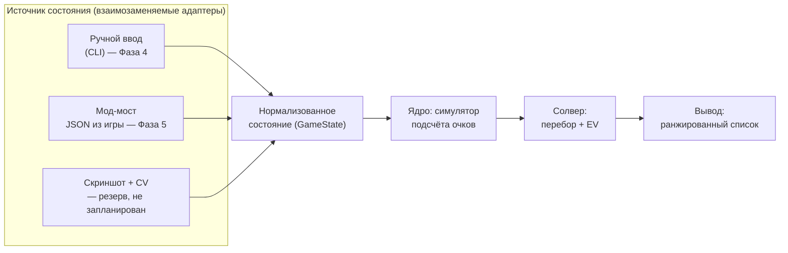

# Бот-помощник для Balatro — план проекта

Статус: план утверждён, решения зафиксированы (раздел 9.1), код не начат.
Платформа разработки и игры: macOS (Apple Silicon / Intel), Steam-версия Balatro.

---

## 1. Выбор игры: Balatro

Balatro выбрана осознанно, а не просто «потому что нравится». Она почти идеально подходит
под задачу «бот-помощник»:

| Критерий | Balatro |
|---|---|
| Реакция / таймеры | Нет вообще. Ход длится столько, сколько нужно. Бот может думать секунды и минуты |
| Детерминированность | Подсчёт очков — чистая арифметика без случайности (кроме отдельных джокеров). У хода есть **объективно лучший** вариант, который можно вычислить |
| Пространство решений | Из 8 карт выбрать подмножество (до 5) — это 218 вариантов на руку, плюс решение «играть или сбросить», плюс магазин. Человек физически не перебирает это, машина перебирает мгновенно |
| Цена ошибки | Высокая: один неправильно выбранный сброс на Ante 8 убивает ран |
| Доступ к состоянию | Игра написана на Lua + LÖVE 2D, есть зрелая мод-экосистема, состояние читается напрямую из движка |
| Правовой аспект | Однопользовательская офлайн-игра, без анти-чита и без мультиплеера, который можно испортить |

Ключевое: в Balatro **есть правильный ответ**, и его можно посчитать. Это отличает её от
игр, где «помощник» скатывается в вкусовые советы.

**Рассмотренные альтернативы** (тоже пошаговые, без экшена):

- *Slay the Spire* — отличная мод-поддержка, но там уже есть сильные готовые боты, и оценка
  хода упирается в долгосрочную стратегию, а не в счёт. Меньше «вычислимости».
- *Into the Breach* — полностью детерминированная, но ходы и так прозрачны, помощник почти
  не добавляет ценности.
- *Luck be a Landlord* — близка по духу, но сильно проще и меньше сообщество/инструменты.

Итог: **делаем под Balatro**.

---

## 2. Что именно делает бот

### Вехи и их соответствие фазам

Единственное определение версий в документе. Везде дальше ссылаемся только на него.

| Веха | Фазы | Что умеет |
|---|---|---|
| **v0.1 «Калькулятор»** | 0–4 | Ручной ввод состояния, выбор лучшего подмножества карт с точным счётом. Первая практическая польза |
| **v1 «Советник»** | 5–6 | Плюс автоподключение к игре и решение «играть или сбросить». Здесь закрывается DoD ниже |
| **v2 «Магазин»** | 7 | Плюс покупки и порядок джокеров |
| **v3 «Стратегия»** | 8 | Плюс решения уровня всего рана |

### Что показывает v1

Советник, не автопилот. Игрок играет сам, бот в соседнем окне показывает:

1. **Какие карты играть** — **ранжированный список** вариантов с посчитанным счётом и разбивкой,
   а не единственная рекомендация. Максимум очков не всегда лучший ход: иногда выгоднее еле
   перебить блайнд, сохранив руки и сбросы, иногда — сыграть слабее ради прокачки уровня нужного
   типа руки. Выбор остаётся за игроком, задача бота — показать, из чего сложилось число.
2. **Играть или сбросить** — сравнение «сыграть сейчас» против матожидания «сбросить N карт
   и сыграть следующей рукой».
3. **Хватит ли на блайнд** — «эта рука даёт 12 400, до блайнда 30 000, за 2 оставшиеся руки не
   добиваем → надо перестраивать».

**Definition of Done для v1:** на вход подано состояние (рука, джокеры, уровни рук, блайнд) —
на выход за <100 мс выдан ранжированный список ходов с разбивкой счёта, совпадающей с игрой
до последней единицы.

### Сквозное требование: честность расчёта

Действует **начиная с Фазы 3** и распространяется на все последующие. Ядро всегда возвращает
не только число, но и **признак полноты расчёта**. Если во входном состоянии встретился джокер,
улучшение или боссовый эффект, которого движок не знает, расчёт помечается неточным, и
интерфейс обязан это показать. Молча выдать правдоподобное, но неверное число — худший
возможный исход для советника.

### Чего сознательно НЕ делаем

- Не делаем автоигру (клики за игрока). Технически мод-API это позволяет, но это отдельный
  слой риска и отладки, и он не нужен для главной ценности — качества решений.
- Не делаем ML/нейросети. Здесь работает честный перебор + симулятор, он точнее и объяснимее.

---

## 3. Архитектура

Три слоя, жёстко разделённые. Ядро ничего не знает про то, откуда пришло состояние.



Почему так: **симулятор скоринга — самая ценная и самая долгоживущая часть**. Способ добычи
состояния может смениться трижды (мод сломался после патча — переехали на CV), ядро при этом
не трогаем. Поэтому первым делаем ядро, а не интеграцию.

---

## 4. Как достать состояние игры

Три варианта, в порядке предпочтения.

### Вариант A — мод-мост (выбран, Фаза 5)

Balatro — это LÖVE 2D + Lua, всё состояние живёт в глобальном объекте `G`
(`G.hand`, `G.jokers`, `G.shop_jokers`, `G.GAME.blind`, `G.GAME.dollars`, ...).
Мод на Lua сериализует это в JSON и отдаёт наружу.

Стек на macOS:
- [Lovely Injector](https://github.com/ethangreen-dev/lovely-injector) — рантайм-инжектор Lua
  (для M-серии нужен билд `lovely-aarch64-apple-darwin`), запуск игры через `run_lovely_macos.sh`.
- [Steamodded](https://github.com/Steamodded/smods) — фреймворк модов, моды кладутся в
  `~/Library/Application Support/Balatro/Mods`.

**Важно: скорее всего не надо писать мод с нуля.** Уже есть
[`coder/balatrobot`](https://github.com/coder/balatrobot) (MIT) — мод, поднимающий
**JSON-RPC 2.0 HTTP API** поверх игры: отдаёт состояние и принимает действия (выбор карт,
покупки в магазине, выбор блайнда). Есть и альтернативы (мод, дампящий состояние в файл
каждый кадр). План — взять готовое как транспорт и вложить свои силы в мозги, а не в биндинги.

**Спайк (Фаза 1) делается заранее и вне очереди:** поставить это на конкретном Mac и убедиться,
что заводится с текущей версией игры. Спайк не блокирует Фазы 2–4, но обязан быть пройден
до начала Фазы 5, иначе к тому моменту вложения окажутся сделаны в неработающий путь.
При успехе спайк **фиксирует конкретные версии** игры, Lovely, Steamodded и мода — за время
Фаз 2–4 они могут обновиться.

Риски:
- Steamodded **по умолчанию отключает достижения Steam** (защита от случайной накрутки).
  Возвращается тумблером в игровом меню модов, но об этом надо знать заранее.
- Обновление Balatro в Steam может временно сломать Lovely/Steamodded — придётся ждать
  обновления модов. Отсюда правило: играть можно и без бота, бот не должен быть обязателен.

### Вариант B — компьютерное зрение (резерв, в дорожную карту не входит)

Захват окна игры + распознавание карт. Плюс: не трогает игру вообще, достижения целы.
Минус: сильно дороже в разработке и хрупко. **Сознательно не планируется** — задача заводится
только если Фаза 1 провалилась и мод-путь закрыт. Карты в Balatro визуально контрастные,
template matching реалистичен, полноценный OCR не нужен.

### Вариант C — ручной ввод (Фаза 4, нужен в любом случае)

CLI/TUI, где рука вводится строкой вида `AH KH QH 7C 7D 3S 2S 2C`, джокеры — по именам.
Это **не костыль**: он позволяет разрабатывать и тестировать ядро, не завися от модов,
и остаётся как режим отладки навсегда.

Важное ограничение, которое надо понимать сразу: ручной ввод даёт полноценный ответ на вопрос
«какие карты играть», но **не даёт точного состава оставшейся колоды**. Это напрямую бьёт по
Фазе 6 — см. раздел 6.

---

## 5. Ядро: симулятор подсчёта очков

Это сердце проекта. Счёт = `chips × mult`, но оба множителя собираются в строго определённом
порядке, и порядок важен (сложение до умножения даёт совсем другой результат).

Порядок вычисления, который надо воспроизвести:

1. **Определить тип руки** из сыгранных карт → базовые chips/mult **по текущему уровню руки**
   (уровни повышаются Planet-картами, поэтому уровни рук — часть состояния, а не константа).
   Учесть модификаторы распознавания: `Four Fingers` (флеш/стрит из 4 карт), `Shortcut`
   (стрит с пропусками), `Smeared Joker` (масти попарно эквивалентны), Wild-карты,
   секретные руки (Five of a Kind, Flush House, Flush Five).
2. **Дебаффы боссового блайнда** — какие карты отключены и не считаются.
3. **Сыгранные карты слева направо**: chips карты (2–10 = номинал, J/Q/K = 10, A = 11),
   улучшения (Bonus, Mult, Glass, Steel, Stone, Gold, Lucky), издания (Foil, Holographic,
   Polychrome), печати; ретриггеры (красная печать, `Hanging Chad`, `Dusk`, `Hack`).
4. **Карты, оставшиеся в руке** (Steel, `Baron`, ретриггеры от `Mime`).
5. **Джокеры слева направо** — в порядке их расположения. `Blueprint`/`Brainstorm` копируют
   соседей, поэтому порядок — это самостоятельная задача оптимизации.
6. **Финал** — произведение с округлением. Точное правило округления и поведение на очень
   больших числах **сверяем с исходниками**, а не предполагаем: это не всегда обычный `round`.

### Откуда брать точные данные

Не выписывать 150+ джокеров руками по памяти — это гарантированные ошибки.
Исходники игры лежат прямо на диске:

```
~/Library/Application Support/Steam/steamapps/common/Balatro/Balatro.app/Contents/Resources/Balatro.love
```

Это обычный zip. Внутри — Lua-код: таблицы `G.P_CENTERS` (все джокеры, улучшения, издания),
значения покерных рук, функция подсчёта очков. План — **сгенерировать справочник джокеров
скриптом из исходников игры** и держать его как данные, а в коде описывать только логику
эффектов. Это же — эталон для сверки порядка вычислений и правила округления.

Следствие для планирования: **Фаза 3 требует доступа к установленной игре.** Без файлов игры
её можно начать (каркас движка), но нельзя закрыть.

### Проверка корректности

Golden-тесты: набор реальных ситуаций из игры (рука + джокеры + уровни) и точный счёт,
который показала игра. Ядро обязано совпадать до единицы.

**Сбор этих кейсов — отдельная ручная работа человека за игрой**, а не побочный эффект
написания кода. Она вынесена в дорожную карту как явная задача Фазы 3, потому что без неё
критерий готовности Фазы 3 недостижим в принципе.

---

## 6. Солвер

### Выбор руки (Фаза 4)

Перебор всех подмножеств руки размера 1–5: из 8 карт — 218 вариантов; при увеличенном размере
руки (`Juggler` даёт +1 карту, есть и другие источники) — до ~640 при десяти картах. Каждое
подмножество прогоняется через симулятор. Полный перебор, никакой эвристики — доли миллисекунды.

Результат — не одна «лучшая» рука, а ранжированный список с разбивкой счёта (см. раздел 2).

### Играть или сбросить (Фаза 6)

Матожидание сброса считаем методом Монте-Карло: сэмплируем N добборов, для каждого считаем
лучший возможный счёт, усредняем. Сравниваем с «сыграть сейчас» с учётом того, сколько рук
и сбросов осталось до блайнда.

**Точность зависит от источника состояния**, и это надо честно показывать в интерфейсе:

- **С мод-мостом (Фаза 5)** состав оставшейся колоды известен точно — мы видим всю колоду
  и все ушедшие карты. Оценка корректна.
- **При ручном вводе** точный состав колоды недоступен: колода меняется за ран (карты
  добавляются, удаляются, улучшаются), и отслеживать это руками нереально. Работаем
  на допущении стандартной колоды из 52 карт минус увиденное в текущем раунде, а результат
  помечаем как приблизительный.

Отсюда порядок фаз: **Фаза 6 идёт после Фазы 5**, потому что полноценной она становится
только с автоматическим источником состояния.

### Магазин и порядок джокеров (Фаза 7)

- Порядок джокеров: перебор перестановок с отсечениями (для 5 слотов — 120 вариантов,
  считается влёт) на репрезентативной руке.
- Покупка: оценка «на сколько вырастет ожидаемый счёт типичной руки за эти деньги»,
  с поправкой на экономику (проценты капают до $25 — держать деньги выгодно).

### Стратегия рана (Фаза 8)

Здесь честного перебора не хватит — уходим в эвристики и симуляцию ранов
(прогон тысяч ранов с разными политиками, отбор лучших правил).

---

## 7. Стек и структура репозитория

- **Python 3.12+**, менеджер зависимостей — `uv`.
- `pytest` — тесты, `ruff` — линт/формат, `mypy` — типы (ядро типизируем строго).
- `pydantic` — модели состояния (валидация того, что приходит из мода).
- `textual`/`rich` — TUI-советник.
- Никаких тяжёлых зависимостей в ядре: оно должно быть чистым Python, чтобы быстро тестироваться.

```
balatro_bot/
  core/
    cards.py        # карта: ранг, масть, улучшение, издание, печать
    hands.py        # распознавание покерных рук + балатровские правила
    scoring.py      # симулятор подсчёта очков (порядок из п.5)
    jokers/         # данные джокеров (сгенерированы) + логика эффектов
    state.py        # GameState — нормализованное состояние, уровни рук
  solver/
    play.py         # ранжированный список подмножеств
    discard.py      # EV сброса, Монте-Карло
    shop.py         # магазин, порядок джокеров
  adapters/
    manual.py       # ручной ввод
    mod_bridge.py   # клиент к JSON-RPC моду
  ui/
    tui.py
tools/
  extract_game_data.py   # распаковка Balatro.love → справочник джокеров
tests/
  golden/               # эталонные счёта из реальной игры
```

---

## 8. Дорожная карта

Фазы пронумерованы по порядку выполнения, но **зависимости важнее номеров** — см. колонку
«Зависит от». Фаза 1 стоит рано намеренно: она проверяет самый большой внешний риск проекта,
но при этом никого не блокирует до Фазы 5.

| Фаза | Зависит от | Содержание | Готово, когда |
|---|---|---|---|
| **0. Каркас** | — | Репозиторий, `uv`, `ruff`, `mypy`, `pytest`, CI на GitHub Actions | Все проверки CI зелёные на smoke-тесте (пустой `pytest` без тестов даёт код 5 и валит CI — нужен хотя бы один настоящий тест) |
| **1. Спайк интеграции** | доступ к Mac с игрой | Поставить Lovely + Steamodded + `balatrobot`, руками дёрнуть API, посмотреть реальный JSON. Включить тумблер достижений. Зафиксировать версии | Есть сохранённый дамп реального состояния игры и записанный список версий |
| **2. Карты и руки** | 0 | Модель карты, распознавание всех типов рук включая секретные. `Four Fingers`/`Shortcut`/`Smeared`/Wild реализуются как **абстрактные флаги-модификаторы** — привязка их к конкретным джокерам будет в Фазе 3 | Тесты на все типы рук, на каждый модификатор и на пограничные случаи (`A-2-3-4-5` валиден, `Q-K-A-2-3` нет) |
| **3. Скоринг** | 2 + файлы игры | Симулятор подсчёта, `extract_game_data.py`, уровни рук, ~30 самых частых джокеров, **механизм пометки неточного расчёта** (раздел 2) | Golden-тесты совпадают с игрой до единицы; неизвестный джокер помечает расчёт неточным, а не игнорируется |
| **3a. Сбор golden-кейсов** | игра под рукой | **Ручная работа человека:** записать ~20 реальных ситуаций (рука, джокеры, уровни, блайнд) и показанный игрой счёт | Кейсы лежат в `tests/golden/`, Фаза 3 может быть закрыта |
| **4. Солвер + ручной ввод** | 3 | Перебор подмножеств, ранжированный вывод, CLI. **Первая практическая польза (v0.1)** | Ввожу с клавиатуры руку, джокеров и блайнд — получаю список ходов со счётом и ответ «хватает / не хватает» |
| **5. Автоподключение** | 1, 4 | Мост к моду, TUI обновляется сам во время игры | Играю, не трогая бота — советы появляются сами |
| **6. Сброс и EV** | 5 | Монте-Карло по колоде, отслеживание вышедших карт. При ручном вводе — режим допущения (раздел 6). **Здесь закрывается v1** | Бот говорит «сбрось эти 3», объясняет числами и честно помечает, точная оценка или приблизительная |
| **7. Магазин и джокеры** | 3, 5 | Покрытие остальных джокеров, советы по покупкам и порядку (v2) | Бот рекомендует перестановку джокеров с приростом счёта; доля «неизвестных джокеров» упала до нуля |
| **8. Стратегия рана** | 7 | Скипы блайндов, теги, экономика, симуляция ранов (v3) | Оценка политик на массовых прогонах |

**Фазы 0–4 дают работающий инструмент без единого мода** — это v0.1. Он считает точно, но
состояние вводится руками, а совет по сбросу ещё не даётся.

### Идея на потом (опционально)

RNG в Balatro посеян: по сиду ран полностью предопределён — есть сторонние анализаторы сидов,
предсказывающие содержимое магазинов и боссов наперёд. Технически это подключаемо, но это
уже не «помощь в принятии решений», а знание будущего. Оставляю как отдельный флаг, который
по умолчанию выключен — решать тебе, где проходит граница между помощником и читом.

---

## 9. Риски

| Риск | Что делаем |
|---|---|
| Steamodded отключает достижения Steam | Знать заранее, включить тумблер в конфиге модов (Фаза 1), либо играть под отдельным профилем |
| Патч Balatro ломает моды | Ядро от мода не зависит; ручной ввод продолжает работать — но советы по сбросу деградируют до приблизительных (раздел 6) |
| Ошибка в симуляторе скоринга незаметно портит советы | Golden-тесты плюс сквозной механизм пометки неточного расчёта с Фазы 3 |
| С Фазы 5 игра отдаёт джокеров, которых движок не знает | Тот же механизм: расчёт помечается неточным. Полное покрытие закрывается только в Фазе 7 — до тех пор это штатная ситуация, а не сбой |
| 150+ джокеров — большой объём | Данные генерируем из исходников игры, руками пишем только логику; покрываем по частоте использования |
| `balatrobot` окажется несовместим/заброшен | Спайк в Фазе 1 до вложений в Фазу 5; запасной путь — свой минимальный мод-дампер (он несложный) |
| Golden-кейсы некому собрать | Вынесено в отдельную задачу 3a с явным исполнителем — иначе Фаза 3 не закрывается |

## 9.1. Принятые решения

Зафиксировано, дальше исходим из этого:

- **Роль бота — советник.** Игрок играет сам, бот считает и объясняет. Автоигру не делаем.
- **Вывод — ранжированный список с разбивкой счёта**, а не единственная команда. Выбор за игроком.
- **Интеграция — мод-мост, ручной ввод как база.** Ставим Lovely + Steamodded + `balatrobot`,
  состояние приходит автоматически. Ручной ввод реализуем в любом случае и оставляем навсегда
  как режим отладки и как страховку на случай, когда патч игры ломает моды.
- **Компьютерное зрение не планируется** — только как аварийный путь, если Фаза 1 провалилась.
- Следствие: тумблер достижений в конфиге модов включаем осознанно при установке (Фаза 1).

---

## 10. Практическая сторона

Balatro — однопользовательская офлайн-игра без анти-чита и без соревновательного мультиплеера.
Внешний помощник никому не портит игру и ничего не нарушает. Единственный реальный побочный
эффект — поведение достижений Steam при установке модов (см. выше).
