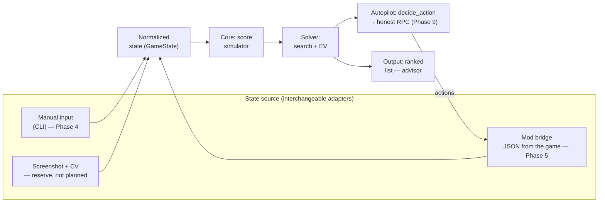

# Balatro bot — project plan

**Goal change (recorded in this revision):** the project used to be an advisor (the human
plays, the bot computes and explains) — that's cancelled. The new goal: a bot that clears
the game on its own at any difficulty without human involvement, i.e. one that reliably wins
on all 8 stakes (White…Gold). Section 2 below is rewritten around this goal; the reason for
the change and its consequences are there too. Advisor mode (`advise`/`doctor`/`watch`) is
not thrown away — it stays both as a standalone tool and as the source of decisions for the
autopilot: the autopilot doesn't replace the computation, it adds an action layer on top of
the already-computed advice and fills in the decisions that used to be left honestly to the
human.

Status: phases 0–2 and 4 are closed. Phase 3 — the scoring engine is ready (149 of 150
jokers); the numbers themselves were checked against the game's own source on 2026-09-05
(§9.8 **A12**), and what task 3a still wants is reference cases captured from a live game as
an end-to-end check. The old "needs a Mac" label is deliberately gone — §8.3 explains why it
was wrong six times out of seven. Phase 5 is confirmed live on real macOS; phases 6–8 are done (exact discard EV, shop
and joker order, blind skip and economy). Phase 9 ("Autopilot") — subtasks 9.1–9.7 are done
(action loop, skip/shop/pack-opening, vouchers, Planet consumables, boss catalogue and score
fix, stake stickers, run-runner) plus the section 9.8 improvement roadmap through **C2** and **A21/A22** — that
section, not this paragraph, is where done-versus-open is tracked, so it is named rather than
copied here. See also section 6, "Autopilot" subsection. Run 7 (RED/WHITE, 2026-09-01) is the **first autopilot
win** — beat Ante 8, 168 steps, zero mod rejections/timeouts/stalls, with A5/A6/A7/B1/D1/F1
all exercised live; it also surfaced the reroll churn A8/F2 (the bot burned ~$75 on 21
rerolls and visibly hung in the shop while re-evaluating). The 35-run deck rotation
(2026-09-06) then measured why runs are lost — median 58 % of the requirement, 11 of 30 losses
short of half — and named the cause: the bot could not buy a consumable at all, so hand levels
never rose. That is **C2**, now closed, together with **A21 + A22** — the reroll policy that both
rolled into a full board ($887 of $1141) and refused to roll when the bot was poor with a slot
free. **C3** was then diagnosed and half-closed on 2026-09-09 by reading the game's own source
rather than by another batch: pack tags fire on the skip itself, one per blind-choice screen, and
the pack a tag opens but nobody collects is where the bot's foreign pack contents came from — one
defect, not two. The re-poll fix shipped; whether it is enough is the first thing the next batch
must answer. What's left, ranked in 9.8: the rest of C3, the Tarot half of the consumable channel,
Arcana/Spectral/Standard packs, an unattended 24/7 mode, and the mass win-rate measurement itself
(E1). **Nothing below C3 is ranked on current evidence** — the loss table above predates C2 and
must be re-taken, which is what the next batch is for
([docs/measuring-runs.md](docs/measuring-runs.md), "The next batch"). The current state of
each phase and what's left — section 8.1; the improvement roadmap — item 9.8.
Development and gameplay platform: macOS (Apple Silicon / Intel), the Steam version of
Balatro.

### How this document is numbered — read this before chasing a cross-reference

`N.M` means **two different things here**, and mixing them up costs a search every time:

- **Section numbers** — the `##` headings, 1…11. Only section 8 has real subsections, `8.1`–`8.4`
  ("Where we are now", "Deviations", "Open assumptions", "Fixed defects"). These are cited from
  the code as `§8.3 №5`.
- **Phase numbers** — the roadmap's phases 0–9, described inside **section 6**. Phase 9
  ("Autopilot") has items `9.1`–`9.8`, and those are what the code means by
  `раздел 6, «Автопилот», п. 9.5`. **Item 9.8 is the improvement roadmap**, cited as `§9.8 A12`.

So `9.8` is a *phase item*, not a section, which is why it sits inside section 6 rather than after
section 9 — that is correct, not a mis-ordering. Section 9 is "Risks" and has nothing to do with
Phase 9. Prefer citing a phase item as "section 6, Autopilot, item 9.5" rather than bare "9.5";
several places in the code already do, and those are the ones that never need a second look.

---

## 1. Game choice: Balatro

Balatro was chosen deliberately, not just "because it's fun". It fits almost perfectly both
the advisor the project originally was and the autopilot it became (section 2) — both roles
need the same thing: a move has an exactly computable correct answer:

| Criterion | Balatro |
|---|---|
| Reaction / timers | None at all. A move takes as long as it needs. The bot can think for seconds and minutes |
| Determinism | Score computation is pure arithmetic with no randomness (except for individual jokers). A move has an **objectively best** option that can be computed |
| Decision space | Picking a subset (up to 5) of 8 cards is 218 options per hand, plus the "play or discard" decision, plus the shop. A human physically can't enumerate this; a machine does it instantly |
| Cost of a mistake | High: one wrongly chosen discard on Ante 8 kills the run |
| State access | The game is written in Lua + LÖVE 2D, there is a mature mod ecosystem, state is read straight from the engine |
| Legal aspect | A single-player offline game, no anti-cheat and no multiplayer that could be spoiled |

The key point: in Balatro **there is a correct answer**, and it can be computed. That sets it
apart from games where a "helper" slides into taste-based advice.

**Alternatives considered** (also turn-based, no action):

- *Slay the Spire* — excellent mod support, but strong ready-made bots already exist, and
  evaluating a move comes down to long-term strategy rather than score. Less "computability".
- *Into the Breach* — fully deterministic, but the moves are already transparent, a helper
  adds almost no value.
- *Luck be a Landlord* — close in spirit, but much simpler and with a smaller
  community/tooling.

Conclusion: **we build for Balatro**.

---

## 2. What exactly the bot does

### Milestones and how they map to phases

The single definition of versions in the document. Everywhere further down we refer only to
this.

| Milestone | Phases | What it can do |
|---|---|---|
| **v0.1 "Calculator"** | 0–4 | Manual state input, picking the best subset of cards with an exact score. First practical use |
| **v1 "Advisor"** | 5–6 | Plus auto-connection to the game and the "play or discard" decision. This is where the DoD of the old goal was met |
| **v2 "Shop"** | 7 | Plus purchases and joker order |
| **v3 "Strategy"** | 8 | Plus whole-run decisions (blind skip — done; economy — not) |
| **v4 "Autopilot"** | 9 | Plus an action loop through the mod's honest RPC methods and decisions where the advisor used to stay honestly silent (skip — yes/no, not numbers; shop — buy/don't buy, vouchers and packs; opening packs; consumables before a play; move legality under rule-modifying bosses). **The project's new goal** — section below |

### The new goal: autonomous clearing (Phase 9)

Recorded explicitly, because it changes the whole "What we deliberately do NOT do" section
below, which had been unchanged since the very start of the project.

**Success criterion:** the bot reliably wins (reaches Ante 8 and finishes off the final
boss) on each of the 8 stakes (`WHITE`…`GOLD`) separately — not "got lucky once", but a
measurable win-rate over N runs per stake, with a separate report per stake. Stakes in
Balatro are cumulative (confirmed from source, `game.lua`: `if self.GAME.stake >= K then
... end`) — `GOLD` includes all 8 modifiers at once (no money for the Small Blind,
accelerated requirement growth, Eternal/Perishable/Rental jokers in the shop, −1 discard).
Hence the shakedown order: bottom-up, `WHITE → RED → ... → GOLD`, not the hardest one
straight away — on the intermediate stakes it's easier to tell which of the 8 modifiers
sank a run.

**Launch mode — managed, not a daemon.** `balatro-bot autoplay --deck X --stake Y` plays one
run with honest actions to a win or a loss and stops with a report; a mass run of N runs per
stake is a wrapper on top of that same runner. Running around the clock unattended (24/7,
auto-restarting runs) is deliberately out of scope for now — it's a separate layer (a
watchdog for hangs, time/attempt limits) that can be added later on top of the
already-working managed loop without reworking it.

**Switching between advisor and autopilot — a mandatory requirement, not a side effect of
both modes existing.** Beyond `advise`/`doctor`/`watch` not being removed (section above) —
it must be possible to switch between them and `autoplay` on the fly: start a run under the
autopilot and take control back at any moment (finish playing by hand), or the other way
round — watch as advisor and hand the run to the autopilot to finish. Both modes read the
same state through the same bridge, so switching isn't a transfer of data between separate
systems, it's a question of who is currently pulling the actions (`play`/`buy`/...) — the
advisor doesn't do that at all. `autoplay` must be able to terminate cleanly (or pause) at
any moment between actions, not only at the end of a run — since the human must be able to
grab the wheel mid-game, not only between runs.

**Honest actions only.** The mod's RPC (`src/lua/utils/openrpc.json`) offers two different
classes of methods: game actions (`select`, `skip`, `play`, `discard`, `buy`, `sell`,
`use`, `reroll`, `next_round`, `cash_out`, `rearrange`, `start`) and cheats (`set` — set
money/ante/hands directly, bypassing the game rules; `add` — spawn any card; `load` — swap
in someone else's save). The autopilot uses only the first class — the same principle
already recorded in section 8 of the plan about seed analyzers ("Idea for later"): the bot
doesn't read the future and doesn't cheat, it only computes and acts within what a live
player has available. `set`/`add`/`load` stay available exclusively to test infrastructure
(`tests/fake_mod.py` and the like), as they are now.

### What v1 shows

Advisor, not autopilot. The player plays; the bot in a window next to it shows:

1. **Which cards to play** — a **ranked list** of options with a computed score and
   breakdown, not a single recommendation. The maximum score isn't always the best move:
   sometimes it's better to barely beat the blind, keeping hands and discards; sometimes to
   play weaker to level up the hand type you need. The choice stays with the player; the
   bot's job is to show what the number is made of.
2. **Play or discard** — comparing "play now" against the expected value of "discard N
   cards and play with the next hand".
3. **Whether the blind will be met** — "this hand gives 12,400, the blind is 30,000, over 2
   remaining hands we don't get there → we need to rebuild".

Points 1 and 2 are described here as two different kinds of advice — in the implementation
(section 6, Phase 6) it's long been one list: `solver.actions.rank_actions` merges plays and
discards into a single ranked output by descending score, because for the player it's one
and the same decision, "what to do now", not two lists to compare by eye.

**Definition of Done for v1:** given a state (hand, jokers, hand levels, blind) — within
<100 ms produce a ranked list of moves with a score breakdown that matches the game to the
last unit.

### A cross-cutting requirement: honest computation

In effect **starting from Phase 3** and extends to all subsequent phases. The core always
returns not only a number but also a **completeness flag for the computation**. If the input
state contains a joker, enhancement, or boss effect the engine doesn't know, the computation
is marked inexact, and the interface must show it. Silently returning a plausible but wrong
number is the worst possible outcome for an advisor.

**A third category from Phase 9: an explicitly flagged heuristic.** Until now a number had
two honest states — an exact computation (`exact=True`) or a refusal to compute at all (text
instead of a number, like `core/tags.py`/`ShopItem.effect` for things there's nothing to
compare with via a counterfactual). That was enough for the advisor: the decision stayed
with the human. The autopilot has to make the decision anyway — silence for it is equivalent
to a random choice, so a refusal stops being a neutral option. Hence a third state: an
expert estimate based on the game-sense of the effect (not computed via a counterfactual,
but assigned), which must be as clearly distinguishable from an exact number as `exact=False`
is now from `exact=True` — not the same field with the same semantics meaning "sample-based
estimate" (like `DiscardOption.exact`), but a separate one, because the inexactness here is
of a different kind: not an approximation of an exact number, but a constant with no
computation at all.

### What we deliberately do NOT do

- **We now do autoplay — this reverses the project's original decision.** Before this
  revision of the plan it said here "we don't do autoplay, it isn't needed for decision
  quality" — that was a deliberate boundary of responsibility (the human decides, the bot
  computes), not a technical limitation. The new goal (section 2, "Autopilot") requires
  exactly the opposite, and the decision is reversed on purpose, not by accident. The
  boundary moves to a different axis: not "who presses the buttons" but "by what methods" —
  see "Honest actions only" above.
- We don't read the run's seed ahead of time (see "Idea for later" in section 8) — even
  playing autonomously, the bot doesn't know the future shop/bosses in advance, only what a
  live player can see right now.
- We don't do ML/neural nets. Honest search + a simulator works here; it's more accurate and
  more explainable — that hasn't changed: the autopilot acts on the same solver computations
  that used to be shown to the human, just without the human in the middle.

---

## 3. Architecture

Three layers, strictly separated. The core knows nothing about where the state came from.
The action layer (autopilot, Phase 9) sits on top of the solver: it takes the solver's
output and executes it through the same mod bridge it read state from; the advisor just
displays that same output.



Why this way: **the scoring simulator is the most valuable and longest-lived part**. The way
state is obtained may change three times (the mod broke after a patch — we moved to CV); the
core is left untouched. So we build the core first, not the integration.

---

## 4. How to get the game state

Three options, in order of preference.

### Option A — the mod bridge (chosen, Phase 5)

Balatro is LÖVE 2D + Lua, all state lives in the global object `G`
(`G.hand`, `G.jokers`, `G.shop_jokers`, `G.GAME.blind`, `G.GAME.dollars`, ...).
A Lua mod serializes this to JSON and exposes it.

The macOS stack:
- [Lovely Injector](https://github.com/ethangreen-dev/lovely-injector) — a runtime Lua
  injector (M-series needs the `lovely-aarch64-apple-darwin` build). Only `liblovely.dylib`
  itself is needed: the mod's CLI sets it up via `DYLD_INSERT_LIBRARIES` on its own, no
  launch script required. You can't launch the game through Steam on macOS — a client bug
  gets in the way.
- [Steamodded](https://github.com/Steamodded/smods) — a mod framework; mods go into
  `~/Library/Application Support/Balatro/Mods`.

**Important: most likely there's no need to write a mod from scratch.** There's already
[`coder/balatrobot`](https://github.com/coder/balatrobot) (MIT) — a mod that brings up a
**JSON-RPC 2.0 HTTP API** over the game: it exposes state and accepts actions (card
selection, shop purchases, blind selection). There are alternatives too (a mod that dumps
state to a file every frame). The plan is to take the ready thing as transport and put our
effort into the brains, not the bindings.

**The spike (Phase 1) is done early and out of order:** install this on the specific Mac and
confirm it comes up with the current game version. The spike doesn't block Phases 2–4, but
it must be passed before Phase 5 starts, otherwise by then the investment will have gone
into a non-working path. On success the spike **pins specific versions** of the game,
Lovely, Steamodded, and the mod — over the course of Phases 2–4 they may update.

Risks:
- Steamodded **disables Steam achievements by default** (protection against accidental
  farming). It's restored with a toggle in the in-game mods menu, but you need to know this
  in advance.
- A Balatro update on Steam may temporarily break Lovely/Steamodded — you'll have to wait
  for the mods to update. Hence the rule: you can play without the bot too, the bot must not
  be mandatory.

### Option B — computer vision (reserve, not in the roadmap)

Capturing the game window + card recognition. Upside: doesn't touch the game at all,
achievements are intact. Downside: much more expensive to develop and fragile. **Deliberately
not planned** — the task starts only if Phase 1 failed and the mod path is closed. Cards in
Balatro are visually high-contrast, template matching is realistic, full OCR isn't needed.

### Option C — manual input (Phase 4, needed in any case)

A CLI/TUI where the hand is entered as a string like `AH KH QH 7C 7D 3S 2S 2C`, jokers by
name. This is **not a crutch**: it lets us develop and test the core without depending on
mods, and it stays forever as a debug mode.

An important limitation to understand right away: manual input gives a full answer to "which
cards to play", but **doesn't give the exact composition of the remaining deck**. This
directly hits Phase 6 — see section 6.

---

## 5. The core: the score-computation simulator

This is the heart of the project. Score = `chips × mult`, but both factors are assembled in
a strictly defined order, and the order matters (adding before multiplying gives a
completely different result).

The computation order to reproduce:

1. **Determine the hand type** from the played cards → base chips/mult **at the current hand
   level** (levels are raised by Planet cards, so hand levels are part of the state, not a
   constant). Account for detection modifiers: `Four Fingers` (a flush/straight from 4
   cards), `Shortcut` (a straight with gaps), `Smeared Joker` (suits pairwise equivalent),
   Wild cards, secret hands (Five of a Kind, Flush House, Flush Five).
2. **Boss blind debuffs** — which cards are disabled and don't count.
3. **Played cards left to right**: card chips (2–10 = face value, J/Q/K = 10, A = 11),
   enhancements (Bonus, Mult, Glass, Steel, Stone, Gold, Lucky), editions (Foil,
   Holographic, Polychrome), seals; retriggers (red seal, `Hanging Chad`, `Dusk`, `Hack`).
4. **Cards left in hand** (Steel, `Baron`, retriggers from `Mime`).
5. **Jokers left to right** — in their slot order. `Blueprint`/`Brainstorm` copy their
   neighbours, so the order is an optimization task in its own right.
6. **Finalize** — the product, with rounding. The exact rounding rule and the behaviour on
   very large numbers are **checked against the sources**, not assumed: it isn't always a
   plain `round`.

### Where to get the exact data

Don't write out 150+ jokers by hand from memory — that's guaranteed errors. The game's
sources are right there on disk:

```
~/Library/Application Support/Steam/steamapps/common/Balatro/Balatro.app/Contents/Resources/Balatro.love
```

This is a plain zip. Inside — Lua code: the `G.P_CENTERS` tables (all jokers, enhancements,
editions), the poker-hand values, the score-computation function. The plan is to
**generate the joker catalogue with a script from the game's sources** and keep it as data,
describing only the effect logic in code. This is also the reference for checking the
computation order and the rounding rule.

A planning consequence: **Phase 3 requires access to an installed game.** Without the game
files it can be started (the engine skeleton) but not closed.

### Correctness check

Golden tests: a set of real situations from the game (hand + jokers + levels) and the exact
score the game showed. The core must match to the unit.

**Collecting these cases is a separate piece of manual work by a human at the game**, not a
by-product of writing code. It's carried into the roadmap as an explicit Phase 3 task,
because without it the readiness criterion for Phase 3 is unreachable in principle.

---

## 6. The solver

### Hand selection (Phase 4)

A search over all hand subsets of size 1–5: from 8 cards — 218 options; with an increased
hand size (`Juggler` gives +1 card, there are other sources) — up to ~640 at ten cards. Each
subset is run through the simulator. Full search, no heuristics — fractions of a
millisecond.

The result isn't a single "best" hand but a ranked list with a score breakdown (see
section 2).

### Play or discard (Phase 6)

The expected value of a discard is compared against "play now", taking into account how many
hands and discards are left before the blind.

**Monte-Carlo was the original design here and was dropped — see §8.3 #9, which records the
removal.** It was going to sample N draws and average, and the speed estimate (1000 samples ×
218 options) is what killed it. What replaced it is not a cheaper sample but an exact answer:
`discard_outcome` enumerates **compositions of equivalence classes** — cards indistinguishable
by the final score are counted once and weighted by a binomial coefficient — so a five-card
discard is answered exactly where the raw draw search stalled at two. The cheap general-case
path (`advise_discard`, `docs/Discard Spec.md`) is not a Monte-Carlo either: it enumerates
*targets* with a hypergeometric probability and estimates the payoff over a sample of
representative hands. Nothing in this module samples draws.

**Accuracy depends on the state source**, and this must be shown honestly in the interface:

- **With the mod bridge (Phase 5)** the composition of the remaining deck is known exactly —
  we see the whole deck and every card that's gone. The estimate is correct.
- **With manual input** the exact deck composition isn't available: the deck changes over
  the run (cards added, removed, upgraded), and tracking it by hand is unrealistic. We work
  on the assumption of a standard 52-card deck minus what's been seen this round, and mark
  the result approximate.

Hence the phase order: **Phase 6 comes after Phase 5**, because it only becomes fully
capable with an automatic state source.

### Consumables before a play (discovered in a session, wasn't in the original plan)

The solver doesn't know about Tarot/Planet cards sitting unused in the inventory
(`consumables` in the mod's state) — and they can be used before a play and change the
result. Two cases of very different size:

- **Planet cards** — a small mechanical task: raise the level of the needed hand by 1 using
  the existing tables and recompute with the same engine. The same pattern as the joker
  order search. **Done** — `solver/consumables.py`, Phase 9.4 (section 6, "Autopilot",
  item 9.4).
- **Tarot cards** — an order of magnitude larger: ~22 different effects, many of which don't
  add a number but transform cards (`Death` — picking a "donor/target" pair of cards, a
  search dimension on top of the existing one). Comparable in scope to implementing new
  jokers. **Improvement C1, first slice done**: the eight "enhance the selected cards" Tarots
  are computed exactly, `Hermit`/`Temperance` in dollars, the rest an honest `None`. The second
  slice — suit conversion, `Strength`, `Death`, `The Hanged Man` — is still open; `Death` has
  already turned up in the inventory live.

Not tied to a phase number: essentially closer to Phase 4 (affects the current play, not the
shop), but it surfaced after the phase numbering was already fixed.

### Shop and joker order (Phase 7)

- Joker order: a permutation search with pruning (for 5 slots — 120 options, computed
  instantly) on a representative hand. **Done** — `solver.play.rank_joker_orders`.
- **Purchasing (done)** — `solver.shop.evaluate_shop`. The mod exposes the real, not a
  hypothetical, shop (`GameState.shop`/`shop_vouchers`/`shop_packs`, only in phase `SHOP`) —
  there's no need to compute the probability of what might roll, exactly as with the skip
  tags ("Run strategy" section below). For jokers the estimate is the same counterfactual as
  the joker order: add the candidate to the current jokers and see how much `advise().best`
  grows, only not on the player's single hand (there is none in phase `SHOP` —
  `GameState.hand` is empty), but averaged over `SAMPLE_HANDS = 12` representative hands from
  the deck (`full_deck` in the narrow case, otherwise `standard_deck()` with an honest
  `exact_deck=False` marker). A joker the game doesn't know gets `expected_uplift=None`, not
  a guess. **Vouchers and packs got no estimate in this phase** — a deliberate refusal at the
  time, not a gap: a voucher changes the run's rules wholesale (discounts, slots, odds), not
  the score of one hand, so there was nothing to compare with via a counterfactual, and instead
  of a number the live effect text from the game itself was shown (`ShopItem.effect`, the same
  `value.effect` field that gives `JokerCard.current_value` elsewhere). **That refusal was
  lifted in Phase 9.3**, which is what the third honesty tier (section 2) exists for:
  `solver/vouchers.py` values all three tiers and `solver/shop.py`'s `PackPurchaseOffer` values
  a pack by an expected value over its own mechanic. The effect text is still shown, now
  alongside a number rather than instead of one. **The economy adjustment (done)** —
  `JokerOffer.interest_lost`: buying a joker also means forgone interest at the end of the
  next round, not only `item.price`. The formula (`solver.shop._interest`) is written out
  from the game's `functions/state_events.lua`, not from memory: `interest_amount *
  min(floor(dollars/5), interest_cap/5)`, defaults `interest_amount=1`/`interest_cap=25`
  from `game.lua`. Dollars and points are deliberately not collapsed into one number (the
  same principle as `core/tags.py`) — `interest_lost` is shown next to `expected_uplift`,
  not subtracted from it. Two honestly acknowledged incompletenesses: the figure is only
  about the next round-end, not the whole rest of the run (that needs knowing the number of
  remaining rounds — already Phase 9 scope, not a shop-screen thing), and — at the time this
  was written — it assumed the default $25 cap because `GameState` did not store already-redeemed
  `Seed Money`/`Money Tree` (which raise the cap to $50/$100), making it an honest lower bound
  rather than an overestimate. **That second one is closed:** Phase 9.3 added
  `GameState.used_vouchers` (the field was in the mod's schema all along, the bridge just never
  parsed it) and moved the formula into `core/economy.py`, so the cap is now read, not assumed.
  The one explicitly tracked special case is `Green Deck`
  (`GameState.deck_type == "GREEN"`), where `game.lua` disables interest outright: there
  `interest_lost` is a guaranteed zero, not an approximation. **Verified live**: the sentence
  here used to read "not verified live on a Mac yet — the game never reached the `SHOP` phase",
  which stopped being true on 2026-08-21. The shop has since been exercised across dozens of
  live runs; the deck rotation alone measured 575 shelf offers, and the shop policy is where
  most of the improvement log comes from (A1–A2, A5–A11, A21/A22, C2).

### Run strategy (Phase 8)

A full run simulation (running thousands of runs with different policies, selecting the best
rules) isn't the first step but the last: without working heuristics for individual
decisions (blind skip, shop, economy) there's nothing to simulate with — the policy for the
simulation comes from exactly those.

**Clarification (session 2026-08-27): "simulation" means running the real game through the
autopilot, not our own offline rules engine.** Stated and recorded explicitly so it isn't
read two ways in future sessions: our own simulator would require guessing the generation
odds for the shop/deck/bosses — exactly what `solver/skip.py`/`solver/shop.py`/
`solver/discard.py` have consistently refused to do (compute only from what the game
actually showed, never model randomness in advance). "Run a thousand runs" means literally
playing a thousand real runs with the bot through the bridge to the mod and looking at the
win statistics — so this item **hard-depends on the autopilot's action loop (Phase 9, not
yet started)**, it's not just last in order: there's technically nothing to play on before
that.

**Blind skip (done, the first slice of the phase)** — `solver/skip.py`, `evaluate_skip()`.
The key observation: the blind-select screen isn't the place to guess probabilities. The mod
already exposes the real state: the requirements of all three ante blinds
(`GameState.blinds["small"/"big"/"boss"]`) and the exact text of the tag you'd get on a skip
(`Blind.tag_name`/`tag_effect`), not a distribution of possible tags. So this isn't a
simulation but an honest analysis of an already-known choice — the same principle as
`advise_discard`/`rank_joker_orders`: don't guess, compute from what's actually visible.

The function doesn't collapse the decision to a single made-up number — some tags (a free
joker, a voucher, a pack) can't be converted to points or dollars at all without an
arbitrary utility valuation. Instead of a verdict — laid-out numbers: how many times heavier
the next ante blind is than this one (`requirement_ratio`, no play — on the blind-select
screen there's no hand yet), the guaranteed minimum money for a win (`_BASE_REWARD`:
`bl_small=$3`, `bl_big=$4`, written out from `game.lua`, not from memory), and the tag's
contents as-is. The exact dollar value of a tag (`tag_dollars`) is computed only where the
formula doesn't need a run-level counter that the mod never sends (only `round.*`, per
round): `Investment Tag` ($25, conditional on beating this ante's boss) and `Economy Tag`
(`min($40, current money)`) — exact; `Handy`/`Garbage`/`Skip Tag` need a run-total count of
hands/discards/skips — `tag_dollars` for them is honestly `None`, not a guess. The catalogue
of all 24 tags (`core/tags.py`, `TAGS`) is written out from the game's source (`game.lua`
`tag_*`, `tag.lua` `Tag:apply_to_run`) the same way as jokers — a structural description of
what a tag mechanically does, with no utility valuation.

Wired into `doctor`/`watch` (`render_skip_advice`), not `advise`: on the blind-select screen
`GameState.hand` is empty, there's nothing for `advise()` to compute on.

**Verified live on a Mac** 2026-08-22: a real Big Blind with an Investment Tag (ante 1) —
the numbers matched a hand calculation ($4 guaranteed for playing versus $25 conditionally
for skipping), the decision was discussed and confirmed separately from the code.

Joker purchasing moved to Phase 7 ("Shop and joker order" section above) — it's about the
shop specifically; what stays here is the more general economy (interest, reroll timing) and
the full run simulation after it.

**Interest — done in Phase 7** (`JokerOffer.interest_lost`, see the "Shop and joker order"
section above).

**Reroll timing (done, honestly limited scope).** `GameState.reroll_cost` — the live reroll
price right now, from the mod's `round` area (`reroll_cost`, the same area as
`hands_left`/`discards_left` — read live from `tests/fixtures/gamestate.json`, not from
memory). `ShopAdvice.reroll_cost` shows it next to the evaluation of the current shop offer
(`solver/shop.py`, `doctor`/`watch`). The bot stopped there at first, and the reason is worth
keeping: an honest "is a reroll worth it" estimate needs the distribution of what might roll
instead of the current offer, which looked like a computation over a probabilistic model of
what doesn't exist yet — different in spirit from the rest of this module, which only ever
computes over what the game has actually shown.

**That refusal was lifted by improvement A5**, and the distinction that made it possible is the
one the refusal got wrong: the objection was to *guessing* the odds, and the odds do not have to
be guessed. `game.lua` states them — the shop's `joker_rate`, and the rarity split — so
`RerollOutlook` is a Monte-Carlo of the roll *mechanic* with the game's own numbers, over
`GameState.shop_slots` slots, valuing each hypothetical joker with the same `joker_uplift`
counterfactual used everywhere else. Three later improvements calibrated the policy on top of
it — **A8** (an opportunity-cost gate against the shelf plus a per-visit cap), **A21** and
**A22** (roll only when there is somewhere to put the find, and keep only enough money to buy
it). What survives from the original reasoning is the narrower rule the module still follows,
the same as `solver/skip.py`: never invent a number the game can supply.

### Autopilot (Phase 9)

Depends on the entire finished decision core (Phases 4–8) — it doesn't recompute them, it
builds an action layer on top and closes the decisions that used to be left honestly to the
human. The project's new goal and its scope — section 2. The order of the subtasks below
isn't a strict sequence (dependencies matter more than numbers, as everywhere in this
document), but 9.1 and 9.5 logically come first: without an action loop there's nothing to
execute decisions with, and without the boss catalogue the autopilot can honestly compute an
illegal move and get stuck trying to play it.

**Where the per-subtask detail lives, and why it is not here.** This section used to carry a
build record for each subtask — what was implemented, how each policy works, which tests pin
it. It grew to a quarter of this document while the code moved on underneath it, and that is
exactly how it came to assert several things the code had stopped doing: that the shop had
never been reached live, that vouchers and packs got no estimate, that a reroll would never be
valued. The prose was a second copy of module documentation:
**[docs/architecture.md](docs/architecture.md)** carries about 70 KB on precisely these modules,
including 21 KB on `autopilot.py` alone, and it is kept in lockstep with the code. It is the
place to read *how the action layer works*. What stays here is the plan — what each subtask is
for, where it stands, and what is deliberately outside it.

| # | Subtask | State | Where the detail is |
|---|---|---|---|
| **9.1** | The action loop and honest bridge calls — a state machine over `GameState.phase`: one decision → one RPC → re-read the state | **done** | `autopilot.py` entry |
| **9.2** | Closing the decisions the advisor left to the human — blind skip, the shop, opening a Celestial pack | **done** | `autopilot.py`, `solver/skip.py`, `solver/pack.py` |
| **9.3** | Valuing vouchers and packs across the three honesty tiers (section 2, "Third category") | **done** | `solver/vouchers.py`, `solver/shop.py` |
| **9.4** | Consumables and hand preparation before a play | **Planet slice done; Tarot first slice done (C1)** | `solver/consumables.py` |
| **9.5** | Rule-modifying bosses — the 28-boss catalogue, the illegal-play filter, and `The Flint`'s score fix | **done**, closing §8.3 #10 | `core/bosses.py`, `solver/play.py`, `core/scoring.py` |
| **9.6** | Stakes: cumulativity, and the Eternal/Perishable/Rental stickers | **done** | `solver/shop.py` |
| **9.7** | The run-runner and win-rate measurement | **done** | `runner.py` |

**What pins each subtask**, kept here because these are the entry points and the module notes
name test *files* rather than classes: 9.1 and 9.2 — `tests/test_autopilot.py`
(`TestDecideSkip`, `TestDecideActionНаВыбореБлайнда`, `TestDecideActionНаRoundEval`,
`TestDecideActionВМагазине`, `TestDecideActionНаВскрытииПака`) with
`tests/test_tui.py::TestAutoplay`
and `tests/test_mod_bridge.py::TestКлиент`/`TestРазборСостояния` for the loop and the client;
9.3 — `tests/test_pack.py` and `tests/test_shop.py`; 9.5 — `tests/test_bosses.py`,
`tests/test_solver.py::TestЛегальностьПодБоссом` and `tests/test_scoring.py::TestБоссФлинт`;
9.7 — `tests/test_runner.py`.

Everything found after these closed — every policy change, every threshold, every defect a live
run surfaced — is the improvement roadmap in section 9.8 and the
**[improvement log](docs/improvements.md)**, not this section. Where the two ever disagree about
what the code does, `docs/architecture.md` is the copy to trust.

**The advisor ⇄ autopilot switch is a plan-level constraint, not an implementation detail.**
Recorded again here because it constrains 9.1's shape: `autoplay` must check the pause/takeover
switch **between every action**, not only between runs, and when paused must behave exactly like
`watch` — show the same thing, touch nothing. Both modes read the same state through the same
bridge and differ only in who pulls the actions, so this is a requirement about the loop, not a
feature to bolt on. Section 2 states it as a goal; section 9.1 states it as a decision.

**What each subtask deliberately left open.** These are scope boundaries, not gaps to be
discovered later:

- **9.3** — `Hieroglyph`/`Petroglyph` are not valued even in the first tier: their "−1 Ante" side
  needs a blind-requirement-by-ante formula, which exists nowhere in this project (the game has
  `get_blind_amount(ante)` in `functions/misc_functions.lua` — exact for antes 1–8 and a power
  formula beyond — but it also depends on stake and deck, which nothing here models).
  `Director's Cut`/`Retcon`/`Illusion`/`Magic Trick`/`Omen Globe` stay an honest `None`.
  Arcana/Tarot, Spectral and Standard **packs** (`TAROT_PACK`, `SPECTRAL_PACK`,
  `STANDARD_PACK` before Steamodded collapsed them into `SMODS_BOOSTER_OPENED`) have nothing to
  value them with — they need the consumable and deck-card mechanics — so they are skipped
  rather than stalled on.
- **9.4** — the Tarot second slice: suit conversion, `Strength`, `Death`, `The Hanged Man`.
  `Death` picks a donor/target pair, which is a search dimension the solver does not have.
  Separately, `v_observatory` creates a real but uncomputed trade-off — using a Planet now can
  cost a repeatable X1.5 bonus the scoring engine does not implement — so
  `PlanetConsumableOffer.note` warns instead of pretending to compare.
- **9.5** — `The Arm` (permanently lowers a hand type's level) and `The Serpent` (caps the draw
  after the first move) are real effects but informational: they are about the cost of a move and
  the future hand size, not about this play's legality or its score.
- **9.6** — `JokerCard` (jokers already in slots, as opposed to shop offers) got no new fields,
  so the ongoing rent drain and the perish countdown on jokers already owned are not modelled;
  and the autopilot does not treat `rental`/`eternal` as a stop factor when buying, which is an
  open policy question (dollars and terms against points — the same incommensurability as
  `interest_lost`), not an oversight.
- **9.7** — the unattended 24/7 mode: a watchdog for hangs, auto-restart and time limits is a
  separate layer on top of the working managed loop. The first half of it is done (the runner can
  adopt a run already in progress); the watchdog half is not started. The runner also does not
  try to pull a run out of a phase whose decision is unclosed — it stops there honestly, and that
  is a signal to close the decision in `autopilot`, not a job for the runner. A fixed `--seed`
  gives N identical runs, useful for regression and useless for a win-rate.

### Phase 9, item 9.8 — an improvement roadmap from the live runs

(Cited everywhere as `§9.8`. It is a **Phase 9 item**, which is why it lives here inside section 6
and not after section 9 — see "How this document is numbered" at the top.)

Letter labels are working ones, not from the general phase numbering. Every item here came out
of a run against the real game rather than out of review, and they keep the same shape: the bot
computes a correct number **from a state the game is never in**. A thousand unit tests cannot
see that — they ask what a joker computes, not what the counterfactual may never output — and
one live run does. Runs 1–5 died to it on antes 3–5, run 7 was the first win, and the deck
rotation kept finding it.

Thirty items are closed. Each write-up — what was measured, what changed, which tests pin it —
is in the **[improvement log](docs/improvements.md)**, in the order the work was done. The
index below is what keeps a citation like "§9.8 A12" resolving; the log itself is searchable by
label.

| Label | Closed item |
|---|---|
| **A1** | [Joker sell-replace — done.](docs/improvements.md#a1-joker-sell-replace--done) |
| **D1** | [Joker rearrange — done.](docs/improvements.md#d1-joker-rearrange--done) |
| **A3** | [Buying a Celestial pack from the shop — done.](docs/improvements.md#a3-buying-a-celestial-pack-from-the-shop--done) |
| **A2** | [A stricter joker-buy threshold — done.](docs/improvements.md#a2-a-stricter-joker-buy-threshold--done) |
| **A4** | [Buying vouchers — done.](docs/improvements.md#a4-buying-vouchers--done) |
| **B1** | [Temper the over-aggressive discarding — done (run 6 confirmed).](docs/improvements.md#b1-temper-the-over-aggressive-discarding--done-run-6-confirmed) |
| **A5** | [Shop reroll — done (run 6's economy ceiling).](docs/improvements.md#a5-shop-reroll--done-run-6s-economy-ceiling) |
| **F1** | [Decision-loop performance — done.](docs/improvements.md#f1-decision-loop-performance--done) |
| **A6** | [Shop branch order — sell-replace vs. a cheap pack — done.](docs/improvements.md#a6-shop-branch-order--sell-replace-vs-a-cheap-pack--done) |
| **A7** | [Voucher tier-3 threshold when cash-rich with empty joker slots — done.](docs/improvements.md#a7-voucher-tier-3-threshold-when-cash-rich-with-empty-joker-slots--done) |
| **A8** | [The reroll policy over-rerolls and burns whole shop visits — done.](docs/improvements.md#a8-the-reroll-policy-over-rerolls-and-burns-whole-shop-visits--done) |
| **F2** | [`evaluate_shop` rebuilt from scratch after every reroll — done.](docs/improvements.md#f2-evaluate_shop-rebuilt-from-scratch-after-every-reroll--done) |
| **A9** | [The autopilot cannot shed dead weight while a joker slot is free — done.](docs/improvements.md#a9-the-autopilot-cannot-shed-dead-weight-while-a-joker-slot-is-free--done) |
| **A10** | [The shop valued jokers at the wrong moment of the round — done.](docs/improvements.md#a10-the-shop-valued-jokers-at-the-wrong-moment-of-the-round--done) |
| **F3** | [The probability tree was the whole performance problem — done.](docs/improvements.md#f3-the-probability-tree-was-the-whole-performance-problem--done) |
| **C1** | [Tarot consumables](docs/improvements.md#c1-tarot-consumables) |
| **A11** | [An audit of the whole "wrong state to evaluate from" defect class — done.](docs/improvements.md#a11-an-audit-of-the-whole-wrong-state-to-evaluate-from-defect-class--done) |
| **A12** | [The §8.3 assumptions audited against the game's own source — done.](docs/improvements.md#a12-the-83-assumptions-audited-against-the-games-own-source--done) |
| **F4** | [Event dispatch — measured and rejected, not deferred.](docs/improvements.md#f4-event-dispatch--measured-and-rejected-not-deferred) |
| **B2** | [The autopilot stopped discarding, and the journal could not say why — done.](docs/improvements.md#b2-the-autopilot-stopped-discarding-and-the-journal-could-not-say-why--done) |
| **A13** | [The journal caught a lying explanation and a bad pack policy — done.](docs/improvements.md#a13-the-journal-caught-a-lying-explanation-and-a-bad-pack-policy--done) |
| **A14** | [Blind skipping was switched off, and nobody noticed for eleven runs — done.](docs/improvements.md#a14-blind-skipping-was-switched-off-and-nobody-noticed-for-eleven-runs--done) |
| **A15** | [A skipped blind is not a pending one — done.](docs/improvements.md#a15-a-skipped-blind-is-not-a-pending-one--done) |
| **A16** | [The tag bar was wrong by mechanism, not by number — done.](docs/improvements.md#a16-the-tag-bar-was-wrong-by-mechanism-not-by-number--done) |
| **E1b** | [Joker contributions in the journal — done.](docs/improvements.md#e1b-joker-contributions-in-the-journal--done) |
| **E1c** | [The batch was measuring one run N times — done, and it failed silently.](docs/improvements.md#e1c-the-batch-was-measuring-one-run-n-times--done-and-it-failed-silently) |
| **A19** | [A mod refusal often means «not yet», not «not allowed» — done.](docs/improvements.md#a19-a-mod-refusal-often-means-not-yet-not-not-allowed--done) |
| **A20** | [The suite now refuses the impossible — done.](docs/improvements.md#a20-the-suite-now-refuses-the-impossible--done) |
| **C2** | [The bot could not buy consumables at all, and that was the root of the loss pattern — done.](docs/improvements.md#c2-the-bot-could-not-buy-consumables-at-all-and-that-was-the-root-of-the-loss-pattern--done) |
| **A21 + A22** | [The reroll policy was wrong in both directions at once — done.](docs/improvements.md#a21--a22-the-reroll-policy-was-wrong-in-both-directions-at-once--done) |
| **C3** | [The autopilot was killing the game process by skipping a pack that did not exist yet — done.](docs/improvements.md#c3-the-autopilot-was-killing-the-game-process-by-skipping-a-pack-that-did-not-exist-yet--done) |
| **E3** | [A dead game destroyed the evidence of its own death — done.](docs/improvements.md#e3-a-dead-game-destroyed-the-evidence-of-its-own-death--done) |
| **E4** | [A timeout is not a refusal, and retrying one fired a second action into a live first — done.](docs/improvements.md#e4-a-timeout-is-not-a-refusal-and-retrying-one-fired-a-second-action-into-a-live-first--done) |
| **E5** | [The journal could not say which boss was standing — done.](docs/improvements.md#e5-the-journal-could-not-say-which-boss-was-standing--done) |

#### Open, ranked — the next work

Everything in the index above is done. What follows is not, and is ordered by what the
16-run batch showed.

- **What actually kills runs — measured, and it reorders everything below.**

  **The corpus, stated once so every later measurement can name its own slice.** "The deck
  rotation" is the batch in `runs/decks`: **35 runs across 15 decks — 30 lost, 3 won, 2 ended in
  `error`**. Entries written while it was still filling quote smaller slices (24, 32 and 33 runs
  appear in the log) and are left as they were, since they record what was measured at the moment
  a decision was taken. The table below is re-derived from all 30 losses.

  | | |
  |---|---|
  | median share of the requirement reached | **58 %** |
  | lost having reached ≥ 80 % | 5 (17 %) |
  | **lost without reaching half** | **11 (37 %)** |
  | discards left at the moment of loss (median) | 1 |
  | money left (median) | $15 |

  The bot does not lose narrowly. In 37 % of losses it fails to reach half the requirement, which
  is not bad luck on a final hand — it is a board too weak to matter. Narrow losses are the
  minority.

  **So the items that deserve priority are the ones that affect board strength**, not the ones
  that shave a hand. Three of them are now done — **C2** (Planets on the shelf are bought, the input
  hand levels were starved of) and **A21 + A22** (the reroll policy no longer rolls into a full
  board, and no longer refuses to roll when the bot is poor with a slot free). What is left in that
  class is **C3**, which forfeits blind rewards for pack tags that then reach nothing. By the same
  measurement **D2** and the discard-threshold questions of **B3** are tactical detail and can wait
  — a pendulum costing 0.8 % of steps, or three unspent discards, do not close a 42 % gap.

  **The measurement above is the pre-C2 baseline and should be re-taken, not reused.** It describes
  runs played by a bot that could not buy a Planet and burned $887 rolling into full boards; whether
  the 37 %-without-half figure survives those two changes is exactly what the next batch is for —
  and until it runs, nothing below is ranked on current evidence.

  One caveat kept, restated with its definition — the earlier phrasing ("8 of 24 losses ended
  with all discards unspent") never said what it counted, and could not be reproduced from the
  journals. Counting losses whose **final round spent no discard at all**: **12 of 30 (40 %)**.
  Still a lot. Still not the thing that decided those runs.

- **C3. The bot skips blinds to buy pack tags and then does not collect the pack.**
  **Closed 2026-09-10** — the write-up is [C3 in the improvement log](docs/improvements.md#c3-the-autopilot-was-killing-the-game-process-by-skipping-a-pack-that-did-not-exist-yet--done).
  The reason the pack was never collected turned out to be that the bot **skipped it before
  the game had created its cards**, and that skip killed the game process outright (eight
  crashes, reproduced deliberately on 2026-09-10). The re-poll shipped below settles the
  *phase* but not the *contents*, which is why it was not enough. Everything from here down
  is the original diagnosis, kept because the mechanism it establishes is what the fix rests
  on. Found from a
  run that ended in `error` during the second rotation, then measured across the journals present
  at the time — 33 of the rotation's eventual 35 (corpus above).

  `solver/skip.py` prices the pack-opening tags (A14's `_SCORE_TAGS`) by the uplift of the pack
  they grant, and the bot acts on it: **15 skips for a Meteor/Buffoon/Charm tag**, at claimed
  uplifts of 163–1314 against bars of 90–660, each one forfeiting the blind's money reward. The
  pack then reached the bot **4 times**; it took a card in 3 of those. Of the remaining 11, **9
  went on to reach a shop** — several of them 10 to 17 shop decisions later — **and no pack ever
  opened**; exactly 1 is explained by the run ending before any shop.

  The 15 skips **were** re-derived over the full 35 and hold exactly, splitting 9 Buffoon / 6
  Meteor / 0 Charm. The arrival counts were not, and deliberately so: a `SMODS_BOOSTER_OPENED`
  entry does not say *which* pack it belongs to, so "the tag's pack reached the bot" cannot be
  separated from "a pack the bot bought was opened" by any query over the present journal — the
  naive widening of the window returns 7, which counts bought packs and means nothing. That
  ambiguity is a property of the data, not of the query, and `DecisionEntry.pack` (E1f) is what
  removes it.

  **One of them failed hard**, which is how this was found. Three consecutive decisions:

  ```
  49  BLIND_SELECT          скипнул блайнд ради тега   (Meteor Tag: 204 vs bar 90)
  50  BLIND_SELECT          выбрал блайнд — играет  -> [-32002] Method 'select' requires
                                                       one of these states: BLIND_SELECT
  51  SMODS_BOOSTER_OPENED  скипнул пак             -> [-32002] No pack is currently open
  ```

  The bot decided from a `BLIND_SELECT` snapshot while the game had already moved into the
  booster state, and by the time it observed `SMODS_BOOSTER_OPENED` the pack was gone again. A
  second run reproduced the first half exactly — skip for a `Buffoon Tag`, a refused `select`,
  then `SMODS_BOOSTER_OPENED` — but there the pack survived and the bot took `Campfire` from it.
  So the wasted `select` after a pack-tag skip is systematic; whether the pack is still there
  afterwards is not.

  **The firing moment was settled from the game's own source on 2026-09-09, and the journal never
  could have settled it.** All five pack tags — `tag_charm`, `tag_meteor`, `tag_buffoon`,
  `tag_ethereal`, `tag_standard` — carry `config = {type = 'new_blind_choice'}` in `game.lua`
  (lines 233–240), and `tag.lua`'s `new_blind_choice` branch is what creates the booster and opens
  it immediately via `G.FUNCS.use_card`. That context is dispatched at exactly three sites: the
  skip button itself (`functions/button_callbacks.lua:2776`, in the *same* event that runs
  `add_tag`), the blind-select UI construction (`game.lua:3294`), and the boss reroll
  (`button_callbacks.lua:2848`).

  **So the tag fires on the skip, synchronously** — which is exactly what the hard failure above
  shows: the bot's `select` at decision 50 was refused because the game had already left
  `BLIND_SELECT` for the booster state that the skip itself opened.

  **And the 2/2/11 spread is explained rather than contradicted**, by one word in the dispatch
  loop: `if G.GAME.tags[i]:apply_to_run({type = 'new_blind_choice'}) then break end`. The `break`
  means **only one tag fires per blind-choice screen**. A pack tag held behind another
  `new_blind_choice` tag waits for the next such screen — which arrives an ante later, after an
  intervening shop. "Before any shop" and "after a shop" are therefore the same mechanism at
  different queue depths, not two competing timings.

  **The diagnostic this entry proposed is impossible, and that claim is withdrawn.** It said "the
  mod reports the run's owned tags, so recording `state.tags` on every decision shows directly
  whether the tag is still held after the shop." The mod does not report them. Its
  `src/lua/utils/gamestate.lua` reads tags only from `G.GAME.round_resets.blind_tags` — the tag
  *offered* by each of Small/Big — and never touches `G.GAME.tags`, which is where the game keeps
  the ones actually held. There is no field to record, so the queue depth that explains the spread
  is not observable through this API at all. **This is the fourth confident claim in this entry's
  history to outrun the data**, after the too-short measurement window and the "fires at the next
  shop" mechanism, and it is the one that would have cost the most: it aimed a batch at a field
  that does not exist.

  **What was recorded instead — E1f, done 2026-09-09.** `DecisionEntry` gains `pack` (the open
  pack's contents as the bot saw them, label *and* kind) and `offered_tag` (the `tag_name` of
  whichever of Small/Big has status `SELECT`). Both are read from `GameState` in `_entry`, not
  attached to `Action` the way `board`/`shelf`/`outlook` are, and that difference is deliberate:
  those three carry *computed* valuations that exist only on their own branch, whereas these two
  are raw state, so reading them in `_entry` puts them on **every** entry — including the rejected
  ones, which is the whole point, since all four mod refusals in the corpus are pack handling and
  three of them never produce an `Action` at all. `offered_tag` is documented in the code as *not*
  a substitute for the owned-tag list. Tests — `tests/test_runner.py::TestСнимкаПакаВЖурнале`.

  **The fix — done 2026-09-09, and not yet confirmed live.** `runner._RESETTLE_AFTER` names the
  three action kinds after which the state the mod returns is not taken as the basis of the next
  decision — `skip` and `next_round`, because those are the two `new_blind_choice` dispatch sites
  the bot reaches, and `buy_pack`, whose cards may not have populated yet. After one of them
  `_resettle` pauses `_TRANSIENT_POLL_INTERVAL` and re-polls, falling back to the returned state if
  the poll fails. The pause is the same one A19 uses before retrying a refusal and the transient-
  phase wait uses before re-polling: all three are the same situation, "the game is still finishing
  a transition". Only `runner.play_run` needed it — `ui/tui.py.autoplay` already re-polls at the top
  of every loop and uses the dispatched state only for display, which is also why every instance of
  this defect in the corpus comes from a `--log` batch. Tests —
  `tests/test_runner.py::TestПереспросПослеСкипа`, including that a *non*-listed action does not pay
  for an extra poll and that a failed re-poll does not end the run.

  **What this does not do**, stated because the temptation to call it closed is exactly how A22 was
  misdiagnosed: it has never run against the real game. The unit tests pin the runner's behaviour
  against a scripted bridge, not the game's timing, and if the abandoned tag pack turns out to
  persist in `G.pack_cards` rather than merely lag, a re-poll returns the same stale contents and
  this fix does nothing for the type disagreement — only for the illegal `select`. `DecisionEntry.pack`
  is what will say which, and that is the first thing to read out of the next batch.

  **Ranked below C2's shop branch and above D2/B3.** It is the same Planet channel C2 identified
  as the bottleneck — Meteor Tag grants a Celestial Pack — so it compounds the same shortage,
  and unlike C2 the bot is *paying* for the benefit here, in forfeited blind rewards, before
  losing it. But C2's branch is a certain fix on a larger channel (239 affordable shelf offers),
  while this one waited on a diagnostic — which the source has now supplied, so what remains is
  a policy decision on the skip path rather than an unknown mechanism.

  **Two corrections kept, because the mistakes are instructive.** First, my initial measurement
  looked only 4 decisions past each skip and reported "17 pack-tag skips, 0 takes"; since packs do
  sometimes open only after an intervening shop, that window was too short and the number was
  meaningless. Second, in correcting it I wrote here that pack tags fire on the **next shop
  entry** — stated as fact, and wrong: the very next error run showed a pack opening immediately
  after the skip, and the 2/2/11 spread above shows neither timing is the rule. A wrong mechanism
  in this document is worse than an open question, because it aims the fix. This is the second and
  third time this session that a confident claim outran the data, after the A22 misdiagnosis.

  **Every mod refusal in the corpus is in pack handling**, which is the strongest evidence that
  this area — not the poll loop in general — is what is broken. Re-derived over the full rotation
  on 2026-09-09 (the earlier figure read "4 refusals in 2 958 decisions in 33 runs" and was taken
  before the last two runs landed): across **3 121 decisions in 35 runs there are 6 failed
  actions (0.19 %)**, and all six are pack handling; four of them in `SMODS_BOOSTER_OPENED`:

  ```
  2  Method 'select' requires one of these states: BLIND_SELECT
  1  No pack is currently open
  1  Card index out of range. Index: 3, Available cards: 0
  1  Card index out of range. Index: 2, Available cards: 2
  1  (no reply within 90 s on «pack» — a timeout, not a refusal)
  ```

  The two index refusals show the bot's view of a pack disagreeing with the game's, **by card
  type, not just by count**: after buying a *Celestial* pack it tried to take `Smiley Face` (a
  joker, reason «joker: прирост 91»); after buying a *Buffoon* pack it tried to take `Uranus` (a
  planet, reason «planet: прирост 140»). `evaluate_pack` types a pack by the contents of
  `state.pack`, so in both cases it was handed contents belonging to the other kind of pack. Both
  recovered on the next decision and took a correct card, so the cost is a wasted step rather than
  a lost pack — but the disagreement is real.

  **Where the foreign cards came from — settled 2026-09-09, and this is the same defect as C3
  rather than a neighbour of it.** In both runs the foreign card's type is exactly the pack type
  granted by an earlier **pack tag the bot skipped a blind for and never collected**:

  | run | tag skipped | pack the tag grants | pack later bought | card the bot reached for | game replied |
  |---|---|---|---|---|---|
  | `211850-erratic` | step 17, **Buffoon Tag** | Mega Buffoon (4 cards) | step 23, Celestial | step 24, `Smiley Face` (joker), index **3** | `Available cards: 0` |
  | `212230-erratic` | step 22, **Meteor Tag** | Mega Celestial (5 cards) | step 57, Buffoon (2 cards) | step 58, `Uranus` (planet), index **2** | `Available cards: 2` |

  Three things agree at once, which is why this is stated rather than floated. The **type** matches
  the tag's pack and nothing else the run contains — run `212230` never opened a Celestial pack at
  all, so a planet in `state.pack` has exactly one possible source. The **index** the bot chose is
  in range for the tag's pack and out of range for the real one: `tag.lua` grants `p_buffoon_mega_1`
  and `p_celestial_mega_`, which `game.lua` (lines 679, 696) sizes at 4 and 5 cards, while the real
  Buffoon Pack holds 2 — the number the game reported back. And between the skip and the refusal
  the journal shows **no `SMODS_BOOSTER_OPENED` decision at all**, i.e. the tag's pack opened and
  was never observed, which is precisely C3's 15-skips-4-arrivals pattern seen from the other end.

  **So the earlier rejection of the stale-contents explanation was wrong, and instructively so.**
  It read: "in the Celestial case that was the first pack of the run, and in the Buffoon case the
  only earlier pack was also a Buffoon." Both halves are true and the conclusion does not follow —
  it counted only packs the bot **bought and opened**, and a tag-granted pack is neither. The
  shop-shelf explanation stays correctly rejected. This makes the "wrong mechanism" tally in this
  entry four, and every one of them came from reasoning over the journal instead of reading the
  source or widening the query.

  **What is still genuinely open is the persistence, not the origin.** Whether `G.pack_cards` keeps
  the uncollected tag pack alive indefinitely, or the newly bought pack merely has not populated it
  yet when the mod answers the `buy`, the journal cannot separate — both fit `Available cards: 0`
  followed by a correct pick one decision later. `DecisionEntry.pack` (E1f) is what separates them,
  and that needs a run. The re-poll shipped above covers the lag variant; if it is persistence, the
  re-poll will not help and the bot will need to refuse a `state.pack` whose contents contradict the
  pack it just bought. Which of the two it is decides that, so it is the first question to put to
  the next batch.

- **D2. Joker reordering oscillates — open, cheap, and the same reasoning error as B3.** Raised by
  the user asking whether jokers end up arranged identically. They do, almost always, and that part
  is **correct**: measured over the 25 most frequent boards from the journals × 4 sampled hands
  each, the gain from the best order has a median of **0.0 %** and is non-zero in only **3 of 100**
  cases. Reordering fires in 1.9 % of hand decisions, and the low rate is the right answer rather
  than a threshold set too high — the distribution is bimodal, so `_MIN_REORDER_GAIN_FRAC` barely
  matters at all.

  The defect is elsewhere: **23 of 24 reorders (96 %) return the board to an arrangement it held
  moments earlier.** One RED run made 13 reorders, all 13 of them reversals, swinging
  `Droll ↔ Odd Todd` back and forth across forty steps.

  The comment on `_MIN_REORDER_GAIN_FRAC` claimed the threshold "не даёт этому вылиться в дёрганье
  туда-сюда". It does not, and cannot: **the best order is genuinely different for different
  hands.** With `Brainstorm` on the board the leftmost joker is the one it copies, so a flush hand
  wants `Droll` first and an odd-heavy hand wants `Odd Todd` first. Every individual reorder is
  correct; the sequence is a pendulum.

  **The comment was corrected on 2026-09-09, ahead of the behaviour and deliberately so.** Both
  sites now say what the threshold does (cuts search noise) and what it cannot do (damp oscillation
  between hands), and `_decide_rearrange_action`'s docstring carries the measurement. Leaving a
  known-false claim in the code until the fix arrives is how the next reader re-derives the wrong
  model — the behaviour is still open below.

  **Cost is small** — 0.8 % of all steps, and a rearrange consumes neither a hand nor a discard,
  only a poll. This is not why runs are lost, which is why it is recorded rather than fixed
  mid-batch.

  **Why it is worth recording anyway:** it is the same reasoning error as B3 — a rule that judges
  one step correctly while the *sequence* it produces is wrong. Two instances now, in different
  parts of the policy, which suggests looking for others rather than treating each as a one-off.

- **B3. Discards: one real finding, one claim of mine that did not survive checking — open,
  pending measurement.** This entry previously asserted that the bot "discards until discards run
  out and the promised value is never realised", and that assertion is **wrong**. It came from one
  vivid case (run 13 burned four discards at 206/205/236/234 and then played 144) which I
  generalised without checking. Measured across the 16-run batch:

  | how discard chains ended | count |
  |---|---|
  | **the bot chose to play** | **72 (89 %)** |
  | discards ran out | 9 (11 %) |

  Chain lengths: 54 singles, 13 doubles, 10 triples, 4 quads. The policy stops itself in the
  overwhelming majority of cases and long chains are the tail, not the rule. The mechanism proposed
  here before — a comparison with no stopping rule, by analogy with A8's reroll churn — does not
  exist. Recorded rather than deleted, because the same generalisation-from-one-case is what this
  project keeps paying for.

  **What survives the check** is narrower and still unexplained: estimate accuracy decays with chain
  length — a single discard realises **119 %** of its estimate, a chain of three or more realises
  **76 %** — and the same batch closed **87 rounds of 165 without spending a single discard**.

  **Why it cannot be decided yet.** Judging a discard needs what it gave up: the best play available
  at that moment. The journal records the chosen action's score and, in `reason`, only the
  runner-up, which is usually another discard — an extraction of "play available before the chain"
  over 16 runs matched **2 cases**. `chips_scored` is also written *before* each action, so a
  round's final play never appears at all, which silently biased a round-level attempt.

  **E1d — done, the prerequisite.** `Action.outlook` now records `best_play`, `best_discard`
  and `discards_left` on every hand decision, so what a discard gave up is in the file rather
  than inferred. `best_discard` is `None`, never `0`, when `rank_actions` was skipped — the
  `_on_pace_without_discard` shortcut skips it deliberately (F1), and «not considered» must not
  read as «nothing to discard». The entry closing a round carries `blind_beaten`, because
  `chips_scored` is written *before* each action and therefore never includes a round's final
  play. Attached by a wrapper at the branch's single exit — the third use of that shape after
  E1a's lesson. Tests — `tests/test_autopilot.py::TestСнимкаВыбораНаРуке`,
  `tests/test_runner.py::TestСнимкаВыбораВЖурнале`.

  **What remains is a batch, not a code change.** With these fields one batch turns both open
  questions into arithmetic: per discard, what was given up against what was got; per
  zero-discard round, whether a discard was available and which guard rejected it. **No
  threshold should move before that runs.**

- **E1. The batch itself — half done.** 16 of 30 runs on RED/WHITE completed before the game was
  closed: **1 win, 6 %, mean ante 4.2** (depth: a1×2, a2×4, a3×1, a5×4, a6×2, a7×2, a9×1). The
  first win-rate number this project has ever had, and the machinery behind it (E1a/E1b/E1c) is now
  proven. Journals kept in `runs/batch-e1c/`; the two pre-A16 runs in `runs/batch-before-a16/` are
  the before-picture. Finishing the batch, and then `--all-stakes`, is what turns 6 % into something
  with a confidence interval. Note the caveat honestly: all of A13–A16 and E1a–E1c landed together,
  so this number measures the combination, not any one of them.

- **Run-level strategy — three gaps, none of them started.** Raised during the 2026-09-05 review of
  what the project misses globally, and recorded here because otherwise the next session re-derives
  the same analysis:

  1. **No run archetype.** `decide_action` dispatches by screen; every valuation states its own
     horizon ("on this hand", "to the next round-end"). Nothing represents "I am building flushes"
     or "I am building a mult engine". Run 12 bought 10 jokers and sold 5, ending with a board
     sharing nothing with its ante-2 board — every swap locally justified, no coherent build
     accumulated. Whether that churn costs value is now answerable from E1b's contributions.
  2. **Deck composition is never changed.** Fourteen action kinds, none of which touches a deck
     card. Deck thinning — a core mechanic — is absent entirely: `The Hanged Man` is valued at an
     honest zero with the note "прореживание колоды на весь ран проект не моделирует", and Standard
     packs are skipped.
  3. **The boss is visible but never prepared for.** All 28 bosses are catalogued; three are used,
     and only to filter illegal plays. The bot buys and plays identically against any of them.

  The first two are research-sized, comparable to a phase each. The third is closer to the work
  already done, since the catalogue exists.

- **Still open from §8.3 — one row, not four.** `j_vampire`, `j_space` and the
  `Blueprint`⇄`Brainstorm` recursion bound were all closed by **A17** on 2026-09-06 and are
  written up in §8.4; this bullet had simply not been updated. What remains is
  §8.3 **#3**: `j_hiker`, the one unimplemented joker of 150, whose bonus attaches permanently to
  individual playing cards rather than to the joker — it needs a per-card mechanism the engine
  does not have.

- **E1/E2. Mass win-rate measurement on a live Mac → 24/7 mode.** Run 7 (RED/WHITE,
  2026-09-01) is the **first autopilot win** — beat Ante 8, 168 steps, `RunReport` outcome
  `won` — with A6/A7 plus B1/A5/F1 all live for the first time and zero mod rejections,
  timeouts or stalls. (Run 6, the prior best, reached ante 5 and was stopped manually.) The
  run also surfaced A8/F2 (the reroll churn above), both since closed and both confirmed live
  in run 8 (2026-09-04). Run 8 itself lost at Ante 7 to A9 (dead weight the bot could not
  shed while a slot was free), now closed as well.

  **E2, first slice — done: the runner can adopt a run already in progress.** `play_run`
  always opened with `bridge.menu()` + `bridge.start(...)`, which threw away whatever the
  player had just set up — and that is the normal case, since the game gets started by hand and
  the autopilot is attached to it. So the one mode that can play run after run
  (`autoplay --deck X --runs N` → `run_batch`) was unusable on a live game. `play_run(adopt=True)`
  now polls first and, if the phase is neither `MENU` nor `GAME_OVER`, continues from that
  state; `run_batch(adopt_first=True)` adopts only the first run of a batch, since by the
  second there is nothing left to adopt. Exposed as `autoplay --deck … --adopt`.
  `RunReport.adopted` exists for honesty: an adopted run's deck is read from
  `GameState.deck_type`, but the **stake is not in `GameState` at all** — the mod never sends
  it — so the stake stays merely what the flags asked for, and labelling such a run
  "RED/WHITE" unconditionally would poison the very win-rate table this unblocks. The other
  half of E2 — a watchdog — is covered by the next entry. Tests —
  `tests/test_runner.py::TestПодхватИдущегоРана`.

  **E1a — a diagnosable run journal — done (2026-09-05).** Every diagnosis in runs 8–10 came
  from watching a live terminal, because `DecisionEntry` held step / phase / ante / round /
  money / action and nothing else. A run nobody watched could not be post-mortemed at all —
  and E1, the batch, consists entirely of such runs. Two additions, both free at decision
  time: `Action.reason` carries the numbers the decision was actually made on, filled at the
  six sites that already compute them (the offer's uplift and the bar it cleared, the sold
  joker's contribution against the dead-weight margin, the reroll's expected value against the
  best on the shelf plus which roll of the per-visit limit this is, the voucher's tier and
  threshold); and `DecisionEntry` gains `chips_scored`, `requirement`, `hands_left`,
  `discards_left` and the jokers in slot order. Without the requirement, `chips_scored` has
  nothing to be compared against, and the gap between them is what explains a lost run.
  `autoplay --log DIR` writes one JSON file per run; `play_run` became a thin wrapper over
  `_play_run` so the log is written on **every** exit — the crash and stall paths are exactly
  the ones it exists for, and appending a write to each of a dozen `return`s would eventually
  miss one. `report_to_json` builds the dict by hand rather than via `asdict`, because this
  file is read a month later and its field set should change deliberately. This is also what
  will settle `_MIN_BUY_REQ_FRACTION` at high antes by measurement rather than feel. Tests —
  `tests/test_runner.py::TestЖурналРана`, `tests/test_autopilot.py::TestОбоснованиеРешения`.

  **E1b — joker contributions, the number two other items were stuck on.** `evaluate_shop`
  computes `ShopAdvice.held` — every slot's contribution — for the sell decision and then
  discarded it, so the journal knew the board's labels and nothing about what any of them was
  worth. That is precisely why **A13 could not say** whether run 12's declined 8 145 offer was
  a mistake (the replace may have refused legitimately) and why the **churn question** from the
  global review — 10 jokers bought, 5 sold, a final board sharing nothing with the ante-2 one —
  had no evidence either way. `Action.board` now carries a `BoardEntry` per slot (label,
  contribution, sell value) into `DecisionEntry` and the JSON.

  **Attached in one place, not eight**, and that is the E1a lesson applied: the shop branch has
  eight exits, several inside helpers, and filling a field at each `return` is exactly how E1a
  ended up covering six of fourteen decision sites. The body became `_shop_action` and
  `_decide_shop_action` is a wrapper that attaches the snapshot to whatever comes back — the
  same shape, for the same reason, as `play_run` around `_play_run`. A test asserts the snapshot
  survives every shop exit. Non-shop actions keep an empty tuple: contribution is a shop-screen
  measurement, and inventing it elsewhere would be a guess. **No policy changed** — not one
  threshold moved, because mixing instrumentation with the decision it exists to inform would
  make the next run unreadable. **It cannot answer run 12 retroactively**: that journal predates
  the field, so the two open questions wait for the next run rather than being resolved by
  reinterpreting old data. Tests — `tests/test_autopilot.py::TestСнимкаДоски`,
  `tests/test_runner.py::TestСнимкаДоскиВЖурнале`.

  **E2, second slice — a reconnecting watchdog — done (2026-09-05), with its limit stated.**
  Every `ModBridgeError` inside `play_run` used to end the run `error`, but the bridge drops
  for reasons that are not a dead game: the mod is mid-animation, the window is backgrounded,
  a socket blips. `_reconnect` polls with doubling backoff up to 30 s and returns a **fresh**
  state — the game may have moved on while the connection was gone, and resuming from the
  pre-outage state would act on a stale picture. No new exception type: "the mod refused this
  action" and "the bridge is gone" arrive as the same error but need opposite treatment (a
  stall vs. a wait), and the honest way to tell them apart is to ask whether `game_state`
  answers. That also fixed a real misclassification — a dropped connection during dispatch was
  being recorded as a *rejected action* and counted toward `stall_limit`.

  **A correction to what this document previously claimed:** a dead bridge did **not** stop a
  batch. `run_batch` appended the error report and started the next run, so it burned every
  remaining run into a useless `error` in seconds — worse than stopping. Now an `error`
  outcome is followed by one liveness probe and the batch returns what it has.

  **Deliberately not done: launching the game.** Nothing in Python starts it — `subprocess`
  appears only in `install.py`, and the game comes up by hand via `uvx balatrobot serve`. A
  watchdog that restarts a crashed game would therefore have to spawn the game *and* start a
  run, i.e. choose deck and stake, which is the user's call, not the bot's. So this half
  survives a blip, not a crash, and says so. Tests —
  `tests/test_runner.py::TestПереподключение`, `::TestПакетНеЖжётРаны`.

  **The batch ran on 2026-09-05/06 and its result is recorded in "Open, ranked" above**: 16 of 30
  runs, 1 win, 6 %, mean ante 4.2 — plus three defects it found on the way (A16, E1c and the
  discard bias B3). Finishing it, and then `--all-stakes`, is what remains.

---

## 7. Stack and repository structure

- **Python 3.12+**, dependency manager — `uv`.
- `pytest` — tests, `ruff` — lint/format, `mypy` — types (the core is strictly typed).
- **Zero runtime dependencies** (`pyproject.toml`: `dependencies = []`) — the plan
  originally assumed `pydantic` for state validation and `textual`/`rich` for the TUI, but
  neither was needed: `adapters/mod_bridge.py` parses the mod's state itself, without
  schemas; the live window (`ui/tui.py`) gets by on bare ANSI codes (section 8.2). The
  deviation is recorded there; here we just reflect the resulting reality, not a repeated
  plan.

The tree below is the actual structure as of 2026-09-07, not what was originally assumed;
the current state can always be checked with `find balatro_bot tests tools -name "*.py"`.

```
balatro_bot/
  core/
    cards.py            # card: rank, suit, enhancement, edition, seal
    hands.py            # poker-hand recognition + Balatro rules
    scoring.py          # the score-computation simulator (order from section 5)
    economy.py          # money formulas (interest, cap, discount, RENTAL_RATE) — shared by shop/vouchers
    catalogue.py        # joker reference from the mod's enums.lua — generated, do not edit
    tags.py             # catalogue of all 24 blind-skip tags, from game.lua/tag.lua
    bosses.py           # catalogue of all 28 boss blinds, from game.lua/blind.lua
    state.py            # GameState, BlindInfo, ShopItem, JokerCard — the normalized state
    jokers/
      __init__.py       # joker registry, the Joker protocol, build_jokers()
      implementations.py # each joker's effect logic
  solver/
    play.py            # ranked list of subsets, joker order, boss-legality filter
    discard.py         # exact EV of a given discard + rank_discards + advise_discard (Discard Spec)
    actions.py         # rank_actions — one merged list of plays and discards
    skip.py            # evaluate_skip — blind-skip advice
    shop.py            # evaluate_shop — joker buy / sell-replace, packs, vouchers
    vouchers.py        # evaluate_vouchers — voucher valuation across three honesty tiers
    pack.py            # evaluate_pack — pick a card from an opened Celestial/Buffoon pack
    consumables.py     # evaluate_planet_consumables — a Planet card from inventory before a play
  adapters/
    manual.py          # manual state entry from the keyboard (can't execute actions)
    mod_bridge.py      # client to the JSON-RPC bridge: honest game actions + state parsing
  ui/
    render.py          # output formatting, shared by advise/doctor/watch/autoplay
    tui.py             # watch — poll + redraw; autoplay — the same loop with the right to act
  autopilot.py         # decide_action(state) → Action; dispatch_action/describe_action (shared with the runner)
  runner.py            # play_run/run_batch — run a whole run / a batch of runs, win-rate measurement (9.7)
  cli.py               # commands install/advise/watch/autoplay/doctor/record
  install.py           # one-command macOS mod-stack installer
tools/
  generate_catalogue.py # the mod's enums.lua → core/catalogue.py (was extract_game_data.py, 8.2)
tests/
  golden/              # reference state dumps + score from the real game
  fixtures/            # gamestate.json — the canonical state snapshot
  fake_mod.py          # a fake JSON-RPC server per the mod's spec
  test_*.py            # one file per core/solver/adapter module + autopilot/runner/tui/render
docs/
  architecture.md      # one note per module: the invariants it holds and the refusals behind them
  improvements.md      # the closed half of section 9.8 — every defect a live run found
  measuring-runs.md    # how a batch is run and post-mortemed; the run-journal schema
  adding-a-joker.md    # the full joker-implementation procedure (summarised in CLAUDE.md)
  mac-setup.md         # installing the mod stack by hand, step by step
  Discard Spec.md      # the advise_discard spec (section 6, Phase 6)
```

---

## 8. Roadmap

Phases are numbered in execution order, but **dependencies matter more than numbers** — see
the "Depends on" column. Phase 1 is placed early on purpose: it checks the project's biggest
external risk, while blocking no one until Phase 5.

| Phase | Depends on | Content | Done when |
|---|---|---|---|
| **0. Skeleton** | — | Repository, `uv`, `ruff`, `mypy`, `pytest`, CI on GitHub Actions | All CI checks green on a smoke test (an empty `pytest` with no tests exits 5 and fails CI — at least one real test is needed) |
| **1. Integration spike** | access to a Mac with the game | Install Lovely + Steamodded + `balatrobot`, poke the API by hand, look at real JSON. Turn on the achievements toggle. Pin the versions | There's a saved dump of real game state and a recorded list of versions |
| **2. Cards and hands** | 0 | The card model, recognition of all hand types including secret ones. `Four Fingers`/`Shortcut`/`Smeared`/Wild are implemented as **abstract modifier flags** — binding them to specific jokers is in Phase 3 | Tests for every hand type, every modifier, and the boundary cases (`A-2-3-4-5` valid, `Q-K-A-2-3` not) |
| **3. Scoring** | 2 + game files | The score simulator, `extract_game_data.py`, hand levels, ~30 most common jokers, **the inexact-calculation marking mechanism** (section 2) | Golden tests match the game to the unit; an unknown joker marks the calculation inexact rather than being ignored |
| **3a. Collecting golden cases** | the game at hand | **Manual human work:** record ~20 real situations (hand, jokers, levels, blind) and the score the game showed | The cases are in `tests/golden/`, Phase 3 can be closed |
| **4. Solver + manual input** | 3 | Subset search, ranked output, CLI. **First practical use (v0.1)** | I type a hand, jokers, and a blind — I get a list of moves with scores and a "meets it / doesn't" answer |
| **5. Auto-connection** | 1, 4 | The bridge to the mod, the TUI refreshes itself during play | I play without touching the bot — advice appears on its own |
| **6. Discard and EV** | 5 | Exact EV over the deck (Monte-Carlo was the original design and was dropped — §8.3 #9), tracking cards that are out. With manual input — the assumption mode (section 6). **v1 is closed here** | The bot says "discard these 3", explains with numbers, and honestly marks whether the estimate is exact or approximate |
| **7. Shop and jokers** | 3, 5 | Coverage of the remaining jokers, purchase and order advice (v2) | The bot recommends a joker rearrange with a score uplift; the share of "unknown jokers" has dropped to zero |
| **8. Run strategy** | 7 | Blind skips, tags, economy, run simulation (v3) | Policy evaluation on mass runs |
| **9. Autopilot** | 4–8 | An action loop through the mod's honest RPC, vouchers/packs, opening packs, consumables before a play, the rule-modifying boss catalogue, Perishable/Rental jokers, the run-runner (v4) — section 6, "Autopilot" | A stable win-rate over N runs on each of the 8 stakes separately (section 2, the success criterion) |

**Phases 0–4 give a working tool without a single mod** — that's v0.1. It computes exactly,
but state is entered by hand, and discard advice isn't given yet.

### 8.1. Where we are now

| Phase | State | What's left |
|---|---|---|
| 0. Skeleton | **closed** | — |
| 1. Integration spike | **closed** — the stack installs and comes up on Apple Silicon. Versions: game 1.0.1o-FULL, Lovely 0.9.0, Steamodded 1.0.0~BETA-1814a, BalatroBot v1.5.2 (the mod reports itself as 1.5.1 internally). State dump — `tests/golden/20260820-104352-phase1-spike.json` | — |
| 2. Cards and hands | **closed** | — |
| 3. Scoring | the engine is ready, 149 of 150 jokers implemented; the base hand values and the whole step order were checked against the game's own source in 2026-09-05's audit (§9.8 **A12**), so they are no longer provisional | reference cases from a live game (Phase 3a) — still worth having as an end-to-end check; `j_hiker` is the one deliberately deferred joker (§8.3 #3) |
| 3a. Collecting golden cases | Mac access available | ~20 cases: play a hand, add the game's score to the dump |
| 4. Solver + manual input | **closed** | — |
| 5. Auto-connection | **closed** — the bridge and `watch` verified live 2026-08-21: `uvx balatrobot serve` held a real game for several antes in a row, `doctor`/`watch` read state without failures, and the live session surfaced the joker edition defect (see 8.4) | — |
| 6. Discard and EV | **closed**, verified live 2026-08-22. `discard.discard_outcome` gives the exact EV of a *given* discard — over compositions of equivalence classes, not raw draws, which raised the exact ceiling from 2 cards to usually 5. The general case is closed twice: `rank_discards` enumerates all 218 discard sets exactly (`advise --discard-search`), and the cheap target-based `advise_discard` ([docs/Discard Spec.md](docs/Discard%20Spec.md)) stays the default, merged with plays by `actions.rank_actions` | `advise_discard` is an estimate by construction (`exact=False`) except `success_probability`; `rank_discards` drops a candidate whose composition budget is exhausted — an honest omission, not a guess, and it means no global optimum is promised. Compression and `rank_discards` are not verified live |
| 7. Shop and jokers | **closed** — joker order (`solver.play.rank_joker_orders`, `advise --joker-order`), purchasing (`solver.shop.evaluate_shop`), and the economy adjustment (`JokerOffer.interest_lost`), all exercised across dozens of live runs: the deck rotation alone measured 575 shelf offers. See the "Shop and joker order" section above | `j_hiker` (§8.3 #3). The shop policy itself keeps yielding items — most recently C2, A21 and A22 — which are tracked in section 9.8, not here |
| 8. Run strategy | **closed** — blind skip (`solver/skip.py`), the economy (interest, reroll timing), and the run-simulation mechanism itself (`runner.py`, Phase 9.7), which drives the real autopilot rather than a second rules engine. Purchase advice moved to Phase 7 as being about the shop | the mass win-rate measurement — **half done**: 16 of 30 RED/WHITE runs (1 win, 6 %) plus a 35-run deck rotation. Open item **E1** in section 9.8 |
| 9. Autopilot | **9.1–9.7 closed.** The loop plays and discards, skips blinds, cashes out, shops (buy / sell-replace / reroll / voucher / pack / consumable), opens Celestial and Buffoon packs, uses Planets and the eight computable Tarots, rearranges jokers, and `runner.py` drives whole runs and batches. **First win — run 7** (RED/WHITE, 2026-09-01, beat Ante 8). Everything found in a live run since is the [improvement log](docs/improvements.md) | Arcana/Spectral/Standard packs (they need the consumable and deck-card mechanics); Tarot slice 2 (suit conversion, `Strength`, `Death`, `The Hanged Man`); the unvalued vouchers (`Hieroglyph`/`Petroglyph`, `Director's Cut`/`Retcon`/`Illusion`/`Magic Trick`/`Omen Globe`); the watchdog half of E2. All ranked in section 9.8's open list |

### 8.2. Deviations from the plan

Recorded so the gap between the document and the code doesn't pile up silently.

- **An installer appeared** that wasn't in the plan: `balatro-bot install` installs the
  whole mod stack in one command. Phase 1 didn't vanish because of it, but shrank to "run it
  and look".
- **Part of Phase 5 was done before Phase 1**, though the plan required the reverse order.
  The reason is that the mod client turned out to be fully testable against a fake server
  built to the mod's spec. The risk Phase 1 stood first for — that the stack would not come up
  on macOS at all — was carried until 2026-08-21, when it did: the spike passed, and the stack
  has since held live runs for whole antes at a time.
- **`extract_game_data.py` was replaced with `generate_catalogue.py`** using a different
  data source (see section 5).
- **`ui/tui.py` is written without `textual`/`rich`**, contrary to the stack in section 7:
  the live window (`balatro-bot watch`) gets by on a once-a-second poll and a redraw via
  bare ANSI codes (`\x1b[2J\x1b[H`) — that's enough for read-only output with no
  interactivity, and dependencies are still zero (the rule from CLAUDE.md). Rendering is
  moved into `ui/render.py` and reused by `advise`/`doctor` so the formatting doesn't drift.
- **Hand values come from the game**, so the tables in `hands.py` are downgraded to a
  fallback path for manual input.
- **The `cards` area in the mod's response turned out to be the remaining deck**, not the
  whole deck: on golden dumps `hand.count + cards.count` always equals the whole deck size.
  This wasn't stated explicitly in the original phase numbering; the plan assumed a
  Monte-Carlo over an unknown composition — in fact the bridge from Phase 5 exposes the
  composition exactly, and this unblocked the exact (not sampled) search for the narrow
  slice of Phase 6.
- **The general discard case ("what to discard" without a given set) is implemented not as a
  Monte-Carlo over draws**, contrary to the wording of section 6 above, but per a separate
  spec `docs/Discard Spec.md`: targets (flush/straight/N of a kind/full house) are
  enumerated, their probability is computed exactly with the hypergeometric distribution,
  and sampling remains only inside one "exactly i outs drawn" bucket — otherwise enumerating
  all discards with a Monte-Carlo draw inside each didn't fit in time (section 8.3,
  assumption #9). Details — `solver.discard.advise_discard`.
- **Assumption #9 was removed later not by pruning candidates (as originally planned) but by
  compressing the draw search itself**: cards indistinguishable in their effect on the final
  score (matching rank, relevant suit, enhancement, edition, seal, debuff) are counted as
  one class representative and weighted combinatorially, rather than enumerated individually
  (`solver.discard._build_classes`/`_enumerate_compositions`). This is neither an estimate
  nor a Monte-Carlo — mathematically the same result as an honest search over raw draws,
  just with orders of magnitude fewer `advise()` calls. The upshot is two new, independently
  reusable results: `discard_outcome` for a given set now carries an exact computation up to
  discards of almost any size (it used to hit ~2 cards), and `rank_discards` — an honest
  search over ALL up to 218 possible discard sets (`advise --discard-search`), a real
  alternative to `advise_discard` where there's time for it.
- **Consumables (Tarot/Planet) before a play** — a whole layer not accounted for in the
  original phase numbering. Discovered live. The Planet slice is done (Phase 9.4,
  `solver/consumables.py`), Tarot isn't (improvement C1). Details — section 6, "Consumables
  before a play" and item 9.4.
- **The mod's spec (`openrpc.json`) has no separate field for the full deck composition** —
  only `cards` ("Cards remaining in deck"), i.e. what can still be drawn, not everything the
  player owns. For jokers that count over the whole deck (`j_steel_joker`, `j_stone`,
  `j_drivers_license`, `j_erosion`), this is allowed by a narrow case: while nothing has
  been played or discarded this round (`round.hands_played == 0` and
  `round.discards_used == 0`), `hand ∪ cards` is the whole deck — `GameState.full_deck` is
  filled only then, otherwise `None`, and the joker honestly marks the calculation inexact.
  `j_erosion` additionally needs the starting deck size — it depends on the run's chosen
  deck (`GameState.deck_type`, from the top-level `deck` field in the mod's response): every
  deck has 52 cards except `ABANDONED` (starts with no face cards — 40). The
  `_DECK_STARTING_SIZE` table in `implementations.py` is hardcoded from game knowledge, not
  from mod data — these are static game rules, not a run's event history, so it doesn't fall
  under the "don't guess from effect text" rule below.
- **`Oops! All 6s` (`j_oops`) doubles the probability for Lucky cards and `j_bloodstone`**
  via `core.scoring.double_chance` — a shared function for any joker with a two-outcome "no
  luck / bonus" table. Misprint is untouched: it isn't a chance but a uniform spread 0–23,
  nothing to double. Jokers that only give money when they trigger (`j_business`,
  `j_reserved_parking`, `j_8_ball`) are untouched by Oops: their probability is real, but the
  effect isn't part of this play's chips/mult even without doubling.
- **Accumulator jokers read a ready number from the effect text instead of recomputing
  history.** The plan originally (and section 8.3 in a former revision) considered 27
  accumulator jokers unreachable: their real effect accumulates over events the game state
  doesn't store (past discards, sells, rerolls). But the game itself already computes the
  current value and substitutes it into the effect text ("+3 Mult for each joker card
  (currently +15 Mult)" — discovered live on `Abstract Joker` while investigating the joker
  edition bug, see 8.4). The bridge (`mod_bridge._extract_current_value`) pulls the number
  out of the last parenthesized group of the text structurally — by position and the
  presence of a digit, not by a specific word — so it doesn't depend on the game language
  (verified on Russian and English texts), and puts it into a new field
  `JokerCard.current_value`. 23 of the 27 accumulators (`core/jokers/implementations.py`,
  `_LiveAccumulator`/`_accumulator(...)`) read this field directly and apply it as-is with
  the appropriate effect (`AddChips`/`AddMult`/`XMult` — the effect type is already known
  from the catalogue text, only the number is substituted). Works live only: with manual
  input, or if the effect text had no parenthesized group with a number, `current_value` is
  `None` and the joker honestly marks the calculation inexact.
- **The remaining 6 jokers are closed by a dive into the game's sources** (`Balatro.love` —
  the LÖVE engine archive inside `Balatro.app`, unpacks as a plain zip; `card.lua` — every
  joker's implementation, `localization/{ru,en-us}.lua` — the texts). 4 of them (`j_hiker`,
  `j_loyalty_card`, `j_popcorn`, `j_ramen`) were previously considered unreachable because
  the static catalogue text (`catalogue.py`, built from `enums.lua`) had no parenthesized
  group with the current value — but that turned out to be an artifact of the static export,
  not missing data:
  - **`j_popcorn`, `j_ramen`** — `card.lua` shows `loc_vars = {self.ability.mult, ...}` /
    `{self.ability.x_mult, ...}` — the current (decaying) value is live, it's just the
    **first** number in the effect text, not the last one in parentheses like the other 23.
    A second extraction function was added, `mod_bridge._extract_leading_value` →
    `JokerCard.leading_value`, and a class `_LeadingValueJoker`.
  - **`j_ancient`, `j_idol`** — the current target (a suit for `Ancient Joker`; a rank and a
    suit for `The Idol`) is `G.GAME.current_round.ancient_card`/`idol_card`, a round-level
    field that isn't in the mod's schema (`openrpc.json`) in any form — only the game itself
    substitutes the suit/rank name as a word right into the effect text
    (`localize(suit, 'suits_singular')` etc.). There's no way to get it structurally, so
    `mod_bridge._extract_word` matches against a dictionary of known words (`_SUIT_WORDS`,
    `_RANK_WORDS`) — the one place in the project where recognition is tied to the game
    language rather than the text structure. The dictionary currently covers only Russian
    and English; in any other language `target_suit`/`target_rank` stay `None` and the joker
    honestly marks the calculation inexact rather than staying silently wrong. A separate
    guard against a false positive: `The Idol`'s multiplier is always `X2`
    (`config.extra = 2`), so the digit "2" is always in the effect text and is useless as a
    rank marker — `_RANK_WORDS` deliberately has no numeric key `"2"`, so if the target
    really is a two, the bot honestly doesn't find it rather than guessing right once from
    the homonymous digit.
  - **`j_loyalty_card`** — the real trigger formula (`(every - 1 - (hands_played -
    hands_played_at_create)) % (every + 1) == 0`) depends on when the specific joker was
    bought, which the state stores nowhere — we can't compute it ourselves. But the game
    itself draws the ready answer in the effect text: the word "Active!" when X4 will fire
    on this play, or "N remaining" when it won't. `mod_bridge._extract_loyalty_active`
    recognizes both markers (again only in Russian/English) → `JokerCard.loyalty_active`.
  - **`j_hiker`** remained the only unimplemented one. The mechanism is confirmed from
    source: the bonus (+5 chips per play) attaches not to the joker but permanently to the
    played PLAYING card itself (`context.other_card.ability.perma_bonus`, accumulates over
    the whole run) and is rendered through the same shared text pipeline as jokers
    (`bonus_chips = ability.bonus + perma_bonus` in `generate_UIBox_ability_table`, the same
    code that already builds `value.effect` for hand cards). But the exact text this
    produces (e.g. the string "+30 extra chips" seen live on a Bonus card at the start of
    this session) doesn't match word for word the template `"Bonus +#1# chips"` from
    `localization/ru.lua` in the same `Balatro.love` — either Steamodded swaps the text on
    the fly, or a different function is responsible. Implementing from an unconfirmed text
    was judged too risky: we wait for a live card touched by `Hiker` to check against before
    writing a regex.

### 8.3. Open assumptions and defects

Ordered by impact: at the top what distorts every number, at the bottom the narrow cases.

**Numbers are permanent and are never reused.** They are cited from the code and from
`docs/architecture.md` (`§8.3 №5`, `assumption #10`), so a closed row keeps its number and stays
here as a one-line pointer into §8.4 rather than being deleted — deleting closed rows is what
silently renumbered the survivors once already and left six of those citations pointing at the
wrong row. Of the ten, **one is still open: #3** (`j_hiker`, the last unimplemented joker).

The old "needs a Mac" note is gone from this table, and its disappearance is the point. It meant
"only closable with reference cases from a running game", and for six of the seven items that was
simply untrue: `Balatro.app/Contents/Resources/Balatro.love` is a plain zip, and `game.lua` /
`card.lua` / `blind.lua` / `functions/state_events.lua` answer the question directly. The
2026-09-05 audit (§9.8 **A12**) closed four assumptions by reading, and opened two defects that
reading *found* — `j_vampire` and `j_space`. Those two were raised and closed (§9.8 **A17**)
without ever being numbered here; they are in §8.4 by name. Before labelling anything here as
needing the game, check the source first.

| # | What | Impact | How to close / how it closed |
|---|---|---|---|
| 1 | Base hand values were written from memory | distorts **every** calculation | **Closed** 2026-09-05 by §9.8 **A12** — checked against `G.GAME.hands` in `game.lua`, all 24 numbers match. Write-up in §8.4 |
| 2 | The scoring step order was never checked against the game's source | calculations with complex joker combinations | **Closed** 2026-09-05 by **A12** — `G.FUNCS.evaluate_play` matches `_run_once` step for step. §8.4 |
| 3 | 149 of 150 jokers implemented. A sizeable share are "known, but the effect doesn't touch this play's chips/mult" jokers (money, consumables, hand/discard size already reflected in the state, post-scoring events): `j_burnt`, `j_rough_gem`, `j_business`, `j_reserved_parking`, `j_ticket`, `j_8_ball`, `j_astronomer`, `j_juggler`, `j_burglar`, `j_certificate`, `j_mr_bones`, `j_midas_mask`, and ~25 more in this vein (`j_space` was on this list and should not have been — see row 6) — a silent `BaseJoker` for them is an honest computed zero, not a guess. For some jokers the state was extended: `PokerHandInfo.played_this_round` (`j_card_sharp`), `GameState.hands_played` (`j_ice_cream`), `GameState.joker_slots` (`j_stencil`), `JokerCard.sell_value` (`j_swashbuckler`), `GameState.full_deck` (`j_steel_joker`, `j_stone`, `j_drivers_license`, `j_erosion` — exact only in the narrow case, see the field's docstring and section 8.2), `GameState.deck_type` (`j_erosion` — the starting deck size by its type), `JokerCard.current_value` (23 accumulator jokers), `JokerCard.leading_value` (`j_popcorn`, `j_ramen`), `JokerCard.target_suit`/`target_rank` (`j_ancient`, `j_idol` — only on Russian/English effect texts), `JokerCard.loyalty_active` (`j_loyalty_card` — also only ru/en; all this is section 8.2). Three new rule-modifying cards in `HandModifiers`: `pareidolia` (any card is a face card), `chicot` (the boss blind debuff is removed), `oops` (`core.scoring.double_chance` doubles the bonus-outcome probability for Lucky cards and `j_bloodstone`). Separately, a hardcoded rarity table for all 150 jokers (`_JOKER_RARITY` in `implementations.py`, for `j_baseball`) — a static game rule, not event history, checked both against the three community wiki categories (61/64/20/5, matching the official numbers) and against `rarity` directly in `game.lua` | `j_hiker` is the only one left: the bonus attaches to playing cards, not the joker, needs a new deck-card-level mechanism (section 8.2). Phase 7 |
| 4 | Assumption: a card debuff doesn't affect hand-type detection | boss blinds | **confirmed on the game** 2026-08-20 (The Goad, spade debuff): `3S 3H 3D` → three_of_a_kind, 108, the score matched exactly — `tests/golden/20260820-104835-boss-goad-debuffed-spade-trips.json` |
| 5 | Assumption: `Supernova` doesn't count the current hand | one joker | **Closed** 2026-09-05 by **A12** — the assumption was **backwards**: the game counts the current hand, so the `+ 1` is required. §8.4 |
| 6 | Assumption: `Photograph` triggers again on a retrigger | a combo of two jokers | **Closed** 2026-09-05 by **A12** — correct as assumed. §8.4 |
| 7 | Assumption: a royal flush is scored as a plain straight flush | the hand name in the output | **Closed** 2026-09-05 by **A12** — correct as assumed; the distinction is display-only. §8.4 |
| 8 | With a `Blueprint` ⇄ `Brainstorm` cycle the copy chain breaks | a rare arrangement | **Closed** 2026-09-06 by §9.8 **A17** — the game bounds recursion by depth, this engine by "already in this chain"; the arrangements agree. §8.4 |
| 9 | ~~The Phase 6 Monte-Carlo will hit speed: 1000 samples × 218 options ≈ 13 s~~ — removed not by pruning candidates but by compressing the search: `solver.discard._enumerate_compositions`/`_build_classes` group draw cards indistinguishable by the final score into equivalence classes (rank + relevant suit + enhancement + edition + seal + debuff) and weight each class by a binomial coefficient instead of enumerating each raw card separately — the same exact answer as an honest search, orders of magnitude cheaper. `discard_outcome` for one given discard carries the exact search from ~2 cards (before) to practically all 5; `rank_discards` — an honest search over ALL up to 218 discard sets (`advise --discard-search`), each candidate an exact `discard_outcome`, not a sample-based estimate | closed. A candidate whose draw search doesn't fit the composition budget even after compression honestly drops out of the result (`None`, not a guess) — this is neither a Monte-Carlo nor a heuristic prune, but a direct consequence of the same principle used everywhere in the project |
| 10 | **Fully closed.** The catalogue — `core/bosses.py`, 28 bosses from `game.lua`/`blind.lua`/`functions/state_events.lua` (section 6 "Autopilot" item 9.5). `The Flint` (halving base chips/mult) — fixed in `core/scoring.py._apply_boss_score_modifier`, with one honestly acknowledged incompleteness: with no jokers the calculation is exact, with any joker it's honestly marked `unknown` (our pipeline scores jokers last, section 5, and doesn't reproduce the real game's "before/after" order relative to The Flint). The illegal-option filter (`The Mouth`/`The Eye`/`The Psychic`) — in `solver/play.py._is_legal_play`, before reaching the ranked list | it was: a silently wrong number under `The Flint`, silently wrong legality advice under the three other bosses — both worse than `unknown` | closed |

Every assumption in this list is **already flagged in the code** next to where it's taken,
so they don't have to be hunted through the document later.

### 8.4. Fixed defects

Kept so the same mistakes don't come back: each is closed by a regression test.

**Closed 2026-09-06 by improvement A17** — the three rows A12 characterised and deliberately
left open, each needing a mechanism rather than a value change, done before the measurement batch
because they make the engine compute a wrong number and the batch measures decisions taken from
those numbers:

- **`j_space` levels up the hand it is played on.** The 1-in-4 upgrade resolves in the game's
  `context.before` pass, *before* base chips and mult are read, so it applies to the current play;
  the joker had been registered as an honest zero on the opposite belief. The chance point is
  raised at the top of `_run_once`, where the picker exists and the base has not yet been read, and
  `score_play` enumerates it like any other. Test — `tests/test_scoring.py::TestSpaceJoker`.
- **`Blueprint` ⇄ `Brainstorm` — settled, and nothing had to change** (§8.3 #8)**.** The game caps
  copy recursion
  by *depth*, `_Copycat` by "already in this chain". The arrangements agree, for a reason worth
  recording: our rule is stricter or equal, and the difference is only in how many **idle** steps
  precede stopping. An idle step contributes nothing — the effect comes from whichever non-copycat
  joker the chain reaches — so a pure cycle yields nothing under both rules, and a cycle through a
  real joker terminates on it under both. Test —
  `tests/test_scoring.py::TestПределКопированияДжокеров`, one case per arrangement.
- **`j_vampire` was wrong in both directions at once.** In the same `before` pass it strips the
  enhancement off every scoring card and only then adds `0.1` per card eaten; the project scored
  those cards *with* their enhancements and applied the pre-play `current_value`. `_vampire_feast`
  now strips before the context is built and records the count on `ScoreContext`; the joker gets
  its own implementation instead of being a plain accumulator. Held cards keep their enhancements,
  matching the game. **Stated limit:** the game's stripping is permanent for the rest of the run,
  and this engine has no deck-mutation model — the same gap `The Hanged Man` and deck thinning
  already declare — so only the current hand is made correct. Test —
  `tests/test_scoring.py::TestVampire`.

Common-path timings were re-measured because A17 adds a chance point and a per-hand card copy to
the core: cold shop 17.3 s against 17.4 s, repeat poll 0.47 s against 0.48 s — unchanged.

**Closed 2026-09-05 by reading the game's own source** (§9.8 A12) — four assumptions that
had sat in §8.3 for the whole project, three of them marked "needs a Mac":

- **Base hand values were written from memory** (§8.3 #1) and were the top-ranked open assumption,
  "distorts **every** calculation". Checked mechanically against `G.GAME.hands` in `game.lua`:
  all 24 numbers — 12 base chip/mult pairs and 12 per-level increments — match, zero
  discrepancies. `HAND_VALUES_ARE_PROVISIONAL` is now `False`, so results stop being marked
  inexact on account of them. The numbers are still hand-written; what changed is that
  `tests/test_hands.py::TestЗначенияРук::test_таблицы_совпадают_с_game_lua` now pins them
  (transcribed with the source cited, the same discipline as `_JOKER_RARITY`), so a future
  "correction from memory" fails a test instead of silently skewing every score.
- **The scoring step order was never checked against the game** (§8.3 #2)**.**
  `G.FUNCS.evaluate_play` in
  `functions/state_events.lua` runs: base values → `blind:modify_hand` → played cards left to
  right with retriggers → cards held in hand → jokers left to right (edition first, then the
  effect). That is `core/scoring.py::_run_once` step for step, including edition-before-effect.
- **`Photograph` triggers again on a retrigger** (§8.3 #6) — correct. Its per-card hook sits
  inside the
  `for j=1,#reps do` retrigger loop, so each repetition fires it.
- **A royal flush is scored as a plain straight flush** (§8.3 #7) — correct. `state_events.lua`
  leaves
  the scoring `text` as `'Straight Flush'` and only sets `disp_text = 'Royal Flush'`; the
  distinction is display-only and never reaches a number.

The same read produced four fixes, each with its own regression test:

- **`The Flint` was needlessly marked inexact with any joker in play.** The old
  `mark_unknown` claimed our pipeline could not reproduce the game's before/after ordering
  around the halving. It could: `Blind:modify_hand` (`blind.lua`) is called immediately after
  the base values are read and *before any card or joker scores*, which is exactly where
  `_apply_boss_score_modifier` already sat. Every Flint hand with a joker was reported as
  unknown for no reason. Test — `TestБоссФлинт::test_с_джокером_расчёт_тоже_точный`.
- **`The Flint` ignored `Chicot`.** `modify_hand` opens with
  `if self.disabled then return mult, hand_chips, false end`, and `Chicot` disables the boss
  blind — so the halving was being applied to a blind the game had switched off. Test —
  `::test_chicot_отменяет_уполовинивание`.
- **`Supernova` was understated by exactly 1 Mult, every single play** (§8.3 #5)**.** It reads
  `G.GAME.hands[...].played`, and that counter is incremented for the current hand at the very
  top of `evaluate_play` — so the current hand *is* counted, and the mod's pre-play snapshot
  needs the `+ 1`. The assumption in §8.3 had it backwards. Test —
  `TestСостояниеРана::test_supernova_с_данными`.
- **A whole class of accumulators was understated by one increment.** Before reading base
  chips/mult the game runs a `context.before` pass over the jokers, and several accumulators
  increment themselves there — so the current hand is scored *with* the increment, while
  `JokerCard.current_value` (snapshotted before the play) is *without* it. New
  `_BeforePassAccumulator` handles `j_trousers` (+2 Mult when the played cards contain Two Pair
  or a Full House), `j_runner` (+15 chips on a Straight) and `j_square` (+4 chips on exactly 4
  cards played) — every increment read from that joker's `config` in `game.lua`, every
  condition from `card.lua`, and the condition checked with the existing `contains_*`
  vocabulary rather than a second way of asking. This is the same shape of error as improvement
  A11 in `solver/shop.py`: a value taken from a state that is not the moment being scored.
  Tests — `TestНакопителиПрибавляющиеДоПодсчёта`.

- `Blueprint` and `Brainstorm` placed next to each other copied each other to a stack
  overflow.
- A played card could also be counted as still in hand — `Steel` silently overstated the
  score.
- The reason for inexactness got into the report twice, in two phrasings.
- `Steel` and `Stone` were printed with one marker, though they work at different moments.
- `advise --top 0` crashed on an empty sample.
- The installer crashed with a traceback if GitHub returned something other than expected.
- The fallback way of resolving randomness took the first outcome instead of the most
  likely one.
- Finding a file in an archive depended on traversal order and could pick up a nested
  directory.
- Finding the `lua` directory in the BalatroBot archive was ambiguous: `tests/lua/` (a
  Python mirror of the tests) sits at the same depth as the real `src/lua/` and could be
  chosen instead — the game crashed on startup with `Error reading file
  'src/lua/settings.lua'`. Found live during the Phase 1 spike. Fixed: the layout looks not
  for a directory by name but for `settings.lua` itself.
- The edition of the joker card itself — Foil/Holographic/Polychrome — was counted nowhere:
  `mod_bridge` parsed it honestly, `BaseJoker.edition` even exposed it, but no scoring code
  read the property, so `+50`/`+10`/`×1.5` silently vanished while the calculation was still
  marked exact (parsing succeeded, there was no one to apply the effect — not "unknown" but
  forgotten). Found live 2026-08-21: a live hand with Foil on `8 Ball` and `Seeing Double`
  gave `13,706`, the bot predicted at most `6,966`. Fixed: `_run_once` applies
  `_score_joker_edition` on each joker's turn (`core/scoring.py`), the same way the edition
  was already applied to playing cards.
- The CLI showed a card's Edition and Seal nowhere — `format_card` could only do the
  Enhancement, which made the joker edition defect above impossible to spot by eye even
  looking at `doctor`'s output. Fixed alongside it: a card's edition is now in the same
  brackets as the enhancement (`TD(BF)`), the seal is a separate marker (`!R`/`!G`/`!U`/`!P`),
  and the joker list shows each joker's own edition next to the name.
- `advise_discard(..., limit=0)` returned **all** options instead of none, because of an
  `if limit else options` check in Python (`0` is falsy) — it silently contradicted
  `rank_actions`/`rank_plays`, where `top=0` is treated as "at least one". Found by an
  output regression test, not live. Fixed: an unconditional list slice (`options[:limit]`),
  and the top level (`rank_actions`) itself bumps `top` up to 1 if less was asked for.
- **A game-disabled joker was silently scored.** `_parse_joker` read `state.debuff` only for
  playing cards, not jokers, and `JokerCard` had no `debuffed` field at all — so the engine
  applied the effect of a joker the game had already disabled. In base Balatro this only
  happens when a perishable joker's round counter expires (`card.lua`'s
  `Card:calculate_perishable` → `set_debuff`; `ORANGE`+ stake) — i.e. exactly on the path
  Phases 9.6/9.7 made routine. A silently wrong number is the same worst outcome as any
  other silent overstatement. Found by a review after 9.7, not live (the mod serializes
  `state.debuff` for jokers too — `gamestate.lua`, checked). Fixed: `JokerCard.debuffed`
  (parsed in `mod_bridge`), and `core/scoring.py` skips such a joker entirely
  (`ScoreContext.emit`/`ask_retriggers`, edition, `modifiers_from`) — but `Joker
  Stencil`/`Baseball`/"+N per joker" still see it in the list, the card is physically in the
  slot, as in the game (`#G.jokers.cards`).

### Idea for later (optional)

Balatro's RNG is seeded: by the seed a run is fully predetermined — there are third-party
seed analyzers that predict shop and boss contents in advance. This is technically pluggable,
but it's no longer "help with decisions", it's knowledge of the future. Left as a separate
flag, off by default — it's up to you where the line between a helper and a cheat runs.

---

## 9. Risks

| Risk | What we do |
|---|---|
| Steamodded disables Steam achievements | Know it in advance, turn on the toggle in the mods config (Phase 1), or play under a separate profile |
| A Balatro patch breaks the mods | The core doesn't depend on the mod; manual input keeps working — but discard advice degrades to approximate (section 6) |
| A bug in the scoring simulator silently spoils the advice | Golden tests plus the cross-cutting inexact-calculation marking mechanism from Phase 3 |
| From Phase 5 the game exposes jokers the engine doesn't know | The same mechanism: the calculation is marked inexact. Full coverage is only closed in Phase 7 — until then this is normal, not a failure |
| 150+ jokers is a lot of scope | Data is generated from the game's sources, only the logic is written by hand; covered by usage frequency |
| `balatrobot` turns out incompatible/abandoned | The spike in Phase 1 before investing in Phase 5; the fallback is our own minimal mod-dumper (it's not hard) |
| No one to collect golden cases | Carried into a separate task 3a with an explicit owner — otherwise Phase 3 doesn't close |
| The autopilot spoils a real run/save with an honest action (Phase 9) | Managed launch, not a daemon (section 2) — a human nearby during the shakedown; only whitelisted methods (section 2, "Honest actions only"), `set`/`add`/`load` aren't used outside tests at all; a separate game profile, as for the achievements toggle |
| A rule-modifying boss isn't in the catalogue (Phase 9, item 9.5) → the autopilot tries an illegal move | **Removed**: the 28-boss catalogue is written out from source, not from memory (`core/bosses.py`, the same principle as `core/tags.py`), the illegal-move filter is in `solver/play.py`, assumption #10 is fully closed |
| The heuristic estimate (tier-3 vouchers, item 9.3) turns out to be a bad policy | Not presented as fact — a separate, explicitly flagged category (section 2, "Third category"); the run-runner (item 9.7) gives a measurable win-rate against which the heuristics can and should be revised |

## 10. Decisions made

Recorded; from here on we proceed from this:

- **The bot's role is autopilot, not only advisor (revised).** Before this revision it said
  here "the bot's role is advisor, we don't do autoplay" — the decision was reversed on
  purpose (section 2). The advisor didn't go anywhere: `advise`/`doctor`/`watch` remain a
  working mode and a source of decisions for the autopilot, not replaced by it.
- **Switching between advisor and autopilot is mandatory** (section 2, section 6 item 9.1) —
  not "both modes exist separately", but you can take control from the autopilot mid-run and
  hand it back without losing state. Both read the same bridge, differing only in who pulls
  the actions.
- **The advisor's output is still a ranked list with a score breakdown**, not a single
  command, where the decision stays with the human (manual mode). The autopilot takes the
  top option from that same list where it's already exact, and fills in the missing verdicts
  (section 6, "Autopilot", item 9.2) where the list didn't reduce to a single choice.
- **Integration — the mod bridge, manual input as the base.** We install Lovely + Steamodded
  + `balatrobot`, state arrives automatically. Manual input is implemented in any case and
  kept forever as a debug mode and as insurance for when a game patch breaks the mods. The
  autopilot works only through the mod bridge — manual input can't execute actions, only
  accept state.
- **Computer vision is not planned** — only as an emergency path if Phase 1 failed.
- Consequence: the achievements toggle in the mods config is turned on deliberately at
  install time (Phase 1).
- **Only the mod's honest RPC methods** (section 2) — `set`/`add`/`load` are not used in the
  autopilot's game loop under any circumstances, only in test infrastructure.

---

## 11. The practical side

Balatro is a single-player offline game with no anti-cheat and no competitive multiplayer.
An external helper spoils no one's game and breaks nothing. The only real side effect is the
behaviour of Steam achievements when mods are installed (see above).
