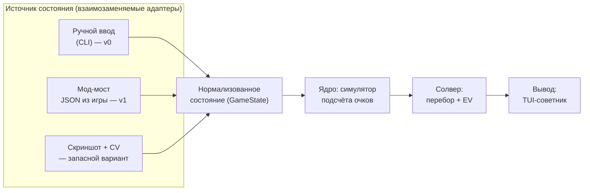

# Бот-помощник для Balatro — план проекта

Статус: черновик плана, код ещё не написан.
Платформа разработки и игры: macOS (Apple Silicon / Intel), Steam-версия Balatro.

---

## 1. Выбор игры: Balatro

Balatro выбрана осознанно, а не просто «потому что нравится». Она почти идеально подходит
под задачу «бот-помощник»:

| Критерий | Balatro |
|---|---|
| Реакция / таймеры | Нет вообще. Ход длится столько, сколько нужно. Бот может думать секунды и минуты |
| Детерминированность | Подсчёт очков — чистая арифметика без случайности (кроме отдельных джокеров). У хода есть **объективно лучший** вариант, который можно вычислить |
| Пространство решений | Из 8 карт выбрать подмножество (до 5) — это 218 вариантов на руку, плюс решение «играть или сбросить», плюс магазин. Человек физически не перебирает это, машина перебирает мгновенно |
| Цена ошибки | Высокая: один неправильно выбранный сброс на Ante 8 убивает ран |
| Доступ к состоянию | Игра написана на Lua + LÖVE 2D, есть зрелая мод-экосистема, состояние читается напрямую из движка |
| Правовой аспект | Однопользовательская офлайн-игра, без анти-чита и без мультиплеера, который можно испортить |

Ключевое: в Balatro **есть правильный ответ**, и его можно посчитать. Это отличает её от
игр, где «помощник» скатывается в вкусовые советы.

**Рассмотренные альтернативы** (тоже пошаговые, без экшена):

- *Slay the Spire* — отличная мод-поддержка, но там уже есть сильные готовые боты, и оценка
  хода упирается в долгосрочную стратегию, а не в счёт. Меньше «вычислимости».
- *Into the Breach* — полностью детерминированная, но ходы и так прозрачны, помощник почти
  не добавляет ценности.
- *Luck be a Landlord* — близка по духу, но сильно проще и меньше сообщество/инструменты.

Итог: **делаем под Balatro**.

---

## 2. Что именно делает бот

### v1 (цель первого работающего результата)

Советник, не автопилот. Игрок играет сам, бот в соседнем окне показывает:

1. **Какие карты играть** — конкретное подмножество руки, с посчитанным итоговым счётом.
2. **Играть или сбросить** — сравнение «сыграть сейчас» против матожидания «сбросить N карт
   и сыграть следующей рукой».
3. **Хватит ли на блайнд** — «эта рука даёт 12 400, до блайнда 30 000, за 2 оставшиеся руки не
   добиваем → надо перестраивать».

**Definition of Done для v1:** на вход подано состояние (рука, джокеры, уровни рук, блайнд) —
на выход за <100 мс выдан оптимальный ход с разбивкой счёта, совпадающей с игрой до последней
единицы.

### Позже (v2+)

4. Советы по магазину: что покупать, что продавать, порядок джокеров (в Balatro порядок
   джокеров влияет на счёт — это отдельная задача оптимизации, перестановка джокеров может
   дать кратный прирост).
5. Стратегия рана: какой блайнд скипать ради тега, когда копить деньги под проценты,
   на какой тип руки строить колоду.

### Чего сознательно НЕ делаем на старте

- Не делаем автоигру (клики за игрока). Технически возможно, но это отдельный слой риска и
  отладки, и он не нужен для главной ценности — качества решений.
- Не делаем ML/нейросети. Здесь работает честный перебор + симулятор, он точнее и объяснимее.

---

## 3. Архитектура

Три слоя, жёстко разделённые. Ядро ничего не знает про то, откуда пришло состояние.



Почему так: **симулятор скоринга — самая ценная и самая долгоживущая часть**. Способ добычи
состояния может смениться трижды (мод сломался после патча — переехали на CV), ядро при этом
не трогаем. Поэтому первым делаем ядро, а не интеграцию.

---

## 4. Как достать состояние игры

Три варианта, в порядке предпочтения.

### Вариант A — мод-мост (рекомендуемый)

Balatro — это LÖVE 2D + Lua, всё состояние живёт в глобальном объекте `G`
(`G.hand`, `G.jokers`, `G.shop_jokers`, `G.GAME.blind`, `G.GAME.dollars`, ...).
Мод на Lua сериализует это в JSON и отдаёт наружу.

Стек на macOS:
- [Lovely Injector](https://github.com/ethangreen-dev/lovely-injector) — рантайм-инжектор Lua
  (для M-серии нужен билд `lovely-aarch64-apple-darwin`), запуск игры через `run_lovely_macos.sh`.
- [Steamodded](https://github.com/Steamodded/smods) — фреймворк модов, моды кладутся в
  `~/Library/Application Support/Balatro/Mods`.

**Важно: скорее всего не надо писать мод с нуля.** Уже есть
[`coder/balatrobot`](https://github.com/coder/balatrobot) (MIT) — мод, поднимающий
**JSON-RPC 2.0 HTTP API** поверх игры: отдаёт состояние и принимает действия (выбор карт,
покупки в магазине, выбор блайнда). Есть и альтернативы (мод, дампящий состояние в файл
каждый кадр). План — взять готовое как транспорт и вложить свои силы в мозги, а не в биндинги.

**Обязательный первый шаг — спайк (см. Фаза 1):** поставить это на конкретном Mac и убедиться,
что заводится с текущей версией игры. Пока спайк не прошёл, на этот вариант не закладываемся.

Риски:
- Steamodded **по умолчанию отключает достижения Steam** (защита от случайной накрутки).
  Возвращается тумблером в игровом меню модов, но об этом надо знать заранее.
- Обновление Balatro в Steam может временно сломать Lovely/Steamodded — придётся ждать
  обновления модов. Отсюда правило: играть можно и без бота, бот не должен быть обязателен.

### Вариант B — компьютерное зрение (запасной)

Захват окна игры + распознавание карт. Плюс: не трогает игру вообще, достижения целы.
Минус: сильно дороже в разработке и хрупко. Держим как план Б, если A не заведётся.
Карты в Balatro визуально контрастные — template matching реалистичен, полноценный OCR не нужен.

### Вариант C — ручной ввод (нужен в любом случае)

CLI/TUI, где рука вводится строкой вида `AH KH QH 7C 7D 3S 2S 2C`, джокеры — по именам.
Это **не костыль, а обязательная часть v0**: позволяет разрабатывать и тестировать ядро,
не завися от модов, и остаётся как режим отладки навсегда.

---

## 5. Ядро: симулятор подсчёта очков

Это сердце проекта. Счёт = `chips × mult`, но оба множителя собираются в строго определённом
порядке, и порядок важен (сложение до умножения даёт совсем другой результат).

Порядок вычисления, который надо воспроизвести:

1. **Определить тип руки** из сыгранных карт → базовые chips/mult по текущему уровню руки.
   Учесть модификаторы распознавания: `Four Fingers` (флеш/стрит из 4 карт), `Shortcut`
   (стрит с пропусками), `Smeared Joker` (масти попарно эквивалентны), Wild-карты,
   секретные руки (Five of a Kind, Flush House, Flush Five).
2. **Дебаффы боссового блайнда** — какие карты отключены и не считаются.
3. **Сыгранные карты слева направо**: chips карты (2–10 = номинал, J/Q/K = 10, A = 11),
   улучшения (Bonus, Mult, Glass, Steel, Stone, Gold, Lucky), издания (Foil, Holographic,
   Polychrome), печати; ретриггеры (красная печать, `Hanging Chad`, `Dusk`, `Hack`).
4. **Карты, оставшиеся в руке** (Steel, `Baron`, ретриггеры от `Mime`).
5. **Джокеры слева направо** — в порядке их расположения. `Blueprint`/`Brainstorm` копируют
   соседей, поэтому порядок — это самостоятельная задача оптимизации.
6. Финал: `round(chips × mult)`.

### Откуда брать точные данные

Не выписывать 150+ джокеров руками по памяти — это гарантированные ошибки.
Исходники игры лежат прямо на диске:

```
~/Library/Application Support/Steam/steamapps/common/Balatro/Balatro.app/Contents/Resources/Balatro.love
```

Это обычный zip. Внутри — Lua-код: таблицы `G.P_CENTERS` (все джокеры, улучшения, издания),
значения покерных рук, функция подсчёта очков. План — **сгенерировать справочник джокеров
скриптом из исходников игры** и держать его как данные, а в коде описывать только логику
эффектов. Это же — эталон для сверки порядка вычислений.

### Проверка корректности

Golden-тесты: набор реальных ситуаций из игры (рука + джокеры + уровни) и точный счёт,
который показала игра. Ядро обязано совпадать до единицы. Расхождение — это баг, который
обнаружится в самый неподходящий момент на Ante 8, поэтому тестов должно быть много.

---

## 6. Солвер

### Выбор руки (v1)

Перебор всех подмножеств руки размера 1–5 (из 8 карт — 218 вариантов, из 10 при `Juggler` —
меньше 640). Каждое прогоняется через симулятор. Полный перебор, никакой эвристики — это
доли миллисекунды.

### Играть или сбросить (v1)

Матожидание сброса считаем методом Монте-Карло: состав оставшейся колоды известен точно
(мы отслеживаем все ушедшие карты), неизвестен только порядок. Сэмплируем N добборов,
для каждого считаем лучший возможный счёт, усредняем. Сравниваем с «сыграть сейчас» с учётом
того, сколько рук и сбросов осталось до блайнда.

### Магазин и порядок джокеров (v2)

- Порядок джокеров: перебор перестановок с отсечениями (для 5 слотов — 120 вариантов,
  считается влёт) на репрезентативной руке.
- Покупка: оценка «на сколько вырастет ожидаемый счёт типичной руки за эти деньги»,
  с поправкой на экономику (проценты капают до $25 — держать деньги выгодно).

### Стратегия рана (v3)

Здесь честного перебора не хватит — уходим в эвристики и симуляцию ранов
(прогон тысяч ранов с разными политиками, отбор лучших правил).

---

## 7. Стек и структура репозитория

- **Python 3.12+**, менеджер зависимостей — `uv`.
- `pytest` — тесты, `ruff` — линт/формат, `mypy` — типы (ядро типизируем строго).
- `pydantic` — модели состояния (валидация того, что приходит из мода).
- `textual`/`rich` — TUI-советник.
- Никаких тяжёлых зависимостей в ядре: оно должно быть чистым Python, чтобы быстро тестироваться.

```
balatro_bot/
  core/
    cards.py        # карта: ранг, масть, улучшение, издание, печать
    hands.py        # распознавание покерных рук + балатровские правила
    scoring.py      # симулятор подсчёта очков (порядок из п.5)
    jokers/         # данные джокеров (сгенерированы) + логика эффектов
    state.py        # GameState — нормализованное состояние
  solver/
    play.py         # выбор лучшего подмножества
    discard.py      # EV сброса, Монте-Карло
    shop.py         # магазин, порядок джокеров (v2)
  adapters/
    manual.py       # ручной ввод (v0)
    mod_bridge.py   # клиент к JSON-RPC моду (v1)
  ui/
    tui.py
tools/
  extract_game_data.py   # распаковка Balatro.love → справочник джокеров
tests/
  golden/               # эталонные счёта из реальной игры
```

---

## 8. Дорожная карта

| Фаза | Содержание | Готово, когда |
|---|---|---|
| **0. Каркас** | Репозиторий, `uv`, `ruff`, `pytest`, CI на GitHub Actions | `uv run pytest` зелёный на пустом проекте |
| **1. Спайк интеграции** | Поставить Lovely + Steamodded + `balatrobot` на Mac, руками дёрнуть API, посмотреть реальный JSON состояния | Есть сохранённый дамп реального состояния игры |
| **2. Карты и руки** | Модель карты, распознавание всех типов рук включая секретные, Wild/Four Fingers/Shortcut/Smeared | Тесты на все типы рук и на пограничные случаи (A-2-3-4-5, Q-K-A) |
| **3. Скоринг** | Симулятор подсчёта, извлечение данных джокеров из `.love`, ~30 самых частых джокеров | Golden-тесты совпадают с игрой до единицы |
| **4. Солвер + ручной ввод** | Перебор подмножеств, CLI. **Первая практическая польза** | Ввожу руку с клавиатуры — получаю лучший ход |
| **5. Автоподключение** | Мост к моду, TUI обновляется сам во время игры | Играю, не трогая бота — советы появляются сами |
| **6. Сброс и EV** | Монте-Карло по колоде, отслеживание вышедших карт | Бот говорит «сбрось эти 3» и объясняет числами |
| **7. Магазин и джокеры** | Покрытие всех джокеров, советы по покупкам и порядку | Бот рекомендует перестановку джокеров с приростом счёта |
| **8. Стратегия рана** | Скипы блайндов, теги, экономика, симуляция ранов | Оценка политик на массовых прогонах |

Фазы 0–4 — это уже работающий полезный инструмент. Дальше — наращивание.

### Идея на потом (опционально)

RNG в Balatro посеян: по сиду ран полностью предопределён — есть сторонние анализаторы сидов,
предсказывающие содержимое магазинов и боссов наперёд. Технически это подключаемо, но это
уже не «помощь в принятии решений», а знание будущего. Оставляю как отдельный флаг, который
по умолчанию выключен — решать тебе, где проходит граница между помощником и читом.

---

## 9. Риски и открытые вопросы

| Риск | Что делаем |
|---|---|
| Steamodded отключает достижения Steam | Знать заранее, включить тумблер в конфиге модов, либо играть под отдельным профилем |
| Патч Balatro ломает моды | Ядро не зависит от мода; ручной ввод всегда работает |
| Ошибка в симуляторе скоринга незаметно портит советы | Много golden-тестов; при расхождении с игрой бот должен ругаться, а не молча советовать |
| 150+ джокеров — большой объём | Данные генерируем из исходников игры, руками пишем только логику; покрываем по частоте использования |
| `balatrobot` окажется несовместим/заброшен | Спайк в Фазе 1 до любых вложений; запасной путь — свой минимальный мод-дампер (он несложный) |

Открытые вопросы к тебе — в сообщении рядом с этим планом.

---

## 10. Практическая сторона

Balatro — однопользовательская офлайн-игра без анти-чита и без соревновательного мультиплеера.
Внешний помощник никому не портит игру и ничего не нарушает. Единственный реальный побочный
эффект — поведение достижений Steam при установке модов (см. выше).
